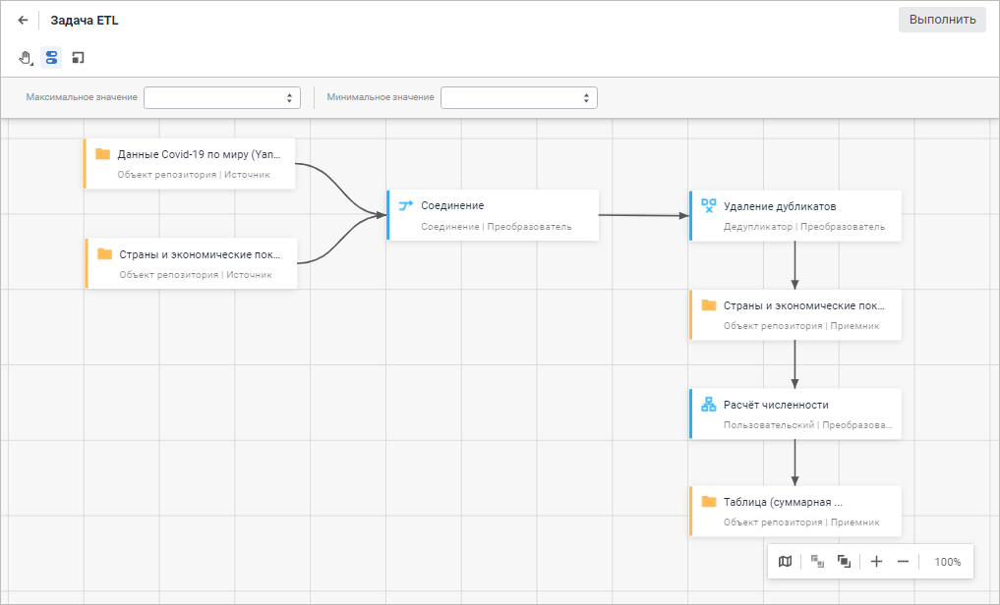

# Подключение к данным и их подготовка

Подключение к данным и их подготовка
-

# Подключение к данным и их подготовка

Продукт «Форсайт. Аналитическая платформа»
 позволяет организовать хранилище данных любой сложности и архитектуры
 или настраиваться на уже существующее хранилище.

Все объекты хранилища данных содержатся в едином репозитории. Все операции
 с объектами в репозитории выполняются с помощью [навигатора
 объектов](GetStarted.chm::/Interface/Interface_Navigator.htm).

## Импорт данных без подготовки

Инструмент «[Импорт
 данных](Data_import_wizard/Data_import_wizard.htm)» предназначен для загрузки данных из
 произвольного источника в стандартный куб или в базу данных временных
 рядов. Мастер импорта позволяет с минимальными настройками произвести
 загрузку данных в репозиторий и создать все необходимые объекты, которые
 потребуются для доступа к этим данным: куб или базу данных временных рядов,
 справочники, таблицы.

*

## Подключение к внешним базам данных

[Подключение к внешним базам данных](connect_to_database.htm)
 предназначено для получения доступа к данным, которые хранятся во внешних
 источниках. Подключение к внешним базам данных позволяет хранить фактические
 настройки баз данных, получать доступ к объектам из другого репозитория,
 а также получать доступ к многомерным базам, которые построены на базе
 Microsoft Analysis Services, SAP NetWeaver BW и других платформах.

## Структурирование наборов данных

[Структурирование
 наборов данных](TimeSeriesDatabase/Structure_data_set.htm) позволяет создавать структуры данных,
 формировать базовые элементы для многомерных источников данных и управлять
 нормативно-справочной информацией. Под структурированными наборами данных
 понимаются таблицы, справочники, кубы и базы данных временных рядов.

Перед началом структурирования данных
 выполните подключение к внешним базам данных.

## Импорт, экспорт и преобразование
 данных

Инструмент «[Задача ETL*](UiETL.chm::/desktop/01_General_Info/UiETL_General.htm)» предназначен для извлечения данных
 из внешних источников, их преобразования и загрузки в приёмники данных.
 Начало работы с задачей ETL предполагает наличие структурированных наборов
 данных и подключения к внешним базам данных.

См. также:

[Вопросы
 и ответы](DataWarehouse_FAQ.htm)

		Справочная
		 система на версию 10.9
		 от 18/08/2025,
		 © ООО «ФОРСАЙТ»,
