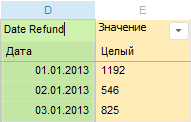
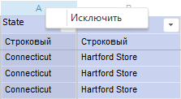
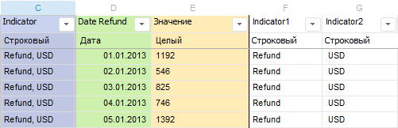
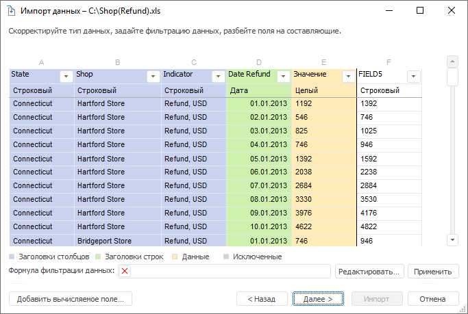

# Преобразование данных: Импорт данных

Преобразование данных: Импорт данных
-

Интерфейсы импорта данных в веб-приложении и настольном приложении совпадают.

# Преобразование данных

Для преобразования данных, которые были получены из источника данных
 и в дальнейшем будут импортированы в приёмник, перейдите на страницу корректировки
 данных [мастера импорта данных](Data_import_wizard.htm):

На странице доступны операции:

[Изменение
 наименования полей](javascript:TextPopup(this))

	Наименования полей загружаются из источника данных. В соответствии
	 с этими наименованиями будут формироваться наименования атрибутов
	 в измерениях.

	Для переименования атрибута дважды щёлкните по наименованию соответствующего
	 поля в таблице и укажите новое наименование:

	

	Примечание.
	 На данной странице рекомендуется изменить наименование полей со значениями.
	 Данные наименования будут иметь факты в измерении фактов.

[Исключение
 полей](javascript:TextPopup(this))

	Данные всех полей, полученных из источника, будут использоваться
	 при импорте. Если какие-либо данные не нужны, то их можно исключить.
	 Для этого выполните одно из следующих действий:

		- выполните команду «Исключить» в
		 контекстном меню столбца;

		- нажмите кнопку  «Действия»
		 и выполните команду «Исключить».

	

	Примечание.
	 Для успешного импорта в куб должно остаться не менее двух столбцов,
	 для импорта в базу данных временных рядов - не менее трех столбцов.
	 Исключённые поля могут быть использованы при составлении выражения
	 для [вычисляемых полей](#calculated_fields).

[Изменение
 формата данных](javascript:TextPopup(this))

	Тип данных полей в источнике определяется автоматически в соответствии
	 с [дополнительными настройками](additional_settings.htm).
	 Если тип был определен неправильно, то его можно скорректировать.
	 Для изменения типа данных нажмите кнопку  «Действия» и выберите необходимый
	 тип:

	

	Поля с типом «Дата» определяются автоматически путем проверки соответствия
	 наиболее часто используемым форматам указания дат, например «ДД.ММ.ГГГГ»,
	 «ДД/ММ/ГГГГ» и других. Если даты заданы в каком-либо специфическом
	 формате, то его можно указать, выполнив дополнительную команду «Дата > Настроить». Будет
	 открыт диалог «Формат даты».
	 Описание диалога представлено в подразделе «[Настройка формата даты](UiDw.chm::/Import/Date_Format.htm)».
	 Задайте формат с помощью допустимых подстановок и необходимых символов-разделителей.
	 После нажатия кнопки «ОК»
	 формат будет применён для распознавания значений дат.

[Разбивка
 строковых полей](javascript:TextPopup(this))

	Строковые поля могут быть разбиты на несколько полей, если в них
	 встречается определенный символ-разделитель. Для разделения нажмите
	 кнопку  «Действия» и выполните команду «Разбить на несколько полей». В открывшемся
	 диалоге из раскрывающегося списка выберите разделитель и нажмите кнопку
	 «ОК». После анализа значений
	 и поиска выбранного разделителя будет создано необходимое количество
	 дополнительных полей и в них будут помещены соответствующие значения.
	 Количество создаваемых полей соответствует количеству частей, на которые
	 может быть разбито значение поля, содержащее максимальное количество
	 символов-разделителей. Если используются парные символы-разделители
	 (круглые скобки (), квадратные скобки [] и другие), то в новые поля
	 выносятся только те значения, которые расположены в области этих разделителей.
	 Значения, расположенные за пределами парных символов-разделителей,
	 исключаются.

	Примечание.
	 Если разбивка не возможна, то будет выдано сообщение об ошибке. Выберите
	 другой разделитель и повторите разделение.

	Каждое созданное поле будет вычисляемым, при необходимости для него
	 можно изменить выражение. Выбранный символ-разделитель будет исключен
	 из значений. Для всех созданных полей тип данных будет определен автоматически.

	Лишние поля, полученные при разбивке, могут быть исключены или удалены.
	 Для этого нажмите кнопку  «Действия»
	 и выполните соответствующую команду.

	Пример:

	Если поле «Indicator» разбить
	 с использованием символа разделителя «,
	 (Запятая)», то результат будет следующим:

	

	В таблицу будут добавлены дополнительные столбцы, соответствующие
	 заданному разбиению.

[Работа
 с вычисляемыми полями](javascript:TextPopup(this))

	Кнопка «Добавить вычисляемое поле»
	 позволяет в таблице создать дополнительные поля, значения которых
	 будут вычисляться во время загрузки данных по заданным выражениям.
	 При нажатии на кнопку будет открыт [редактор выражения](UiNav.chm::/GUI/ExpressionEditor.htm)
	 для формирования выражения с использованием полей источника и различных
	 функций/операторов. Также для использования доступны исключённые поля.

	После нажатия кнопки «ОК»
	 в таблицу будет добавлено вычисляемое поле и по предварительно загруженным
	 записям будет вычислено значение:

	

	Примечание.
	 Работа с вычисляемыми полями [в кросс-таблице](Cross_Table.htm)
	 идентична работе с вычисляемыми полями в простой таблице.

	Для изменения выражения, по которому вычисляется созданное поле,
	 нажмите кнопку  «Действия»
	 и выполните команду «Редактировать».
	 При выполнении команды будет открыт [редактор выражения](UiNav.chm::/GUI/ExpressionEditor.htm).

	Для удаления вычисляемого поля нажмите кнопку  «Действия» и выполните команду «Удалить».

[Фильтрация
 данных](javascript:TextPopup(this))

	Если из источника требуется импортировать не все данные, то на стадии
	 корректировки данных можно настроить фильтрацию по значениям полей.
	 Условие фильтрации можно задать вручную в поле «Формула
	 фильтрации данных» или сформировать в [редакторе выражений](UiNav.chm::/GUI/ExpressionEditor.htm),
	 который вызывается при нажатии кнопки «Редактировать».
	 Условие формируется с помощью полей и различных функций. Условие должно
	 возвращать логическое значение. Импортированы будут те записи, которые
	 удовлетворяют заданному условию.

	Кнопка «Применить» позволяет
	 применить заданный фильтр к первым загруженным записям, которые отображаются
	 в таблице.

При нажатии кнопки «Далее» будет
 открыта страница для корректировки [наименований
 измерений и их состава](Adjust_Dimensions.htm).

См. также:

[Импорт данных](Data_import_wizard.htm)

		Справочная
		 система на версию 10.9
		 от 18/08/2025,
		 © ООО «ФОРСАЙТ»,
