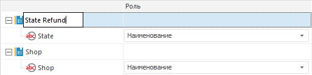

# Настройка многомерной структуры преобразованных данных: Импорт данных

Настройка многомерной структуры преобразованных данных: Импорт данных
-

Интерфейсы импорта данных в веб-приложении и настольном приложении совпадают.

# Настройка многомерной структуры преобразованных данных

Для настройки списка измерений и их состава перейдите на данную страницу
 [мастера импорта данных](Data_import_wizard.htm):

[Изменение наименования
 измерения](javascript:TextPopup(this))

	Для переименования выделенного измерения:

		- щелкните в области наименования;

		- нажмите клавишу F2.

	Наименование будет переведено в режим редактирования. Введите новое
	 наименование измерения.

	

[Изменение
 состава измерения](javascript:TextPopup(this))

	После идентификации данных формируется структура будущего приёмника
	 данных в репозитории. Каждое поле источника связывается с измерением
	 следующим образом:

		- поля, содержащие значения вещественного
		 и целого типа, будут считаться
		 полями с данными. Они будут связаны с измерением фактов. Каждое
		 поле связывается с отдельным фактом;

		- поля, содержащие значения типа Дата
		 или ДатаВремя, будут связаны
		 с календарными измерениями. Параметры календарного измерения будут
		 установлены в зависимости от идентифицированного диапазона дат;

		- все остальные поля будут связаны с отдельными измерениями.
		 Значения полей будут импортироваться как наименования элементов
		 этих измерений. При работе с [кросс-таблицей](Cross_Table.htm)
		 возможна ситуация, когда соседние поля, имеющие разный тип, будут
		 объединены в одно измерение.

	При необходимости поля можно объединить в одно измерение. При этом
	 можно изменить роль полей:

		- Роль «Наименование».
		 Значения полей с ролью «Наименование»
		 импортируются как наименования элементов. Если данная роль установлена
		 для нескольких атрибутов, то создается иерархическое измерение.
		 Используя данную роль, можно организовать произвольные иерархии,
		 например, SHOP-STATE. Объединение с календарным измерением недопустимо;

		- Роль «Атрибут».
		 Значения полей с ролью «Атрибут»
		 рассматриваются как дополнительные характеристики каждого элемента
		 этого измерения. Данные значения будут использоваться для связи
		 фактических данных с определенными элементами измерения;

		- Роль «Код территории».
		 Значения полей с ролью «Код территории»
		 импортируются в атрибут с идентификатором «TERRID»,
		 который необходим для отображения данных на картах. В рамках одного
		 измерения только для одного атрибута может быть установлена роль
		 «Код территории».

	Для переноса атрибута выделите его и перетащите в область нужного
	 измерения, после чего в столбце «Роль»
	 укажите, как будет использоваться атрибут в измерении.

[Агрегация
 фактов](javascript:TextPopup(this))

	Для каждого факта можно выбрать метод агрегации данных. При этом
	 выбранный метод будет установлен для факта в структуре приёмника данных
	 (список доступных методов агрегации совпадает со списком, доступным
	 для [фактов
	 куба](../Cube/CreateCube/Master_Standart/UiMd_Cube_CreateCube_Master_Standart_2.htm)). Также будет установлен флаг «[Агрегировать
	 данные по измерениям с полной отметкой](../Cube/CreateCube/Master_Standart/UiMd_Cube_CreateCube_Master_Standart_3.htm)».

	Если выбран метод агрегации, то будет доступен флажок «Загрузить
	 дублирующие записи». По умолчанию он снят. При установленном
	 флажке будут импортированы все записи. Импортированные дублирующие
	 записи в дальнейшем могут использоваться, например, при просмотре
	 детализированной информации по агрегированным данным.

	Если флажок «Загрузить дублирующие
	 записи» снят и во время импорта будут обнаружены дублирующиеся
	 записи (у двух или более записей значения всех полей полностью совпадают),
	 то будет сгенерирована ошибка импорта. Информация об ошибке будет
	 доступна после завершения импорта в окне «[Конфликты
	 импорта данных](conflict_imports.htm)».

При нажатии кнопки «Далее» будет
 открыта страница для выбора [приёмника данных](Select_consumer.htm).

См. также:

[Импорт данных](Data_import_wizard.htm)

		Справочная
		 система на версию 10.9
		 от 18/08/2025,
		 © ООО «ФОРСАЙТ»,
