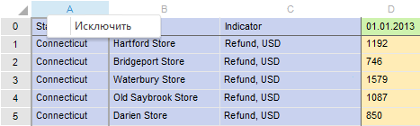

# Настройка кросс-таблицы: Импорт данных

Настройка кросс-таблицы: Импорт данных
-

Интерфейсы импорта данных в веб-приложении и настольном приложении совпадают.

# Настройка кросс-таблицы

Если при импорте из [файла
 с данными](Select_and_configure_the_data_source.htm) был установлен флажок «Кросс-таблица»,
 то при нажатии на кнопку «Далее»
 будет отображена следующая страница мастера:

По данным, загруженным из файла, мастером будет произведена попытка
 идентифицировать точку начала данных. Блок данных, а также заголовки строк
 и столбцов будут выделены различными цветами. При необходимости можно
 скорректировать область данных путем изменения границы области данных
 и шапки/боковика.

При нажатии на кнопку «Далее»
 будет отображена следующая страница мастера, на которой можно скорректировать
 диапазон импортируемых данных.

Корректировка диапазона осуществляется путем удаления строк и столбцов
 с ненужными данными. Для удаления столбца/строки выполните команду контекстного
 меню «Исключить» в области заголовка
 таблицы:

Примечание.
 Удалять можно только крайние левые столбцы боковика и крайние строки в
 шапке. В заголовках должно остаться не менее одного столбца и одной строки.
 Удалённые строки/столбцы в дальнейшем больше не используются и не будут
 доступны.

При нажатии кнопки «Далее» будет
 открыта страница для [корректировки данных](Adjust_Data.htm),
 которые будут автоматически распознаны и загружены из кросс-таблицы.

См. также:

[Выбор источника](Select_and_configure_the_data_source.htm)

		Справочная
		 система на версию 10.9
		 от 18/08/2025,
		 © ООО «ФОРСАЙТ»,
