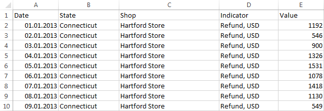
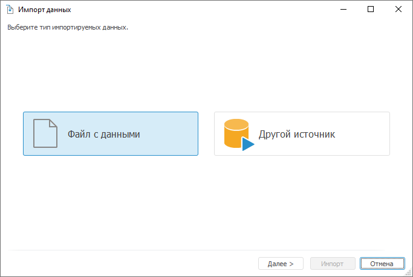
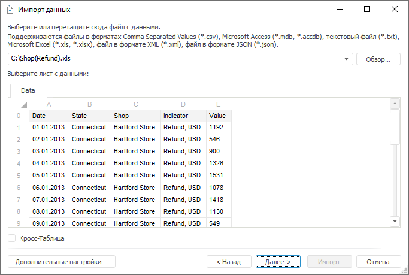
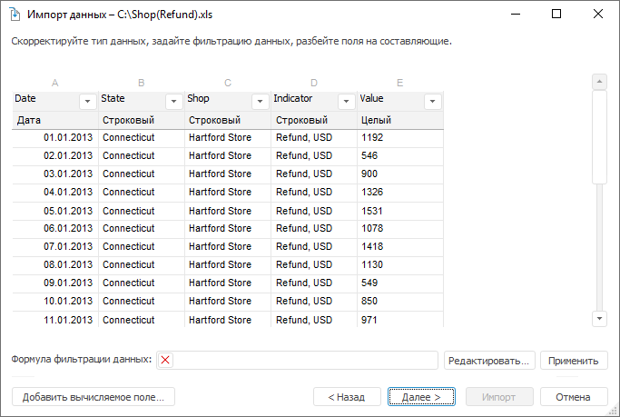
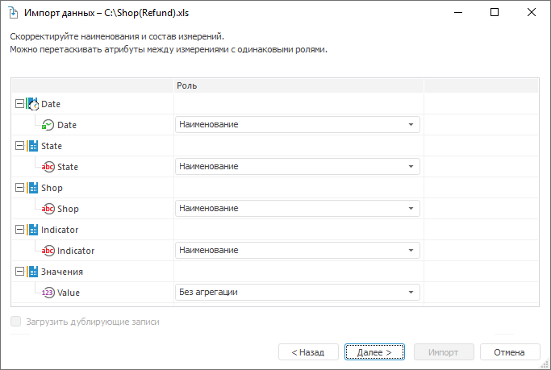
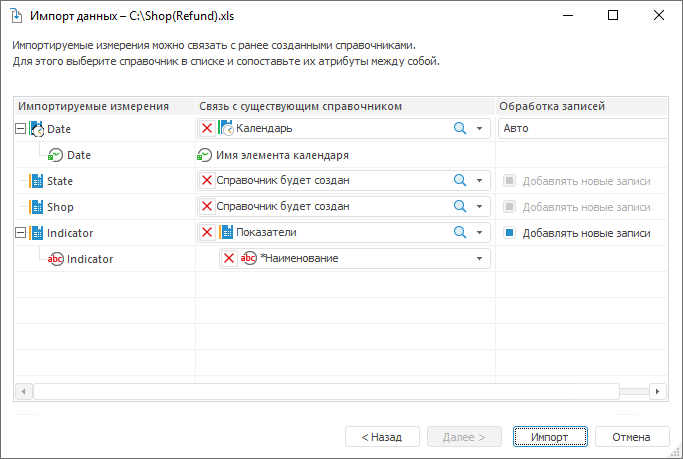
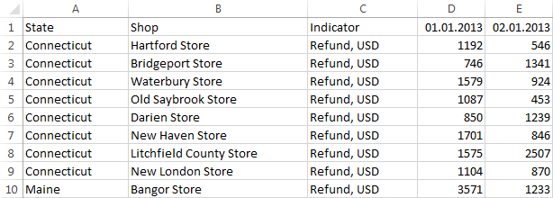
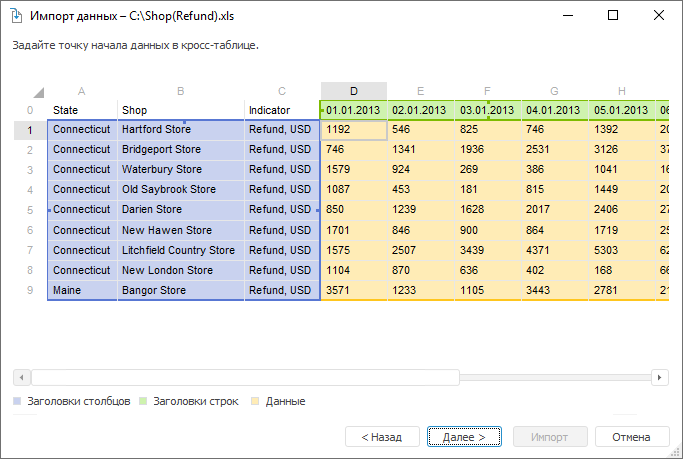
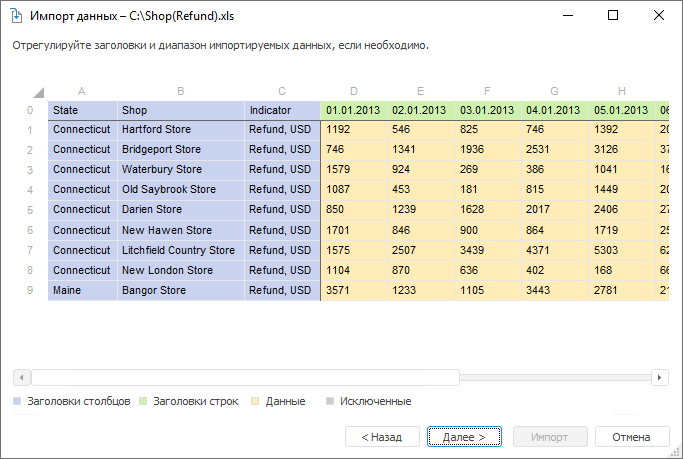

# Примеры импорта

Примеры импорта
-

Интерфейсы импорта данных в веб-приложении и настольном приложении совпадают.

# Импорт из таблицы

Рассмотрим пример импорта данных из файла Microsoft
 Excel в новый куб репозитория. В примере импорта использован файл,
 данные в котором расположены в следующем виде:

Запустите мастер импорта одним из следующих способов:

	- выполните команду «Сервис > Импорт
	 данных» в главном меню навигатора объектов;

	- выберите пункт «Импорт данных»
	 в окне приветствия в настольном или веб-приложении.

Будет открыто окно:

На стартовой странице выберите «Файл
 с данными» и нажмите кнопку «Далее».
 На следующей странице нажмите кнопку «Обзор»
 и выберите файл с данными:

После разбора структуры файла и идентификации данных будут загружены
 и отображены первые сто строк из выбранного файла. Нажмите кнопку «Далее».

При необходимости скорректируйте данные:

	- [измените наименование полей](Adjust_Data.htm#names);

	- [исключите поля](Adjust_Data.htm#include_fields);

	- [измените формат данных](Adjust_Data.htm#format);

	- [выполните разбивку
	 строковых полей](Adjust_Data.htm#split_string_fields);

	- [добавьте вычисляемые
	 поля](Adjust_Data.htm#calculated_fields).

После корректировки состава данных нажмите кнопку «Далее».

Поля автоматически будут разбиты по измерениям, значения текстовых полей
 будут импортированы как значения атрибута «Наименование»
 элементов измерения. Все поля, имеющие вещественный тип данных, импортируются
 как значения. Для каждого поля со значением будет создан факт в измерении
 фактов.

При необходимости можно изменить состав и набор измерений. Для этого
 перетащите атрибуты в состав нужного измерения (атрибуты отображаются
 в виде дочерних элементов измерений, для каждого атрибута определена роль).
 Если в рамках одного измерения для нескольких атрибутов назначена роль
 «Наименование», то измерение будет
 создано иерархическим.

После формирования состава измерений нажмите кнопку
 «Далее».

Нажмите кнопку «Новый приёмник»,
 задайте наименование нового куба и выберите папку, в которой он будет
 сохранен в репозитории. Нажмите кнопку «Далее».

Если в репозитории существуют справочники, тематика и структура которых
 соответствует импортируемым измерениям, то их можно выбрать в раскрывающихся
 списках. Для выбора доступны только справочники НСИ, составные справочники
 НСИ и календарные справочники.

При нажатии на кнопку «Импорт»
 будут созданы и настроены новый куб, все необходимые справочники и таблица
 с импортированными данными. Также произойдет сохранение настроек импорта
 данных в задачу ETL.

На последней странице мастера можно доработать справочники, используемые
 в структуре созданного куба. Можно создать группы элементов, схемы отметки
 или альтернативные иерархии. При нажатии кнопки «Готово»
 окно мастера импорта будет закрыто.

# Импорт из кросс-таблицы

Рассмотрим пример импорта данных, представленных в
 виде кросс-таблицы. Кросс-таблица - это способ представления данных, при
 котором информация о различных показателях располагается в заголовках
 строк и столбцов, а на пересечении строк и столбцов располагаются фактические
 данные. В примере импорта использован файл Microsoft
 Excel, данные в котором расположены в следующем виде:

Запустите мастер импорта одним из следующих способов:

	- выполните команду «Сервис > Импорт
	 данных» в главном меню навигатора объектов;

	- выберите пункт «Импорт данных»
	 в окне приветствия в настольном или веб-приложении.

Будет открыто окно:

На стартовой странице выберите «Файл
 с данными» и нажмите кнопку «Далее».
 На следующей странице нажмите кнопку «Обзор»
 и выберите файл с данными:

Установите флажок «Кросс-таблица»
 и нажмите кнопку «Далее».

Мастер импорта автоматически определит область начала числовых данных.
 Если определение произошло неправильно, то измените область начала данных,
 выделив нужную ячейку. Нажмите кнопку «Далее».

Для исключения из импорта крайних столбцов выполните команду «Исключить» в контекстном меню. Данные
 этих столбцов импортированы не будут.

Нажмите кнопку «Далее».

Идентифицированные данные из кросс-таблицы будут преобразованы следующим
 образом:

	- заголовки строк и столбцов будут выделены в отдельные поля;

	- числовые данные, начало которых было обозначено ранее, будут
	 размещены в отдельном поле - Значение.

При необходимости скорректируйте данные:

	- [измените наименование полей](Adjust_Data.htm#names);

	- [исключите поля](Adjust_Data.htm#include_fields);

	- [измените формат данных](Adjust_Data.htm#format);

	- [выполните разбивку
	 строковых полей](Adjust_Data.htm#split_string_fields);

	- [добавьте вычисляемые
	 поля](Adjust_Data.htm#calculated_fields).

После формирования состава измерений нажмите кнопку
 «Далее».

Поля автоматически будут разбиты по измерениям, значения текстовых полей
 будут импортированы как значения атрибута «Наименование»
 элементов измерения. Все поля, имеющие вещественный тип данных, импортируются
 как значения. Для каждого поля со значением будет создан факт в измерении
 фактов.

При необходимости можно изменить состав и набор измерений. Для этого
 перетащите атрибуты в состав нужного измерения (атрибуты отображаются
 в виде дочерних элементов измерений, для каждого атрибута определена роль).
 Если в рамках одного измерения для нескольких атрибутов назначена роль
 «Наименование», то измерение будет
 создано иерархическим.

После формирования состава измерений нажмите кнопку
 «Далее».

Нажмите кнопку «Новый приёмник»,
 задайте наименование нового куба и выберите папку, в которой он будет
 сохранен в репозитории. Нажмите кнопку «Далее».

Если в репозитории существуют справочники, тематика и структура которых
 соответствует импортируемым измерениям, то их можно выбрать в раскрывающихся
 списках. Для выбора доступны только справочники НСИ, составные справочники
 НСИ и календарные справочники.

При нажатии на кнопку «Импорт»
 будут созданы и настроены новый куб, все необходимые справочники и таблица
 с импортированными данными. Также произойдет сохранение настроек импорта
 данных в задачу ETL.

На последней странице мастера можно доработать справочники, используемые
 в структуре созданного куба. Можно создать группы элементов, схемы отметки
 или альтернативные иерархии. При нажатии кнопки «Готово»
 окно мастера импорта будет закрыто.

		Справочная
		 система на версию 10.9
		 от 18/08/2025,
		 © ООО «ФОРСАЙТ»,
