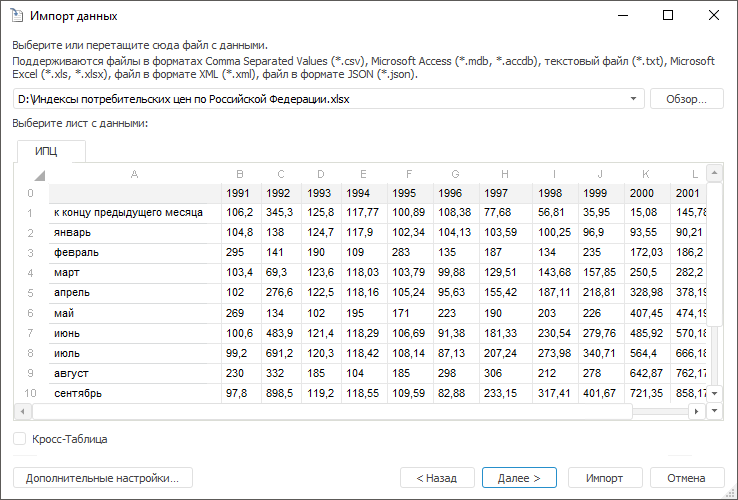

# Импорт данных без подготовки

Импорт данных без подготовки
-

Интерфейсы импорта данных в веб-приложении и настольном приложении совпадают.

# Импорт данных без подготовки

Импорт данных предназначен для
 загрузки данных из произвольного источника в стандартный куб или в базу
 данных временных рядов. Мастер импорта позволяет с минимальными настройками
 произвести загрузку данных в репозиторий и создать все необходимые объекты,
 которые потребуются для доступа к этим данным (куб или базу данных временных
 рядов, справочники, таблицы).

Корректная работа мастера импорта возможна, если для репозитория задана
 база данных, [используемая
 по умолчанию](UiNav.chm::/02_Navigator/Repo_Default.htm).

Ключевые возможности:

	- преобразование и фильтрация данных перед их загрузкой;

	- поддержка большого количества источников данных: OLE DB; баз
	 данных Microsoft Access; REST-источников данных; файлов CSV, TXT,
	 XLS, XLSX, XML, JSON; объектов репозитория платформы;

	- автоматическое создание всех объектов, необходимых для выполнения
	 импорта;

	- загрузка данных в уже существующие объекты.

Возможен импорт из следующих источников данных:

	- файлы Comma Separated Values (*.csv);

	- базы данных Microsoft Access (*.mdb, *.accdb);

	- текстовые файлы (*.txt);

	- файлы Microsoft Excel (*.xls, *.xlsx);

	- файлы в формате XML (*.xml);

	- объекты репозитория:

	-

		- справочники;

		- наборы данных (таблицы, запросы, представления и другие);

	- файлы в формате JSON (*.json);

	- REST-источники данных;

Примечание.
 В текущей реализации из REST-источника можно импортировать данные, представленные
 только в JSON-формате.

	- OLE DB источники, драйверы которых установлены в операционной
	 системе.

Примечание.
 Импорт из OLE DB источников и из объектов репозитория доступен только
 в настольном приложении.

Перед началом импорта ознакомьтесь с [требованиями
 и общими рекомендациями](file_requirements.htm) для источников данных.

## Начало работы

Для начала импорта данных:

	- в веб-приложении:

		- выполните команду  «Импорт данных» на боковой панели
		 навигатора объектов;

		- выполните команду «Отчет >
		 Импорт данных» в главном меню экспресс-отчёта;

		- выполните команду «Документ >
		 Импорт данных» в главном меню аналитической панели;

		- нажмите кнопку «Импорт
		 данных» на вкладке «Источник»
		 боковой панели экспресс-отчёта;

	- в настольном приложении:

		- выполните команду «Сервис >
		 Импорт данных» в главном меню навигатора объектов;

		- выполните команду «Отчет >
		 Импорт данных» в главном меню экспресс-отчёта или регламентного
		 отчёта;

		- выполните команду «Документ >
		 Импорт данных» в главном меню аналитической панели;

		- выполните команду «Рабочая
		 книга > Импорт данных» в главном меню рабочей книги;

		- нажмите кнопку «Импорт
		 данных» на вкладке «Источник»
		 боковой панели экспресс-отчёта или регламентного отчёта;

		- нажмите кнопку «Импорт
		 данных» в раскрывающемся меню кнопки «Источник»
		 на листе рабочей книги;

		- нажмите кнопку «Импорт
		 данных» на вкладке «Источник
		 данных» боковой панели аналитической панели;

		- нажмите кнопку «Из файла»,
		 расположенную в группе «Получение
		 данных» на вкладке «Данные»
		 ленты инструментов регламентного отчёта;

		- в окне приветствия на любой вкладке выберите задачу «Импорт данных».

Будет запущен мастер импорта.

Если в настольном приложении в навигаторе объектов выполнить команду
 «Открыть с помощью > Мастер импорта
 данных» в контекстном меню таблицы/запроса/представления,
 то мастер импорта будет открыт на странице [выбора
 источника](Select_and_configure_the_data_source.htm). Объект, для которого выполнялась команда, будет подставлен
 в качестве источника.

## Работа с мастером импорта

После запуска импорта будет открыта первая страница мастера:

Выберите тип источника, из которого осуществляется импорт, и нажмите
 кнопку «Далее».

Дальнейшая настройка состоит из
 следующих этапов:

	- [Выбор источника](Select_and_configure_the_data_source.htm):

		- [Настройка кросс-таблицы](Cross_Table.htm).

	- [Корректировка данных](Adjust_Data.htm).

	- [Корректировка измерений](Adjust_Dimensions.htm).

	- [Выбор приёмника данных](Select_consumer.htm).

	- [Связь измерений
	 с существующими справочниками](Compare_source_fields_with_consumer_fields.htm) / [Сопоставление
	 полей источника с полями существующего приёмника](Map_source_fields_with_existing_consumer_fields.htm).

	- [Настройка
	 справочников](Directories_Result.htm).

В зависимости от выбранного типа приёмника данных (стандартный куб или
 база данных временных рядов) после выполнения импорта будут созданы различные
 объекты.

[Импорт
 в куб](javascript:TextPopup(this))

	После выполнения импорта произойдет сохранение настроек импорта
	 в задачу ETL, при этом в указанной пользователем папке будут созданы
	 следующие объекты:

		- стандартный куб с наименованием выбранного объекта импорта;

		- папка с наименованием выбранного объекта импорта, содержащая:

			- задачу ETL.
			 Её наименование совпадает с наименованием выбранного объекта
			 импорта. В задаче ETL будут созданы источник и приёмник данных
			 с наименованиями выбранного объекта импорта. В качестве источника
			 данных выступает выбранный объект импорта. В качестве приёмника
			 данных выступает стандартный куб, созданный в процессе импорта
			 либо указанный в качестве существующего источника. Для источника
			 и приёмника данных в задаче ETL настраиваются все необходимые
			 параметры, значения которых берутся из мастера импорта.

			Если при выполнении задачи ETL объект импорта в репозитории
			 не будет найден, то будет выведен диалог для добавления нового
			 импортируемого объекта.

	Если задача ETL запускается из [планировщика
	 задач](UiAppSrv.chm::/3_Work_Tasks/Work_Task.htm#starttask), а объект импорта не будет обнаружен, то
	 задача будет пропущена, в статусе будет выведено сообщение о том,
	 что объект импорта не найден;

	Примечание.
	 Если в качестве источника импорта указывается локальный файл, то в
	 задаче ETL в качестве источника данных, тип которого определится автоматически,
	 выступает объект репозитория «Документ».
	 При этом задача ETL будет иметь наименование и расширение импортируемого
	 файла.

			- объект репозитория
			 «Документ». Данный
			 объект является копией импортируемого файла и имеет такое
			 же наименование и расширение;

	Примечание.
	 Если в качестве источника указан локальный файл с данными, то документ
	 будет создан.

			- таблицу. В таблице
			 находятся данные, выгруженные из источника в процессе выполнения
			 задачи ETL. Таблица имеет наименование объекта импорта;

			- справочник
			 НСИ с наименованием «Значения».
			 Справочник содержит в себе элементы, наименования которых
			 совпадают с наименованиями вещественных полей указанного объекта
			 импорта;

			- справочники
			 НСИ. Наименования справочников совпадают с наименованиями
			 элементов, полученных при разделении по измерениям. Значения
			 текстовых полей из объекта импорта будут импортированы как
			 значения атрибута «Наименование»
			 стандартного куба.

	Примечание.
	 Если импорт данных завершится с ошибкой, то куб не будет создан. В
	 результате, сохранение настроек импорта не произойдет, задача ETL
	 создана не будет.

[Импорт
 в базу данных временных рядов](javascript:TextPopup(this))

	После выполнения импорта в указанной пользователем папке будут созданы
	 следующие объекты:

		- база данных временных рядов с наименованием выбранного объекта
		 импорта;

		- папка с наименованием выбранного объекта импорта, содержащая
		 справочники НСИ. Наименования
		 справочников совпадают с наименованиями импортируемых полей источника
		 данных.

	После выполнения импорта в базу данных временных рядов, в отличие
	 от импорта данных в куб, задача ETL создана не будет.

	Примечание.
	 Если импорт данных завершится с ошибкой, то база данных временных
	 рядов не будет создана.

После выполнения импорта данные сразу же становятся доступны для анализа.
 Если во время импорта возникнут какие-либо ошибки, то по завершению будет
 открыто окно «[Конфликты
 импорта данных](conflict_imports.htm)». Примеры импорта
 из [таблицы](Data_Import_Sample.htm#import_from_table)
 и [кросс-таблицы](Data_Import_Sample.htm#cross_table)
 приведены в разделе «[Примеры импорта](Data_Import_Sample.htm)».

См. также:

[База
 данных](../database/UiDb_database.htm) | [Кубы](../Cube/UiMd_Cube_Type.htm)

		Справочная
		 система на версию 10.9
		 от 18/08/2025,
		 © ООО «ФОРСАЙТ»,
