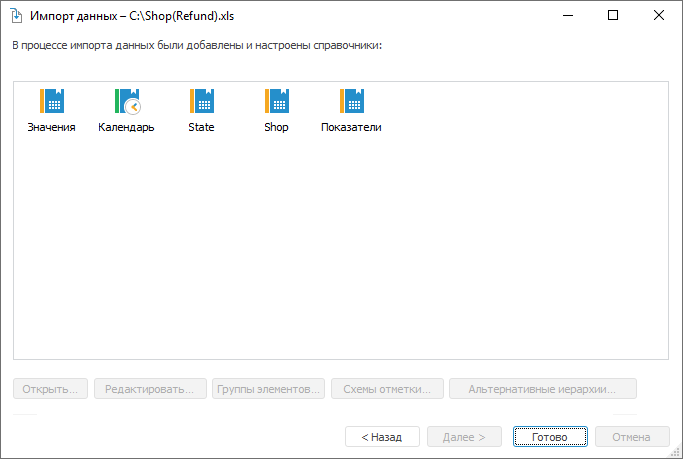

# Редактирование структуры и содержимого созданных справочников: Импорт данных

Редактирование структуры и содержимого созданных справочников: Импорт данных
-

Интерфейсы импорта данных в веб-приложении и настольном приложении совпадают.

# Редактирование структуры и содержимого созданных справочников

После завершения создания всех объектов и импорта данных будет отображена
 последняя страница [мастера импорта](Data_import_wizard.htm),
 на которой представлен список всех справочников, используемых в приёмнике
 данных. В списке представлены как вновь созданные справочники, так и существующие,
 которые были выбраны на странице «[Связь
 измерений с существующими справочниками](Compare_source_fields_with_consumer_fields.htm)».

Выбрав необходимый справочник, можно открыть его на просмотр или редактирование,
 настроить существующие или создать новые [группы
 элементов](../reference_book/look-and-feel_Reference_book/UiMd_reference_book_look-and-feel_Group.htm)/[схемы
 отметки](../reference_book/look-and-feel_Reference_book/UiMd_reference_book_look-and-feel_Scheme.htm)/[альтернативные
 иерархии](../reference_book/UiMd_reference_book_Hierarchy.htm#alternativehierarchy). Для этого нажмите соответствующую кнопку или выполните команду
 контекстного меню.

Примечание.
 В веб-приложении справочники можно открыть только на просмотр.

При нажатии кнопки «Готово»
 окно мастера импорта данных будет закрыто.

См. также:

[Импорт
 данных](Data_import_wizard.htm)

		Справочная
		 система на версию 10.9
		 от 18/08/2025,
		 © ООО «ФОРСАЙТ»,
