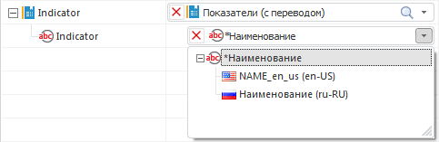

# Особенности импорта в существующие справочники: Импорт данных

Особенности импорта в существующие справочники: Импорт данных
-

Интерфейсы импорта данных в веб-приложении и настольном приложении совпадают.

# Особенности импорта в существующие справочники

При импорте в существующие справочники учитывается иерархия уже имеющихся
 элементов, а также параметры справочника. Привязка может осуществляться
 к любым атрибутам, тип которых совпадает с типом поля источника. Ряд различных
 особенностей импорта представлен в подразделах ниже.

[Импорт
 в иерархические справочники](javascript:TextPopup(this))

	Импорт в иерархические справочники осуществляется следующим образом:

		- при импорте в справочник осуществляется проверка наличия
		 комбинации: родительский элемент (комбинация родительских элементов) -
		 добавляемый элемент. Если проверяемая комбинация существует, то
		 элемент не добавляется. Если существует родительский элемент,
		 то для него будет добавлен новый дочерний элемент. Если комбинация
		 отсутствует полностью, то будет создан родительский элемент (комбинация
		 родительских элементов) и добавлен дочерний элемент;

		- если справочник версионный, то элементы будут добавляться
		 на текущую дату. При этом период действия родительского элемента
		 должен быть не меньше текущей даты. Дата окончания для добавляемого
		 элемента будет установлена равной дате окончания родительского
		 элемента. Если родительский элемент уже является устаревшим, то
		 будет создан новый родительский элемент. В качестве даты начала
		 будет установлена текущая дата, в качестве даты окончания -
		 максимальная дата - «31.12.2999».

[Импорт
 в мультиязычные справочники](javascript:TextPopup(this))

	Если для справочника включен [перевод
	 на различные языки](../reference_book/Master_RDS_reference_book/base_settings.htm#translate_dictionary), то при настройке связи можно указать, в качестве
	 наименований на каком языке будут импортироваться элементы:

	

	При импорте учитывается [текущий язык
	 репозитория](GetStarted.chm::/Interface/Intro_Language.htm), язык, который был установлен в репозитории
	 при создании справочника, а также способ привязки:

		- привязка осуществляется
		 непосредственно к атрибуту. При импорте поиск элементов
		 будет производиться по переводу, совпадающему с текущим языком
		 репозитория. Если этот перевод у элементов отсутствует, то поиск
		 производится по языку, который был установлен при создании справочника.
		 Если значение среди переводов не найдено, то будет создан новый
		 элемент. При этом импортированное значение будет установлено для
		 всех языков, на которые переводится справочник;

		- привязка осуществляется
		 к переводу атрибута (текущий язык репозитория не совпадает с языком,
		 который был установлен при создании справочника) и:

			- перевод атрибута совпадает
			 с языком, который был установлен при создании справочника.
			 Поиск осуществляется только по значениям этого атрибута;

			- перевод атрибута совпадает
			 с текущим языком репозитория. Поиск осуществляется
			 только по значениям этого атрибута. Значения на языке, который
			 был установлен при создании справочника, не учитываются;

			- перевод атрибута не
			 совпадает с текущим языком репозитория. Поиск осуществляется
			 только по значениям этого атрибута. Значения на языке, который
			 был установлен при создании справочника, не учитываются;

		- привязка осуществлена к
		 нескольким переводам атрибута и:

			- один из переводов совпадает
			 с текущим языком репозитория. Поиск будет осуществляться
			 именно по этому переводу. Значения на языке, который был установлен
			 при создании справочника, не учитываются. При создании новых
			 элементов значения импортируются в соответствии с заданными
			 привязками. В качестве значения перевода на языке, который
			 был установлен при создании справочника, будет импортировано
			 значение на текущем языке репозитория;

			- ни один из переводов
			 не совпадает с текущим языком репозитория. Поиск будет
			 осуществляться по переводу на тот язык, который был установлен
			 при создании справочника. При создании новых элементов значения
			 импортируются в соответствии с заданными привязками. В качестве
			 значения перевода на языке, который был установлен при создании
			 справочника, будет импортировано значение первого перевода;

		- привязка осуществляется
		 непосредственно к атрибуту и одному (нескольким) переводам атрибута.
		 Поиск элементов будет производиться по переводу, совпадающему
		 с текущим языком репозитория. Импорт значений осуществляется в
		 соответствии с указанными привязками.

	Ниже приведены примеры, в которых определяется язык поиска элементов
	 в зависимости от языка репозитория и языка, который был установлен
	 при создании справочника:

			 Текущий язык репозитория
			 Язык создания справочника
			 Привязка
			 Язык поиска

			 Русский
			 Русский
			 Непосредственно к атрибуту
			 Русский

			 Английский
			 Русский
			 Непосредственно к атрибуту
			 Английский. Если перевод на английский отсутствует, то
			 русский.

			 Английский
			 Русский
			 К атрибуту перевода на английский
			 Английский

			 Английский
			 Русский
			 К атрибуту перевода на немецкий
			 Немецкий

			 Английский
			 Русский
			 К атрибуту перевода на английский и немецкий
			 Английский

			 Английский
			 Русский
			 К атрибуту перевода на немецкий и французский
			 Русский

			 Английский
			 Русский
			 Непосредственно к атрибуту и переводу на немецкий
			 Английский

См. также:

[Импорт
 данных](Data_import_wizard.htm)

		Справочная
		 система на версию 10.9
		 от 18/08/2025,
		 © ООО «ФОРСАЙТ»,
