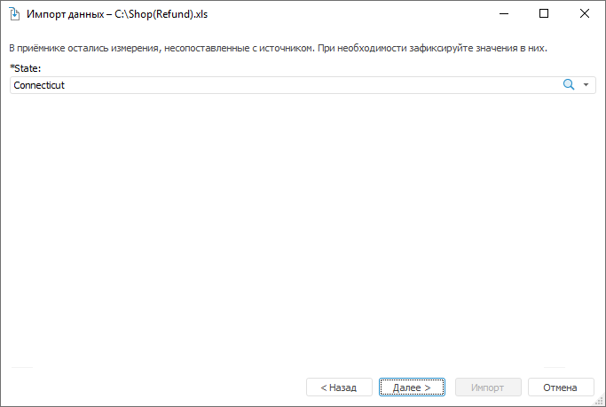

# Фиксация несопоставленных измерений: Импорт данных

Фиксация несопоставленных измерений: Импорт данных
-

Интерфейсы импорта данных в веб-приложении и настольном приложении совпадают.

# Фиксация несопоставленных измерений

Страница отображается, если не все поля источника были [сопоставлены](Map_source_fields_with_existing_consumer_fields.htm)
 с полями измерений приёмника.

Зафиксируйте измерения, выбрав в раскрывающихся списках необходимые
 элементы. К выбранным элементам будет осуществлена привязка импортируемых
 данных.

При нажатии на кнопку «Импорт»
 данные будут импортированы в куб. Если во время импорта возникли какие-либо
 ошибки, то по завершению будет открыто окно «[Конфликты
 импорта данных](conflict_imports.htm)».

См. также:

[Импорт
 данных](Data_import_wizard.htm)

		Справочная
		 система на версию 10.9
		 от 18/08/2025,
		 © ООО «ФОРСАЙТ»,
