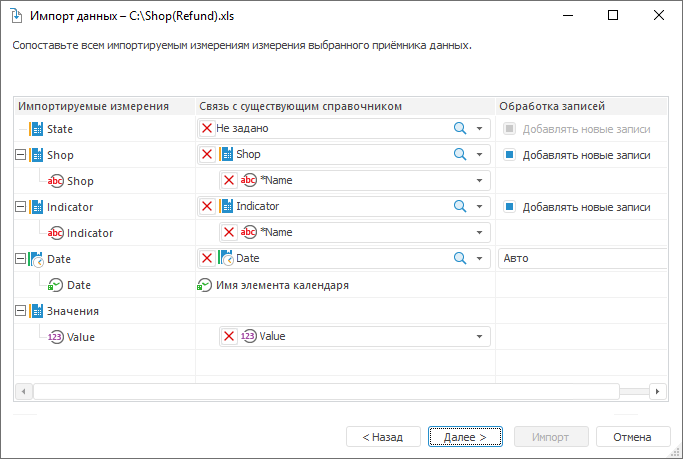

# Сопоставление полей источника с полями существующего приёмника: Импорт данных

Сопоставление полей источника с полями существующего приёмника: Импорт данных
-

Интерфейсы импорта данных в веб-приложении и настольном приложении совпадают.

# Сопоставление полей источника с
 полями существующего приёмника

Страница отображается, если выбран [существующий
 приёмник данных](Select_consumer.htm), и предназначена для связи импортируемых полей с полями
 измерений выбранного приёмника.

Напротив каждого поля из раскрывающихся списков выберите одно из доступных
 полей приёмника. Список доступных полей подбирается по типу данных и имеющимся
 в приёмнике измерениям.

Если сопоставлены все поля, то будет доступна кнопка «Импорт».
 При ее нажатии данные будут импортированы в куб. Если во время импорта
 возникли какие-либо ошибки, то по завершению будет открыто окно «[Конфликты импорта данных](conflict_imports.htm)». Если ошибок
 не было, то будет отображена последняя страница мастера импорта - «[Настройка
 справочников](Directories_Result.htm)».

Если сопоставлены не все поля, то будет доступна кнопка «Далее»,
 при нажатии на которую будет открыта следующая страница мастера, где необходимо
 [зафиксировать несопоставленные измерения
 приёмника](Fix_unmapped_dimensions.htm).

Примечание.
 Во время импорта иерархия элементов справочников, лежащих в основе измерений,
 может быть изменена. Учитывайте имеющиеся особенности при [импорте
 в существующие справочники](Features_Import_Into_An_Existing_Dimensions.htm).

См. также:

[Импорт
 данных](Data_import_wizard.htm) | [Особенности
 импорта в существующие справочники](Features_Import_Into_An_Existing_Dimensions.htm)

		Справочная
		 система на версию 10.9
		 от 18/08/2025,
		 © ООО «ФОРСАЙТ»,
