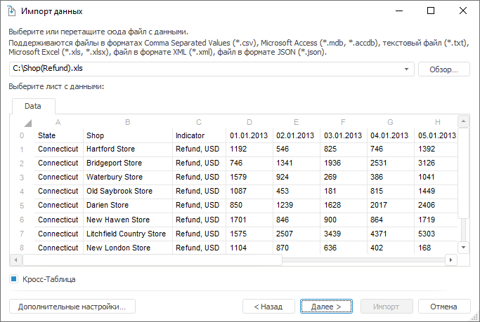
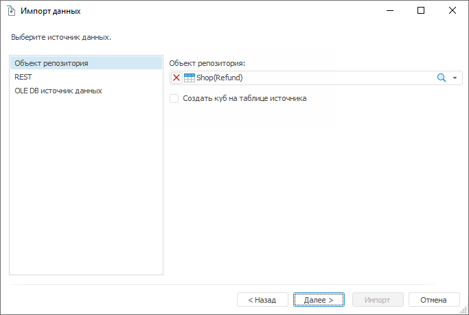
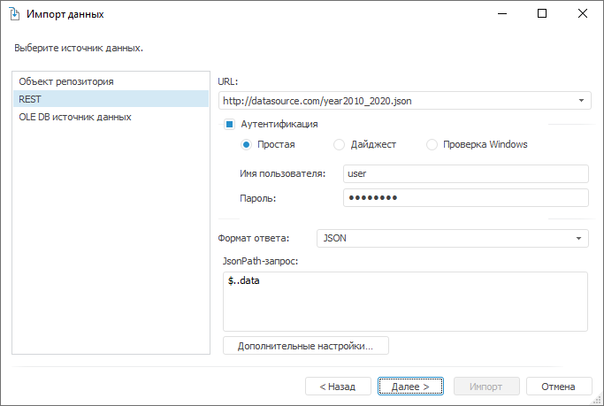
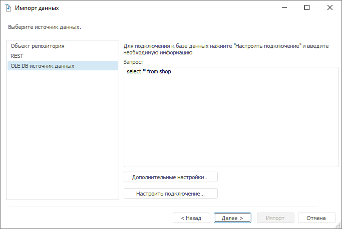

# Выбор источника: Импорт данных

Выбор источника: Импорт данных
-

Интерфейсы импорта данных в веб-приложении и настольном приложении совпадают.

# Выбор источника

На странице «Выбор источника»
 осуществляется выбор источника данных. Внешний вид страницы зависит от
 типа источника, который был выбран на стартовой странице [мастера
 импорта данных](Data_import_wizard.htm#wizard).

## Файл с данными

Если источник - существующий файл, то страница для выбора самого источника
 будет выглядеть следующим образом:

Перед выбором файла-источника ознакомьтесь с [требованиями](file_requirements.htm),
 предъявляемыми к импортируемым файлам.

	- Нажмите кнопку «Обзор»
	 и в открывшемся диалоге выберите файл с данными. По расширению и содержимому
	 будет определен тип файла, его структура и загружены первые сто записей.
	 Идентифицированные поля и записи будут отображены в таблице.

	- Задайте обязательные настройки, которые зависят от типа выбранного
	 файла:

		- Excel. Каждый лист
		 файла будет отображен в виде вкладки с таблицей. Для выбора листа,
		 с которого будут импортироваться данные, перейдите на соответствующую
		 вкладку;

		- Microsoft Access.
		 В дополнительном поле «SQL-запрос»
		 задайте запрос к таблицам базы данных и нажмите кнопку «Выполнить». На основании запроса
		 будут получены и отображены импортируемые данные;

		- XML. В дополнительном
		 поле «XPath-запрос» укажите
		 запрос и нажмите кнопку «Выполнить».
		 На основании запроса будут получены и отображены первые сто записей
		 импортируемых данных;

		- JSON. В дополнительном
		 поле «JSONPath-запрос»
		 укажите запрос и нажмите кнопку «Выполнить».
		 На основании запроса будут получены и отображены первые сто записей
		 импортируемых данных.

	- Нажмите кнопку «Дополнительные
	 настройки», если отображаемое в таблице содержимое не соответствует
	 предполагаемой структуре источника. В открывшемся диалоге «[Дополнительные настройки](additional_settings.htm)» измените
	 настройки, которые используются при идентификации данных.

	- Нажмите кнопку «Далее»
	 для определения дополнительных настроек импорта.

		- Если флажок «Кросс-таблица»
		 снят, то будет осуществлен переход к странице для [корректировки
		 данных](Adjust_Data.htm).

		- Если флажок «Кросс-таблица»
		 установлен, то будут отображены [дополнительные
		 страницы мастера](Cross_Table.htm), позволяющие произвести настройку и идентификацию
		 данных в кросс-таблице. Кросс-таблица
		 - это сводная таблица, в которой заголовки могут располагаться
		 как по строкам, так и по столбцам, позволяя таким образом отразить
		 взаимосвязь двух и более переменных между друг другом.

	- Нажмите кнопку «Импорт»
	 для завершения импорта с установленными по умолчанию настройками.
	 При этом будут созданы все необходимые объекты и стандартный куб,
	 позволяющий работать с импортированными данными. Сохранение происходит
	 в текущей папке навигатора объектов.

## Другой источник

Если выбран [другой источник](Data_import_wizard.htm#wizard),
 то страница для выбора самого источника будет выглядеть следующим образом:

	- Объект
	 репозитория:

В раскрывающемся списке выберите источник
 репозитория. Для выбора доступны наборы данных и справочники.

Установка флажка «Создать куб на таблице
 источника» позволяет создать стандартный куб с привязкой к выбранному
 источнику данных. По умолчанию флажок снят, при этом будет создаваться
 новая таблица и в нее будут импортированы данные из выбранного источника.

	- REST:

В поле «URL»
 укажите адрес REST-сервиса, который предоставляет данные (в текущей реализации
 поддерживается подключение к REST-сервисам, предоставляющим данные в форматах
 JSON и XML). Если для подключения к REST-сервису требуется аутентификация
 пользователя, то установите флажок «Аутентификация»
 и выберите метод проверки пользователя. В полях «Имя
 пользователя» и «Пароль»
 укажите учетные данные пользователя. Указанные параметры будут переданы
 в ядро, обработаны необходимым образом и использованы при подключении
 к REST-сервису.

Важно.
 Если для доступа к REST-сервису требуется подключение к Internet, а оно
 осуществляется через прокси-сервер, то предварительно адрес прокси-сервера
 необходимо указать в [параметрах
 репозитория](UiNav.chm::/02_Navigator/CommonSettings/ProxyServer.htm).

Примечание. С помощью
 языка Fore список доступных для указания REST-сервисов может быть ограничен.
 Более подробно смотрите описание свойства [IMetabasePolicy.HostWhiteList](KeSom.chm::/Interface/IMetabasePolicy/IMetabasePolicy.HostWhiteList.htm).

В списке «Формат ответа» выберите
 формат, в котором приходят данные с REST-сервиса. В зависимости от выбранного
 формата укажите дополнительные настройки:

	- JSON. В поле «JSONPath-запрос» укажите запрос,
	 в соответствии с которым будут отбираться импортируемые данные.

	- XML. В поле «Формат»
	 выберите каким образом организовано хранение данных в XML-файле (поля
	 с данными представлены в виде атрибутов вершин или отдельных дочерних
	 вершин). В поле «XPath-запрос»
	 укажите запрос, в соответствии с которым будут отбираться импортируемые
	 данные.

Примечание.
 При формировании различных условий в запросе учитывайте указываемый тип
 данных. Неявное преобразование типов не поддерживается. Более подробную
 информацию о формировании JSONPath или XPath-запросов можно найти в специализированной
 документации, например в MSDN. Указываемый файл должен быть в кодировке
 UTF-8.

При нажатии кнопки «Дополнительные
 настройки» будет открыт диалог с [дополнительными
 настройками](additional_settings.htm), которые будут использоваться при идентификации данных.

	- OLE DB
	 источник данных:

При нажатии на кнопку «Настроить
 подключение» будет открыт диалог свойств канала передачи данных.
 Выберите драйвер, с помощью которого будет осуществляться подключение,
 и задайте необходимые параметры источника. На основании указанных параметров
 будет сформирована строка подключения и осуществлено подключение к источнику
 данных. При формировании строки подключения используется [глобальная
 переменная](UiNav.chm::/02_Navigator/UiNav_GlobalVariables.htm) %METABASE_OLEDBPARAMS%, которая предназначена
 для хранения дополнительных параметров подключения. Более подробно о параметрах
 подключения к различным источникам читайте в справке по каналу передачи.

После настройки подключения в поле «Запрос» задайте SQL-запрос, который
 будет использоваться для извлечения данных из источника. При нажатии кнопки
 «Настройки» будет открыт диалог
 с [дополнительными настройками](additional_settings.htm), которые
 будут использоваться при идентификации данных.

При нажатии кнопки «Далее» будет
 открыта страница для [корректировки данных](Adjust_Data.htm),
 которые были автоматически распознаны и загружены из источника.

См. также:

[Импорт данных](Data_import_wizard.htm)

		Справочная
		 система на версию 10.9
		 от 18/08/2025,
		 © ООО «ФОРСАЙТ»,
