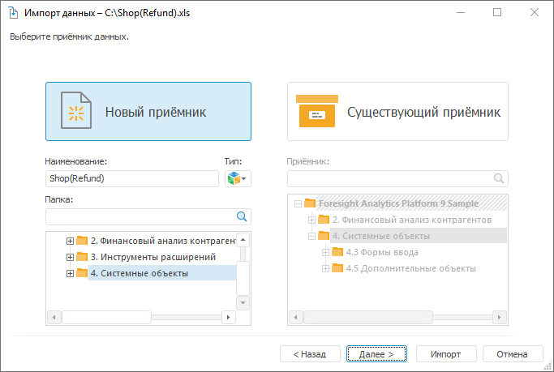

# Выбор приёмника и импорт данных: Импорт данных

Выбор приёмника и импорт данных: Импорт данных
-

Интерфейсы импорта данных в веб-приложении и настольном приложении совпадают.

# Выбор приёмника
 и импорт данных

Для выбора объекта репозитория, который будет являться приёмником данных,
 перейдите на страницу выбора приёмника данных [мастера
 импорта](Data_import_wizard.htm):

## Новый
 приёмник

Для создания нового приёмника данных:

	- Если необходимо, то скорректируйте наименование создаваемого
	 приёмника. По умолчанию берется наименование импортируемого файла/объекта
	 репозитория.

	- Выберите тип приёмника: стандартный куб или базу данных временных
	 рядов.

Примечание.
 При импорте данных из [навигатора
 объектов](GetStarted.chm::/Interface/Interface_Navigator.htm) по умолчанию тип нового приёмника - стандартный
 куб. При импорте данных с помощью инструмента «[Анализ
 временных рядов](UiDw.chm::/UiDw_Title.htm)» или при импорте из [контейнера
 моделирования](UiModelling.chm::/2_Container_of_Modeling/2_2_Window_container/UiModelling_Window_container.htm) по умолчанию тип нового приёмника - база
 данных временных рядов.

	- В дереве объектов выберите папку репозитория, в которой будут
	 созданы приёмник и все необходимые для его работы объекты.

	- Нажмите кнопку «Далее».
	 Будет открыта страница [мастера импорта
	 данных](Data_import_wizard.htm) для сопоставления сформированных измерений с [существующими
	 справочниками репозитория](Compare_source_fields_with_consumer_fields.htm).

## Существующий
 приёмник

Для добавления данных в существующий приёмник:

	- В дереве объектов выберите существующий приёмник: стандартный
	 куб или базу данных временных рядов.

Важно.
 Если импорт осуществляется в существующий приёмник, структура которого
 не соответствует [сформированной структуре
 измерений](Adjust_Dimensions.htm), то структура приёмника будет изменена. Старые данные приёмника
 при этом будут утеряны. Все измерения будут построены на базе справочников
 НСИ и календарей.

	- Нажмите кнопку «Далее».
	 Будет открыта страница [мастера
	 импорта данных](Data_import_wizard.htm) для сопоставления [импортируемых
	 полей источника с полями выбранного приёмника](Map_source_fields_with_existing_consumer_fields.htm).

См. также:

[Импорт
 данных](Data_import_wizard.htm)

		Справочная
		 система на версию 10.9
		 от 18/08/2025,
		 © ООО «ФОРСАЙТ»,
