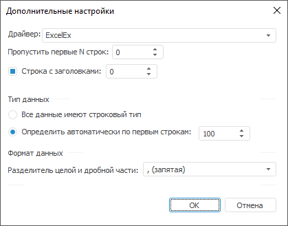
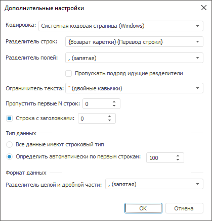
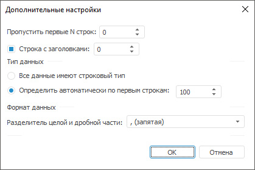
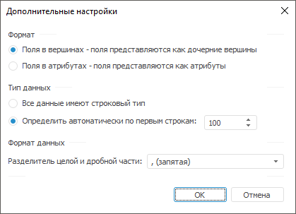

# Дополнительные настройки: Импорт данных

Дополнительные настройки: Импорт данных
-

Интерфейсы импорта данных в веб-приложении и настольном приложении совпадают.

# Дополнительные настройки

Дополнительные настройки используются при идентификации данных из различных
 файлов. Интерфейс диалога зависит от типа выбранного [источника
 данных](Select_and_configure_the_data_source.htm). Можно выделить общие настройки,
 которые всегда одинаковые при работе с любым типом файлов, и специфические
 настройки, набор которых зависит от типа импортируемого файла.

[Для открытия
 диалога](javascript:TextPopup(this))

	На странице [выбора
	 источника](Select_and_configure_the_data_source.htm) нажмите кнопку «Дополнительные
	 настройки».

Окно дополнительных настроек для источника Microsoft Excel (*.xls) выглядит
 следующим образом:

Общие настройки расположены в двух группах:

	- Тип данных. Содержит
	 способы определения типа данных полей:

		- Использовать типы данных,
		 заданные в источнике. Типы данных будут получены из источника
		 данных и преобразованы к сопоставимым типам, используемым в «Форсайт. Аналитическая платформа».
		 Данный пункт доступен только для источников Microsoft Access или
		 OLE DB;

		- Все данные имеют строковый
		 тип. Все данные
		 будут рассматриваться как строковые и импортироваться будут также
		 в строковые поля;

		- Определить автоматически
		 по первым строкам. Укажите количество строк, по которым
		 будет определяться тип данных;

	- Формат данных. Содержит
	 настройки, используемые при определении типа данных:

		- Разделитель целой и дробной
		 части. Задайте разделитель целой и дробной части, который
		 будет использоваться для идентификации вещественных чисел.

## Специфические настройки

[Файлы Comma-Separated
 Values (CSV) и текстовые файлы](javascript:TextPopup(this))

	Окно с дополнительными настройками
	 для CSV/TXT файлов:

	

		- Кодировка. Выберите
		 в раскрывающемся списке кодировку, которая будет использоваться
		 при чтении данных из файла;

		- Разделитель строк.
		 Выберите в раскрывающемся списке или введите с клавиатуры символ,
		 который будет рассматриваться как конец строки с данными;

		- Разделитель полей.
		 Выберите в раскрывающемся списке или введите с клавиатуры символ,
		 который будет рассматриваться как разделитель полей.

			- Пропускать подряд идущие
			 разделители. При установке флажка подряд идущие разделители
			 будут рассматриваться как один разделитель двух полей. По
			 умолчанию флажок снят, при этом подряд идущие разделители
			 будут рассматриваться как разделители полей, содержащих пустые
			 значения;

		- Ограничитель текста.
		 Выберите в раскрывающемся списке или введите с клавиатуры символ,
		 которым должны быть обрамлены строковые значения;

		- Пропустить первые N строк.
		 Укажите количество строк, которые необходимо пропустить. Импорт
		 данных будет производиться со следующей строки;

		- Строка с заголовком.
		 Укажите номер строки, данные которой будут импортированы как заголовки
		 столбцов. По умолчанию заголовки импортируются из первой строки.
		 Снимите флажок, если строка с заголовками отсутствует.

[Microsoft Excel](javascript:TextPopup(this))

	Окно с дополнительными настройками для XLS файлов:

	

		- Драйвер. Выберите
		 драйвер, используемый при работе с файлом. Если выбран драйвер
		 ExcelEx, то набор специфических настроек совпадает с набором для
		 XLSX-файлов;

		- Первая строка содержит
		 заголовки. Установите флажок для импорта заголовков из
		 первой строки файла. Если флажок снят, то заголовки не импортируются;

		- Выборка данных по запросу.
		 Установите флажок и укажите запрос для импорта данных только из
		 определенного диапазона листа. По умолчанию флажок снят, при этом
		 импортируются данные всего листа.

	Окно с дополнительными настройками для XLSX файлов:

	

		- Пропустить первые N строк.
		 Укажите количество строк, которые необходимо пропустить. Импорт
		 данных будет производиться со следующей строки;

		- Строка с заголовком.
		 Укажите номер строки, данные которой будут импортированы как заголовки
		 столбцов. По умолчанию заголовки импортируются из первой строки.
		 Снимите флажок, если строка с заголовками отсутствует.

[XML](javascript:TextPopup(this))

	Окно с дополнительными настройками для XML файлов:

	

	Дополнительные настройки группы «Формат»:

		- Поля в вершинах.
		 Поля располагаются в дочерних вершинах, относительно вершины,
		 указанной в запросе. Имя поля = имя вершины, значение поля = значение
		 вершины;

		- Поля в атрибутах.
		 Поля располагаются в атрибутах вершины. Имя поля = имя атрибута,
		 значение поля = значение атрибута.

См. также:

[Выбор источника](Select_and_configure_the_data_source.htm)

		Справочная
		 система на версию 10.9
		 от 18/08/2025,
		 © ООО «ФОРСАЙТ»,
