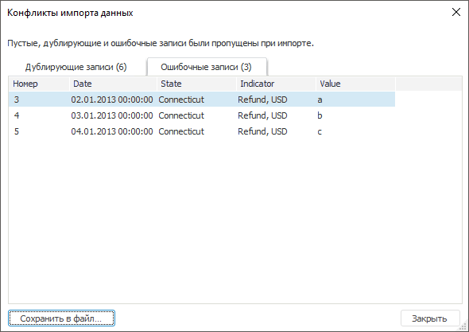

# Просмотр конфликтов импорта данных: Импорт данных

Просмотр конфликтов импорта данных: Импорт данных
-

Интерфейсы импорта данных в веб-приложении и настольном приложении совпадают.

# Просмотр конфликтов импорта данных

Если при импорте возникли какие-либо ошибки и не все данные были импортированы,
 то будет выдано окно:

В окне отображаются элементы и записи, которые не были импортированы
 в приёмник данных.

При нажатии на кнопку «Сохранить в
 файл» появится диалог для сохранения пропущенных записей в файл
 в формате CSV.

## Возможные причины конфликтов импорта

	- Имеются записи, для которых заданы только поля со значениями.
	 Такие записи попадут в список пустых и дублирующихся записей.

	- В полях двух или более импортируемых записей содержатся значения,
	 которые уникальным образом идентифицируют одну и ту же точку с данными.

	- В полях содержатся значения, тип которых не соответствует тому
	 типу, который был [определён](Adjust_Data.htm) для полей.

	- При импорте данных в существующий источник для элементов не
	 задана привязка по всем обязательным атрибутам или отсутствуют права
	 доступа. Элементы в справочник добавлены не будут.

См. также:

[Импорт данных](Data_import_wizard.htm)

		Справочная
		 система на версию 10.9
		 от 18/08/2025,
		 © ООО «ФОРСАЙТ»,
