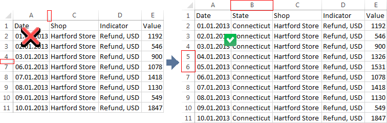
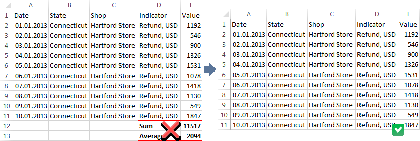

# Требования и рекомендации к источникам данных

Требования и рекомендации к источникам данных
-

Интерфейсы импорта данных в веб-приложении и настольном приложении совпадают.

# Требования и рекомендации к источникам данных

Для корректного импорта в кубы/базы данных временных рядов требуется
 соблюдение определенных требований и рекомендаций к структуре и организации
 данных в файле-источнике.

## Общие рекомендации

	- Значения всех дат должны быть заданы в одном формате. Если используется
	 специфический формат, то должна быть возможность воспроизвести его
	 при [корректировке данных](Adjust_Data.htm).

	- Не используйте разные форматы для указания однотипных данных.
	 Например, для указания всех вещественных значений в файле должен использоваться
	 один и тот же разделитель. Несоблюдение этого условия может повлечь
	 неправильную идентификацию данных, и, как следствие, неполный импорт
	 данных.

	- Для импорта данных из файлов Microsoft Excel и Microsoft Access
	 в операционной системе, разрядность которой 64 бита, «Форсайт. Аналитическая платформа»
	 и Microsoft Office должны быть такой же разрядности.

## Требования к файлам

	- Для импорта в куб в
	 источнике должно быть не менее двух
	 полей с данными.

	- Для импорта в базу данных временных
	 рядов в источнике должно быть не
	 менее трех полей с данными. Одно из полей должно обязательно
	 содержать данные для календарного измерения.

	- При импорте из источника, содержащего кросс-таблицу, кросс-таблица
	 должна содержать не менее двух строк.

## Требования и рекомендации к файлам Microsoft Excel

	- Данные, которые были скрыты с помощью скрытия строк/столбцов
	 при идентификации будут отображены. Если эти данные не должны быть
	 импортированы, то перенесите их на другие листы или удалите из файла.

	- Не используйте расчет каких-либо итоговых данных, так как эти
	 данные будут импортированы в виде отдельной записи.

	- Для импорта данных из файлов Excel с большим объемом данных может
	 потребоваться большое количество оперативной памяти. Для предотвращения
	 такой ситуации перенесите данные из файла Excel в текстовый файл,
	 который будет являться источником данных.

См. также:

[Импорт данных](Data_import_wizard.htm)

		Справочная
		 система на версию 10.9
		 от 18/08/2025,
		 © ООО «ФОРСАЙТ»,
