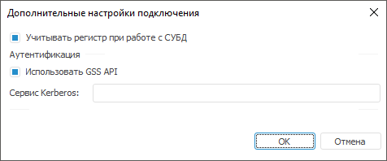
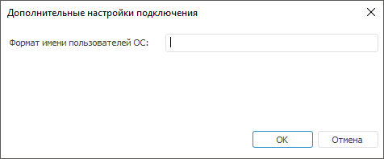
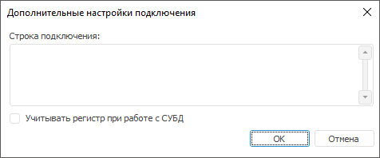

# Дополнительные настройки

Дополнительные настройки
-

# Дополнительные настройки

Окно с дополнительными настройками вызывается
 в настольном приложении при нажатии соответствующей кнопки на странице
 «[Свойства
 базы данных](UiDb_relational_LinkWith_master_property.htm)».
 В зависимости от типа СУБД набор дополнительных параметров будет
 разный.

[PostgreSQL](javascript:TextPopup(this))

	Дополнительные настройки для сервера PostgreSQL:

	

	- Учитывать регистр при работе
	 с СУБД. Установите флажок для работы с репозиторием, объектами
	 и их полями в СУБД с различным регистром символов в их физическом
	 имени при необходимости. После установки флажка объекты базы данных
	 будут доступны только при указании их точного физического имени. Если
	 флажок снят, то наименование репозитория, физические имена объектов
	 и их полей в СУБД преобразуются к нижнему регистру в момент обращения
	 платформы к серверу.

Важно.
 Параметр задаётся один раз при первичной настройке подключения к репозиторию.
 Повторное изменение параметра может привести к потере данных.

Настройки регистрозависимости при заполнении
 параметров подключения к репозиторию должны совпадать с соответствующими
 настройками, заданными при [создании
 репозитория](Setup.chm::/05_RepoMngr/Setup_RepoMngr_CreateRepo.htm#dbms).

		- Использовать GSS API.
		 При установке флажка будет возможность использовать аутентификацию
		 к серверу PostgreSQL по механизму [GSS
		 API](https://www.postgresql.org/docs/9.4/static/auth-methods.html). Установка флага будет доступна только в том случае, если
		 на странице [cвойства
		 базы данных](UiDb_relational_LinkWith_master_property.htm) выбран «Тип аутентификации: Интегрированная доменная»;

		- Сервис Kerberos.
		 Вместе с GSS API используется сервис [Kerberos](https://www.postgresql.org/docs/9.1/static/auth-methods.html#KERBEROS-AUTH).
		 GSS API позволяет использовать разные реализации Kerberos без
		 изменения кода приложения. В строке необходимо указать наименование
		 сервера Kerberos, которое задано в настройках сервера PostgreSQL.
		 Более подробно о API Kerberos можно ознакомиться на [официальном
		 сайте](https://www.postgresql.org/docs/9.1/static/auth-methods.html#KERBEROS-AUTH).

[Oracle](javascript:TextPopup(this))

	Дополнительные настройки для сервера
	 Oracle:

	

		- Формат
		 имени пользователя ОС. Используется при раздаче прав на
		 уровне СУБД. Учитывается при соединении и операциях с БД. Если
		 на сервере задан префикс перед именами пользователей ([параметр
		 OS_AUTHENT_PREFIX](setup.chm::/03_db_server_config/setup_db_server_config_oracle_tuning.htm)), то его также необходимо
		 указать в данном поле. При доменной аутентификации может понадобиться
		 задание формата имен пользователей, так как по умолчанию при доменной
		 аутентификации «Форсайт. Аналитическая платформа»
		 использует следующий формат имен: «ДОМЕН\ИМЯ_ПОЛЬЗОВАТЕЛЯ». Для
		 формирования формата можно использовать статичный текст и следующие
		 теги:

			- $User. Имя пользователя;

			- $Domain. Наименование
			 домена;

			- $FullDomain.
			 Полное наименование домена;

			- $FullDomainUser.
			 Полное доменное имя пользователя (включает имя пользователя
			 и полное имя домена, разделённые символом «@»).

	Примечание.
	 При использовании тегов необходимо соблюдать указанный регистр символов.

	Примеры форматов:

	$User@$Domain.COM

	При данном формате имя пользователя будет выглядеть: «IVANOV@EXAMPLE.COM».

	$Domain@$User

	При данном формате имя пользователя будет выглядеть: «EXAMPLE@IVANOV».

	$User@$FullDomain

	При данном формате имя пользователя будет выглядеть: «IVANOV@EXAMPLE.WORLD.COM».

	$FullDomainUser

	При данном формате имя пользователя будет выглядеть: «IVANOV@EXAMPLE.WORLD.COM».

[Microsoft
 SQL Server](javascript:TextPopup(this))

	Дополнительные настройки для сервера Microsoft
	 SQL Server:

	

		- Строка подключения.
		 По умолчанию в строке подключения содержится [системная
		 глобальная переменная](UiNav.chm::/02_Navigator/UiNav_GlobalVariables.htm) %METABASE_ODBCPARAMS%.
		 Переменная предназначена для хранения дополнительных параметров
		 подключения с использованием драйвера ODBC, заданных в строке
		 подключения при [настройке
		 репозитория](Setup.chm::/06_AK_Client_Config/UiNav_RepoConfig_repo1.htm). При необходимости задайте дополнительные
		 параметры подключения вручную.

	Также для использования драйвера OLE
	 DB в строке подключения укажите глобальную переменную %METABASE_OLEDBPARAMS%.
	 Переменная предназначена для хранения дополнительных параметров подключения,
	 заданных вручную. Поддерживаемые параметры в разных версиях драйвера
	 OLE DB могут отличаться. Для получения подробной информации обратитесь
	 к документации [Microsoft](https://docs.microsoft.com/ru-ru/sql/connect/oledb/applications/using-connection-string-keywords-with-oledb-driver-for-sql-server?view=sql-server-ver15);

	- Учитывать регистр при работе
	 с СУБД. Установите флажок для работы с репозиторием, объектами
	 и их полями в СУБД с различным регистром символов в их физическом
	 имени при необходимости. После установки флажка объекты базы данных
	 будут доступны только при указании их точного физического имени. Если
	 флажок снят, то наименование репозитория, физические имена объектов
	 и их полей в СУБД преобразуются к нижнему регистру в момент обращения
	 платформы к серверу.

Важно.
 Параметр задаётся один раз при первичной настройке подключения к репозиторию.
 Повторное изменение параметра может привести к потере данных.

Настройки регистрозависимости при заполнении
 параметров подключения к репозиторию должны совпадать с соответствующими
 настройками, заданными при [создании
 репозитория](Setup.chm::/05_RepoMngr/Setup_RepoMngr_CreateRepo.htm#dbms).

[Microsoft
 SQL Server (ODBC)](javascript:TextPopup(this))

	Дополнительные настройки для сервера Microsoft
	 SQL Server (ODBC):

	

		- Строка подключения.
		 По умолчанию в строке подключения содержится [системная
		 глобальная переменная](UiNav.chm::/02_Navigator/UiNav_GlobalVariables.htm) %METABASE_ODBCPARAMS%.
		 Переменная предназначена для хранения дополнительных параметров
		 подключения с использованием драйвера ODBC, заданных в строке
		 подключения при [настройке
		 репозитория](Setup.chm::/06_AK_Client_Config/UiNav_RepoConfig_repo1.htm). При необходимости задайте дополнительные
		 параметры подключения вручную;

	- Учитывать регистр при работе
	 с СУБД. Установите флажок для работы с репозиторием, объектами
	 и их полями в СУБД с различным регистром символов в их физическом
	 имени при необходимости. После установки флажка объекты базы данных
	 будут доступны только при указании их точного физического имени. Если
	 флажок снят, то наименование репозитория, физические имена объектов
	 и их полей в СУБД преобразуются к нижнему регистру в момент обращения
	 платформы к серверу.

Важно.
 Параметр задаётся один раз при первичной настройке подключения к репозиторию.
 Повторное изменение параметра может привести к потере данных.

Настройки регистрозависимости при заполнении
 параметров подключения к репозиторию должны совпадать с соответствующими
 настройками, заданными при [создании
 репозитория](Setup.chm::/05_RepoMngr/Setup_RepoMngr_CreateRepo.htm#dbms).

См. также:

[Подключение к другому репозиторию](UiDb_relational_LinkWith.htm)

		Справочная
		 система на версию 10.9
		 от 18/08/2025,
		 © ООО «ФОРСАЙТ»,
