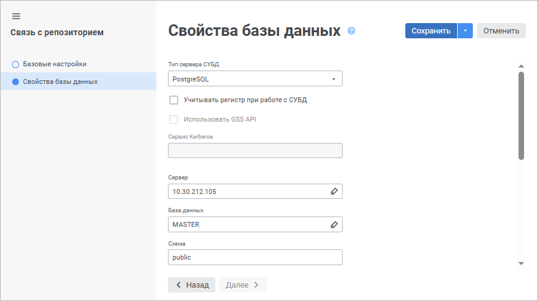
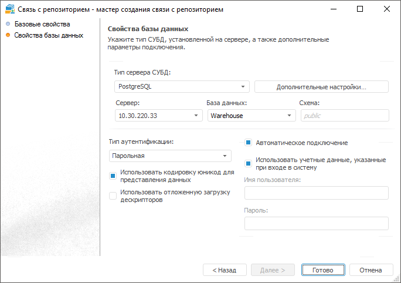

# Подключение к другому репозиторию

Подключение к другому репозиторию
-

# Подключение к другому репозиторию

Объект «Связь с репозиторием»
 дает возможность получить доступ из текущего репозитория к объектам других
 репозиториев. Используя связь с репозиторием, можно создавать [ярлыки](../UiNavObj_label.htm)
 на объекты репозитория, с которым установлена связь.

Для создания связи с репозиторием в навигаторе объектов:

	- в веб-приложении нажмите кнопку  «Создать» в главном меню и выберите
	 тип объекта на боковой панели «[Новый объект](UiNav.chm::/02_Navigator/General_Principles_of_Work.htm#add_object)»;

	- в настольном приложении:

		- выполните команду контекстного меню «Создать >
		 Другие > Связь с репозиторием»;

		- выполните команду «Новый
		 объект > Другие > Связь с репозиторием»
		 в группе «Создать» на
		 вкладке ленты «[Главная](GetStarted.chm::/Interface/Interface_Description.htm#customize_ribbon)».

После выполнения одного из действий будет открыт мастер связи с репозиторием.

	 Веб-приложение Настольное приложение

		

		

Мастер содержит следующие страницы:

	- [Базовые
	 настройки/Базовые свойства](base_settings.htm). Задаются наименование объекта,
	 идентификатор и примечание;

	- [Свойства
	 базы данных](UiDb_relational_LinkWith_master_property.htm). Задаются настройки подключения к базе репозитория,
	 с которым необходимо создать связь.

## Работа со связью с репозиторием

[Редактирование
 настроек](javascript:TextPopup(this))

	Для редактирования связи с репозиторием выделите соответствующий
	 объект в [навигаторе
	 объектов](GetStarted.chm::/Interface/Interface_Navigator.htm) и выполните одно из действий:

		- в веб-приложении:

			- выполните команду «Редактировать»
			 в контекстном меню таблицы;

			- выполните команду «Редактировать
			 в новой вкладке» в контекстном меню таблицы;

			- выполните команду «Редактировать
			 в новом окне» в контекстном меню таблицы;

			- нажмите клавишу F4.

		- в настольном приложении:

			- нажмите кнопку 
			 «Редактировать» на вкладке
			 «Главная» ленты инструментов;

			- выполните команду «Редактировать»
			 в контекстном меню таблицы;

			- нажмите клавишу F4.

	После выполнения одного из действий будет открыт мастер связи с
	 репозиторием. Измените настройки на соответствующих страницах мастера.

[Сохранение
 настроек](javascript:TextPopup(this))

	Для сохранения настроек в мастере связи с репозиторием:

		- в веб-приложении:

			- нажмите кнопку «Сохранить»;

			- выполните команду «Сохранить
			 и закрыть» в раскрывающемся меню кнопки «Сохранить».
			 После этого будут сохранены заданные настройки, закрыт мастер
			 и выполнен переход в [навигатор
			 объектов](getstarted.chm::/Interface/Interface_Navigator.htm);

	Примечание.
	 Команда «Сохранить и закрыть»
	 доступна только при[ редактировании
	 настроек](UiDb_relational_LinkWith.htm#edit).

		- в настольном приложении нажмите кнопку «Готово».

См. также:

[Подключение
 к внешним базам данных](../connect_to_database.htm) | [IMetabaseLink](kesom.chm::/interface/imetabaselink/imetabaselink.htm)

		Справочная
		 система на версию 10.9
		 от 18/08/2025,
		 © ООО «ФОРСАЙТ»,
