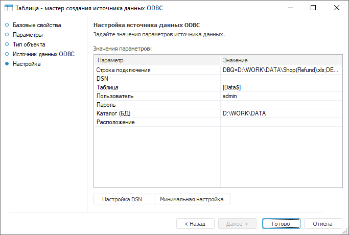

# Страница «Настройка источника данных ODBC»

Страница «Настройка источника данных ODBC»
-

# Настройка

На странице «Настройка» задаются
 значения параметров источника данных:

На данной странице определяются следующие параметры:

	- Строка подключения.
	 Параметры подключения к источнику данных (заполняется автоматически);

	- DSN. Наименование источника
	 данных (заполняется автоматически);

	- Таблица. Имя таблицы,
	 файла или листа книги Excel (в зависимости от типа источника), используемого
	 в качестве источника данных;

	- Пользователь. Имя пользователя,
	 используемое при подключении к серверу;

	- Пароль. Пароль пользователя,
	 используемый при подключении к серверу;

	- Каталог (БД). Каталог,
	 в котором находится подключаемый источник данных;

	- Расположение. В стадии
	 разработки.

Если создаётся новый источник данных, то нажмите кнопку «Минимальная
 настройка» для настройки драйвера. Для получения более подробной
 информации по установке драйверов для внешних источников необходимо обратиться
 к стандартной справке ODBC, которая вызывается при нажатии на кнопку «Справка» в каждом окне установки
 драйверов для выбранных источников.

В случае если на странице «Источник
 данных ODBC» установлен флажок «На
 основе существующего», для настройки драйверов необходимо воспользоваться
 кнопкой «Настройка DSN». Данная
 кнопка будет доступна, если в операционной системе отключен контроль учетных
 записей (UAC) или запуск «Форсайт. Аналитическая платформа»
 выполнен с правами администратора ОС.

В зависимости от выбранного драйвера открываемые диалоги будут иметь
 различный вид. Пример диалога для настройки драйвера Microsoft Excel:

См. также:

[Источник
 данных ODBC](../UiDb_relational_ODBC.htm)

		Справочная
		 система на версию 10.9
		 от 18/08/2025,
		 © ООО «ФОРСАЙТ»,
