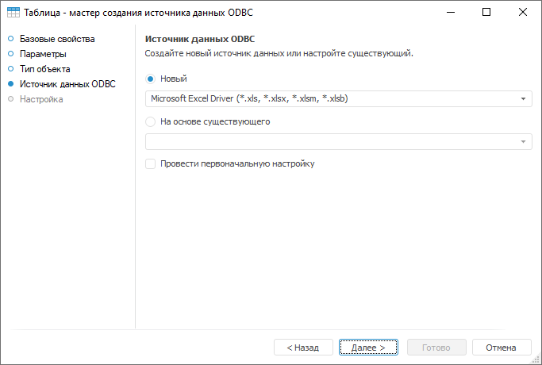
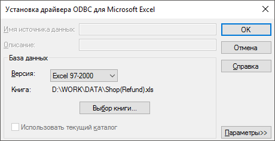
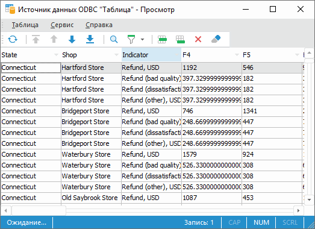

# Пример создания источника данных ODBC

Пример создания источника данных ODBC
-

# Пример создания источника данных ODBC

Рассмотрим пример подключения к XLS-файлу с помощью объекта «Источник
 данных ODBC».

Для создания источника данных ODBC необходимо в окне «Навигатор
 объектов» выполнить:

	- пункт контекстного меню «Создать >
	 Таблица»;

	- команду «Новый объект >
	 Таблица» в группе «Создать»
	 на вкладке ленты «[Главная](GetStarted.chm::/Interface/Interface_Description.htm#customize_ribbon)».

После выполнения одного из действий будет открыт [мастер
 таблицы](../Table/Master/object_type_page.htm). На странице «Тип объекта»
 установите переключатель напротив пункта «Источник
 данных ODBC». Перейдите на следующую страницу мастера. Будет открыто
 окно:

В качестве источника используем файл Microsoft
 Excel. Установите переключатель
 «Новый» и выберите в раскрывающемся
 списке драйвер «Microsoft Excel Driver
 (*.xls)». Перейдите на следующую страницу мастера и нажмите кнопку
 «Минимальная настройка». Будет
 открыто окно «Установка драйвера ODBC
 для Microsoft Excel»:

Нажмите на кнопку «Выбор книги».
 В открывшемся окне укажите файл, используемый для загрузки данных:

После выбора файла страница мастера примет примерно следующий вид:

Для завершения создания источника данных ODBC нажмите на кнопку «Готово». Если все сделано правильно,
 то созданный источник данных ODBC появится в навигаторе объектов.

После создания источника данных ODBC можно открыть его в режиме просмотра
 (редактирования).

Для трансформации загруженных данных в таблицу необходимо воспользоваться
 объектом «Задача ETL». Описание
 и принципы работы с источником данных ODBC представлены в разделе «[Работа
 с набором данных](../Table/Work/UiDb_relational_table_work.htm)».

См. также:

[Источник данных ODBC](UiDb_relational_ODBC.htm) |
 [Основное
 окно задачи ETL](../../UiETL/desktop/01_General_Info/UiETL_General.htm)

		Справочная
		 система на версию 10.9
		 от 18/08/2025,
		 © ООО «ФОРСАЙТ»,
