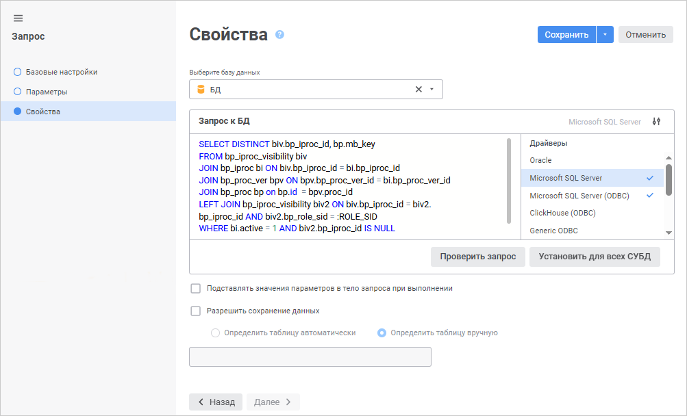

# Страница «Свойства запроса»: Запрос

Страница «Свойства запроса»: Запрос
-

# Свойства запроса

На странице «Свойства» определяется
 база данных, в которую будет помещен запрос, а также текст запроса.

	Веб-приложение Настольное приложение

		

		На данной странице определите параметры:

			- Выберите базу данных.
			 Выберите базу данных, в которую будет помещен запрос, в раскрывающемся
			 списке. Использование базы данных СУБД ClickHouse доступно
			 только в веб-приложении.

Для быстрого выбора объекта в поле для поиска введите его название/идентификатор/ключ,
 в зависимости от настроек отображения. Поиск будет выполняться автоматически
 по мере ввода текста. Список будет содержать объекты, наименования/идентификаторы/ключи
 которых содержат вводимый текст.

Для настройки отображения объектов репозитория в списке нажмите кнопку
  «Отображение
 объекта» и выберите в раскрывающемся меню вариант отображения:

	- Наименование. Объекты
	 отображаются под своими наименованиями. Вариант по умолчанию;

	- Идентификатор. Объекты
	 отображаются под своими идентификаторами;

	- Ключ. Объекты отображаются
	 под своими ключами.

Выбрать можно несколько вариантов. Идентификатор и ключ будут указаны
 в скобках.

Для сброса отметки выбранных объектов нажмите кнопку 
 «Очистить»;

	- Запрос к БД. Сформируйте
	 запрос к БД на языке SQL в соответствии с синтаксисом, который установлен
	 для выбранного драйвера СУБД.

Напротив поля «Запрос
 к БД» отображается выбранный драйвер СУБД и список драйверов. По
 умолчанию в списке драйверов выделен драйвер, используемый при [настройке
 подключения к репозиторию](setup.chm::/06_ak_client_config/uinav_repoconfig_repo1.htm). Если для одного или нескольких
 драйверов указан запрос, то в списке драйверов будет установлена отметка.

Для скрытия/отображения списка драйверов
 используйте кнопку  «Скрыть список драйверов»/«Отобразить список драйверов».

Для проверки корректности сформированного
 запроса нажмите кнопку «Проверить запрос».

Для установки указанного запроса к БД для
 всех СУБД нажмите кнопку «Установить
 для всех СУБД». После чего будет открыто окно подтверждения. Если
 хотя бы для одного драйвера, отличного от текущего, уже указан запрос,
 то при положительном ответе все существующие запросы будут замещены текущим.

			- Подставлять значения
			 параметров в тело запроса при выполнении. Установите
			 флажок для подстановки всех значений параметров в тело запроса
			 при его [выполнении](../Query.htm). Значения подставляются
			 вместо [наименований параметров](parameters.htm)
			 соответствующих SQL-литералов, заданных при формировании текста
			 запроса. По умолчанию флажок снят, в тело запроса подставляются
			 только те значения параметров, которые являются массивами,
			 а остальные значения передаются через [параметры](parameters.htm).
			 Время выполнения запроса зависит от используемых типов данных
			 параметров и может сократиться при установленном флажке;

			- Разрешить сохранение
			 данных. Если флажок установлен, становятся доступными
			 для редактирования следующие параметры группы:

			-

				- Определить таблицу
				 автоматически. При установке переключателя после
				 нажатия кнопки «Сохранить»
				 на последней странице мастера таблица для сохранения данных
				 будет определена автоматически. Если определить таблицу
				 не удалось, будет выдано соответствующее сообщение:

					- при нажатии кнопки «Да»
					 запрос будет сохранён;

					- при нажатии кнопки «Нет»
					 все изменения будут отменены, мастер запроса будет
					 закрыт;

					- при нажатии кнопки «Отменить»
					 сообщение будет закрыто;

				- Определить таблицу
				 вручную. В поле ввода задайте таблицу для сохранения
				 данных.

		Для завершения работы мастера нажмите кнопку «Сохранить»,
		 после чего будет произведено сохранение запроса. При сохранении
		 запроса происходит:

			- обновление полей объектов, на которые ссылается запрос;

			- проверка текста запроса на корректность. Если текст
			 запроса содержит ошибки, будет выдано сообщение.

		

		Определите параметры:

			- База данных.
			 В раскрывающемся списке выберите базу данных, в которую будет
			 помещен запрос. После выбора базы данных драйвер, используемый
			 ей, будет автоматически указан в списке «Драйвер»;

			- Драйвер. В раскрывающемся
			 списке выберите тип драйвера. Более подробно о доступных драйверах
			 читайте в подразделе «[Поддерживаемые
			 СУБД](Setup.chm::/01_SysReq/database_Support.htm)». В списке «Драйвер»
			 по умолчанию отображается драйвер, который используется в
			 выбранной базе данных. При необходимости можно выбрать другой
			 драйвер и указать для него текст SQL-запроса. Параметр актуален,
			 если репозиторий будет использоваться на серверах с различными
			 СУБД и настройки базы данных в репозитории будут изменены;

			- Текст запроса.
			 В поле сформируйте запрос, написанный на языке SQL. Для удобства
			 использования в редакторе SQL-запроса реализован [механизм
			 поиска и замены](UiDb_relational_query_master_PropertySearch.htm). При смене базы данных автоматически сменится
			 драйвер и в поле «Текст запроса»
			 будет отображаться запрос, соответствующий установленному
			 драйверу;

			- Проверить запрос.
			 Кнопка позволяет проверить сформированный текст запроса на
			 корректность. При нажатии на кнопку будет выдано сообщение
			 о наличии или отсутствии ошибок в тексте запроса;

			- Установить для всех
			 СУБД. Кнопка позволяет установить текст запроса для
			 всех СУБД, то есть при смене драйвера текст запроса останется
			 прежним. При нажатии на кнопку будет выдано подтверждение
			 на производимое действие. При положительном ответе текст запроса
			 будет указан для всех СУБД. Запрос на подтверждение действия
			 выдается только в том случае, если хотя бы для одного драйвера,
			 отличного от текущего, текст запроса непустой;

			- Разрешить сохранение
			 данных. Если флажок установлен, становятся доступными
			 для редактирования следующие параметры группы:

				- Определить таблицу
				 автоматически. При установке переключателя после
				 нажатия кнопки «Готово»
				 на последней странице мастера таблица для сохранения данных
				 будет определена автоматически. Если определить таблицу
				 не удалось, будет выдано соответствующее сообщение:

					- при нажатии кнопки «Да»
					 запрос будет сохранён;

					- при нажатии кнопки «Нет»
					 все изменения будут отменены, мастер запроса будет
					 закрыт;

					- при нажатии кнопки «Отмена»
					 сообщение будет закрыто;

				- Определить таблицу
				 вручную. В поле ввода задайте таблицу для сохранения
				 данных;

		Примечание.
		 Для использования подзапросов в кубе, построенном на основе запроса,
		 установите флажок «[Использовать подзапросы при извлечении
		 данных](../../Cube/CreateCube/Master_Standart/UiMd_Cube_CreateCube_Master_Standart_2.htm)» в мастере стандартного куба.

			- Подставлять параметры
			 в тело запроса при выполнении. Установите флажок для
			 подстановки всех значений параметров в тело запроса при его
			 [выполнении](../Query.htm#view). Значения подставляются
			 вместо [наименований параметров](parameters.htm)
			 соответствующих SQL-литералов, заданных при формировании текста
			 запроса. По умолчанию флажок снят, в тело запроса подставляются
			 только те значения параметров, которые являются массивами,
			 а остальные значения передаются через [параметры](parameters.htm).
			 Время выполнения запроса зависит от используемых типов данных
			 параметров и может сократиться при установленном флажке.

		Для завершения работы мастера нажмите кнопку «Готово»,
		 после чего будет произведено сохранение запроса. При сохранении
		 запроса происходит:

			- обновление полей объектов, на которые ссылается запрос;

			- проверка текста запроса на корректность. Если текст
			 запроса содержит ошибки, будет выдано сообщение.

См. также:

[Запрос](../Query.htm)

		Справочная
		 система на версию 10.9
		 от 18/08/2025,
		 © ООО «ФОРСАЙТ»,
