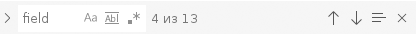
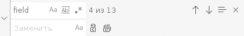
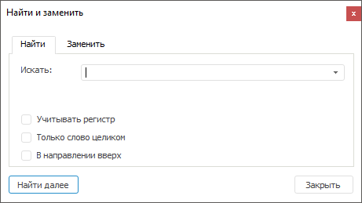
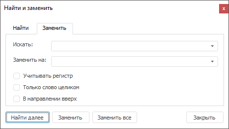

# Поиск и замена в тексте запроса

Поиск и замена в тексте запроса
-

# Поиск и замена в тексте запроса

Для удобства использования в редакторе SQL-запроса реализован механизм
 поиска и замены по тексту. В веб-приложении поиск и замена осуществляются
 с помощью всплывающей панели поиска и замены, в настольном приложении -
 с помощью окна поиска и замены.

	Веб-приложение Настольное приложение

		Для поиска откройте всплывающую панель поиска с помощью сочетания
		 клавиш CTRL+F:

		

		В поле «Найти» введите
		 строку для поиска. Выберите необходимые параметры:

			- . Различаются
			 заглавные и прописные буквы. Также используйте сочетание клавиш
			 ALT+C;

			- . Поиск осуществляется
			 по целому слову, иначе по подстроке. Также используйте сочетание
			 клавиш ALT+W;

			- . Поиск
			 осуществляется с использованием регулярных выражений. Также
			 используйте сочетание клавиш ALT+R.

		Для перехода к следующему соответствию нажмите кнопку  «Далее»
		 либо клавишу ENTER.

		Для перехода к предыдущему соответствию нажмите кнопку  «Назад»
		 либо сочетание клавиш ENTER+INSERT.

		Для поиска в выделенном диапазоне строк нажмите кнопку  «Найти в выделенном» либо
		 сочетание клавиш ALT+L.

		При достижении окончания текста запроса - поиск начинается с
		 начала.

		Для того чтобы открыть всплывающую панель поиска и замены в
		 поле «Текст запроса» нажмите
		 сочетание клавиш CTRL+H или, если открыта панель поиска, нажмите кнопку  «Панель
		 поиска и замены»:

		

		В поле «Найти» введите
		 строку для поиска. В поле «Заменить»
		 укажите текст, на который необходимо заменить найденный текст.
		 Выберите необходимые параметры:

			- . Различаются
			 заглавные и прописные буквы.

		При первом нажатии кнопки  «Заменить» или клавиши ENTER
		 осуществляется поиск и переход к первой найденной строке, при
		 повторном нажатии найденный текст заменяется и осуществляется
		 переход к следующей строке, которая удовлетворяет параметрам поиска.

		Для замены всех найденных строк нажмите кнопку  «Заменить
		 все» или сочетание клавиш CTRL+ALT+ENTER.

		Для поиска откройте окно поиска и замены на вкладке
		 «Найти» с помощью сочетания
		 клавиш CTRL+F:

		

		Для поиска введите строку поиска в поле «Искать»
		 и задайте требуемые параметры:

			- Учитывать регистр.
			 Различаются заглавные и прописные буквы;

			- Только слово целиком.
			 Поиск осуществляется по целому слову, иначе по подстроке;

			- В направлении вверх.
			 Поиск осуществляется от места установки курсора до начала
			 SQL запроса.

		Для поиска и замены откройте окно поиска и замены на вкладке
		 «Заменить» с помощью сочетания
		 клавиш CTRL+H или, если окно уже открыто, перейдите на вкладку
		 «Заменить»:

		

		Введите в поле «Заменить на»
		 строку, на которую требуется заменить строку «Искать».

		При первом нажатии кнопки «Заменить»
		 осуществляется поиск и переход к первой найденной строке, при
		 повторном нажатии найденный текст заменяется и осуществляется
		 переход к следующей строке, которая удовлетворяет параметрам поиска.

		Если необходимо осуществить сразу все замены, следует нажать
		 кнопку «Заменить все»,
		 после чего на экран выдается сообщение, содержащее количество
		 выполненных замен.

См. также:

[Свойства запроса](UiDb_relational_query_master_Property.htm) |
 [Запрос](../Query.htm)

		Справочная
		 система на версию 10.9
		 от 18/08/2025,
		 © ООО «ФОРСАЙТ»,
