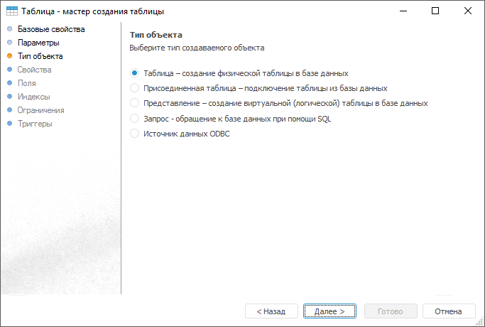
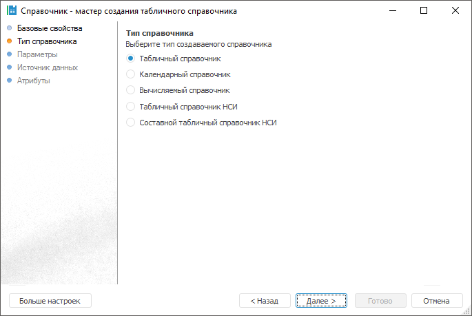

# Структурированый набор данных

Структурированый набор данных
-

# Структурирование наборов данных

Структурированные наборы данных - это класс объектов репозитория,
 предназначенных для создания конструкций данных, формирования базовых
 элементов для многомерных источников данных и управления нормативно-справочной
 информацией.

К структурированным наборам данных относятся:

	- [табличные наборы
	 данных](../Table/Master/object_type_page.htm):

	Веб-приложение Настольное приложение

		

		

	- [справочники](../reference_book/Create.htm):

	Веб-приложение Настольное приложение

		

		

	- [многомерные структуры данных](../Cube/UiMd_Cube_Type.htm):

	Веб-приложение Настольное приложение

		

		

	- [прочие объекты](../UiNavObj_Other_objects.htm):

	Веб-приложение Настольное приложение

		

		

См. также:

[Создание
 табличных наборов данных](../Table/Master/object_type_page.htm) | [Создание
 справочников](../reference_book/Create.htm) | [Создание
 многомерных структур данных](../Cube/UiMd_Cube_Type.htm) | [Создание
 прочих объектов](../UiNavObj_Other_objects.htm)

		Справочная
		 система на версию 10.9
		 от 18/08/2025,
		 © ООО «ФОРСАЙТ»,
