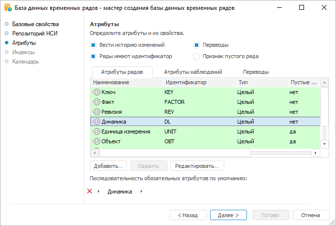

# Настройка атрибутов: База данных временных рядов

Настройка атрибутов: База данных временных рядов
-

# Настройка атрибутов

Для каждого временного ряда существует две группы атрибутов:

	- Атрибуты рядов. Набор
	 характеристик, совокупность значений которых однозначно идентифицирует
	 временной ряд;

	- Атрибуты наблюдений.
	 Набор характеристик, который будет иметь каждое наблюдение ряда.

По умолчанию база данных временных рядов уже содержит минимальный набор
 системных атрибутов рядов и системных атрибутов наблюдений. Они подсвечены
 зелёным цветом и их удаление запрещено.

Для работы с каждой группой атрибутов предназначена
 соответствующая вкладка на странице «Атрибуты»:

Задайте общие параметры:

[Вести историю
 изменений](javascript:TextPopup(this))

	Определите, сохранять ли историю изменений временных рядов. По умолчанию
	 флажок «Вести историю изменений»
	 установлен, история изменений сохраняется, т.е. база данных временных
	 рядов является версионной.

	Для оптимизации работы с БД временных рядов, содержащих большой
	 объём данных, рекомендуется отключать версионность.

	Изменение состояния флажка доступно только при создании БД временных
	 рядов. При последующих открытиях мастера флажок отображает состояние,
	 которое было задано при создании БД.

[Ряды имеют
 идентификатор](javascript:TextPopup(this))

	Определите, использовать ли мнемоники для идентификации рядов. По
	 умолчанию флажок «Ряды имеют идентификатор»
	 установлен, мнемоники используются для идентификации рядов.

	Мнемоника - это уникальное
	 значение, генерируемое на основе значений атрибутов временного ряда.

	Подробное описание приведено
	 в разделе «[Как
	 настроить автоматическую генерацию мнемоник?](UiDw.chm::/FAQ/AutoMnemonics.htm)».

[Переводы](javascript:TextPopup(this))

	Укажите, будет ли доступен перевод наименований атрибутов на другие
	 языки. Если флажок «Переводы»
	 установлен, то станет доступна вкладка «Переводы»,
	 где можно добавить [переводы
	 для наименований атрибутов](UiNav.chm::/Multilanguage/AttrTranslate.htm).

	Примечание.
	 Перевод наименований доступен, если для репозитория задан язык по
	 умолчанию. Выбрать язык по умолчанию для репозитория можно один раз:
	 при [создании
	 репозитория](setup.chm::/05_RepoMngr/Setup_RepoMngr_CreateRepo.htm) или позднее в [настройках
	 репозитория](setup.chm::/06_ak_client_config/uinav_repoconfig_repo1.htm#more).

[Признак пустого
 ряда](javascript:TextPopup(this))

	Определите, должны ли ряды иметь признак пустоты. По умолчанию флажок
	 «Признак пустого ряда» снят
	 и у рядов отсутствует признак пустоты. Ряд считается пустым, если
	 в БД временных рядов отсутствует ревизия, содержащая информацию о
	 данном ряде. Если флажок «Признак
	 пустого ряда» установлен, то ряд имеет признак пустоты. Таким
	 образом, ряд считается пустым, если он не содержит данных.

## Операции с атрибутами

При работе с атрибутами доступны следующие операции:

[Добавление
 атрибута](javascript:TextPopup(this))

	Для добавления атрибута:

		- нажмите кнопку «Добавить»
		 или выполните одноименную команду контекстного меню вкладки;

		- дважды щёлкните по пустому пространству вкладки;

		- нажмите клавишу INSERT.

	Будет открыт диалог «Свойства атрибута».

[Редактирование
 свойств атрибута](javascript:TextPopup(this))

	Для редактирования свойств выбранного атрибута:

		- нажмите кнопку «Редактировать»
		 или выполните одноименную команду контекстного меню атрибута;

		- дважды щёлкните по атрибуту.

	Будет открыт диалог «Свойства атрибута».

[Удаление атрибута](javascript:TextPopup(this))

	Для удаления выбранного атрибута:

		- нажмите кнопку «Удалить»;

		- выполните одноименную команду в контекстном меню атрибута.

	Будет запрошено подтверждение выполняемого действия.

	Примечание.
	 Удаление доступно только для атрибутов, созданных пользователем.

[Перевод наименований
 атрибута на другие языки](javascript:TextPopup(this))

	Перевод атрибутов на другие языки является одним из шагов в [создании мультиязычной](UiDw.chm::/FAQ/Translation.htm)
	 базы данных временных рядов.

	Для перевода атрибутов на другие языки установите флажок «Переводы». Будет отображена дополнительная
	 вкладка «[Переводы](UiNav.chm::/Multilanguage/AttrTranslate.htm)»,
	 на которой задайте переводы атрибутов.

	Примечание.
	 Перед переводом атрибутов убедитесь, что для репозитория задан [язык
	 по умолчанию](setup.chm::/06_ak_client_config/uinav_repoconfig_repo1.htm#more).

	Для получения подробной информации
	 о настройке мультиязычности содержимого репозитория и общей системы
	 обратитесь к разделу «[Настройка
	 мультиязычности](uinav.chm::/Multilanguage/Multilanguage_setting.htm)».

[Настройка
 последовательности обязательных атрибутов по умолчанию](javascript:TextPopup(this))

	Задайте в цепочке навигации последовательность обязательных атрибутов.
	 Настроенная последовательность атрибутов будет по умолчанию отображаться
	 в [дереве
	 рядов](UiDw.chm::/Purpose/UiDw_Purpose_Object.htm)
	 [рабочей
	 книги](UiDw.chm::/Workbook/UiDw_Workbook.htm).

	Настройка последовательности атрибутов доступна как при создании,
	 так и при редактировании базы данных временных рядов.

	Примечание.
	 При создании базы данных временных рядов по умолчанию в цепочке навигации
	 отображается атрибут «Динамика»,
	 содержащий значение календарной динамики.

	Для формирования последовательности атрибутов в цепочке навигации
	 используйте следующие операции:

		- Добавление атрибута в цепочку
		 навигации. Нажмите на кнопку  «Добавить атрибут» в цепочке
		 навигации и выберите необходимый атрибут из списка;

	Примечание.
	 В списке атрибутов отображаются только те атрибуты, для которых установлен
	 тип «Ссылка на справочник»
	 и снят флажок «Скрытый атрибут».
	 Подробное описание настройки атрибута приведено в разделе «Свойства
	 атрибута».

		- Удаление атрибута.
		 Вызовите меню необходимого атрибута и выполните команду «Удалить»;

		- Изменение порядка следования
		 атрибута. Вызовите меню необходимого атрибута и выполните
		 команду «Влево/Вправо»;

		- Сброс последовательности
		 атрибутов. Нажмите кнопку  «Очистить» в цепочке навигации
		 или выполните команду «Очистить
		 цепочку» в контекстном меню любого атрибута.

	Для восстановления последовательности атрибутов по умолчанию нажмите
	 на кнопку  в цепочке навигации и выберите пункт
	 «Порядок по умолчанию». Будет
	 установлена последовательность атрибутов, настроенная в базе данных
	 временных рядов.

	Для настройки значений атрибутов доступны следующие операции:

		- Сортировка значений атрибутов.
		 Сортировка влияет на порядок отображения значений атрибутов в
		 [дереве
		 рядов](UiDw.chm::/Purpose/UiDw_Purpose_Object.htm)
		 [рабочей
		 книги](UiDw.chm::/Workbook/UiDw_Workbook.htm).
		 Для выполнения сортировки:

			- Щёлкните по наименованию требуемого атрибута.

			- В отобразившемся меню выполните команду «Сортировка».

			- Выберите порядок сортировки: по возрастанию или по убыванию.

			- В списке атрибутов установите переключатель напротив
			 атрибута, по значениям которого требуется выполнить сортировку.

	Рядом с наименованием атрибута будет
	 отображена пиктограмма, отображающая порядок сортировки;

		- Фильтрация значений атрибутов.
		 Фильтрация влияет на набор значений атрибутов, доступный в [дереве рядов](UiDw.chm::/Purpose/UiDw_Purpose_Object.htm)
		 [рабочей
		 книги](UiDw.chm::/Workbook/UiDw_Workbook.htm).
		 Для выполнения фильтрации:

			- Щёлкните по наименованию требуемого атрибута.

			- В отобразившемся меню выполните команду «Фильтрация».
			 Рядом с наименованием атрибута будет отображена кнопка  «Фильтр».

			- Нажмите кнопку  «Фильтр»
			 и задайте условие фильтрации.

	Условие фильтрации настраивается аналогично
	 [фильтрации
	 дерева рядов по значениям атрибута](UiDw.chm::/Purpose/UiDw_Purpose_Object.htm#filter_series_tree).

## Свойства атрибута

Для работы со свойствами атрибута используйте следующий диалог:

Набор свойств, доступных для редактирования, зависит от типа атрибута:

[Наименование](javascript:TextPopup(this))

	Введите наименование атрибута.

[Идентификатор](javascript:TextPopup(this))

	Введите уникальный идентификатор атрибута. Допускается использование
	 только латинских букв, цифр, знаков «_», не допускается использование
	 пробелов.

[Тип атрибута](javascript:TextPopup(this))

	В раскрывающемся списке выберите тип атрибута:

		- Простой атрибут.
		 Атрибут, значение которого принадлежит типу данных, указанному
		 в списке «Тип данных»;

		- Ссылка на справочник.
		 Атрибут, значение которого является ссылкой на элемент справочника
		 НСИ, указанного в списке «Ссылка
		 на справочник».

[Тип данных
 атрибута](javascript:TextPopup(this))

	Выбор типа данных доступен только для атрибутов типа «Простой
	 атрибут».

	В раскрывающемся списке «Тип данных»
	 укажите требуемый тип:

		- Строковый. Текст
		 длиной до 4000 символов;

		- Целый. Целое число
		 со знаком;

		- Вещественный. Вещественное
		 число со знаком;

		- Дата. Дата и время;

		- Логический. Принимает
		 только два значения: TRUE
		 или FALSE (истина или
		 ложь);

		- Длинный текст. Текст
		 длиной более 4000 символов. Ограничения:

			- атрибут не может являться обязательным атрибутом ряда;

			- атрибут не может входить в [уникальный
			 индекс](TS_Indexes.htm) базы данных временных рядов.

[Значение
 по умолчанию](javascript:TextPopup(this))

	Если флажок «Значение по умолчанию»
	 установлен, задайте значение, которое атрибут будет иметь по умолчанию:

		- для простого типа атрибута.
		 Доступен редактор, соответствующий типу данных атрибута;

		- для ссылочного типа атрибута.
		 Доступен список всех элементов справочника НСИ, на который ссылается
		 атрибут.

[Обязательный
 атрибут](javascript:TextPopup(this))

	Если флажок «Обязательный атрибут»
	 установлен, то для каждого временного ряда/наблюдения временного ряда
	 должно быть задано значение данного атрибута.

	В дальнейшем атрибут будет использоваться для однозначной идентификации
	 рядов и будет добавлен в состав уникального ключа БД временных рядов.
	 Обязательным атрибут может быть, если его тип «Ссылка
	 на справочник».

	По умолчанию флажок снят, значение атрибута не является обязательным
	 для заполнения.

[Может иметь
 пустое значение](javascript:TextPopup(this))

	Флажок «Может иметь пустое значение»
	 доступен, если атрибут не является обязательным.

	Если флажок снят, то для каждого временного ряда/наблюдения временного
	 ряда должно быть задано значение данного атрибута. Если флажок
	 установлен, значение атрибута не является обязательным для заполнения.
	 По умолчанию флажок установлен.

	Отличие данного флажка от флажка «Обязательный
	 атрибут» заключается в том, что справочник НСИ, связанный с
	 атрибутом ссылочного типа, не включается в состав уникального ключа
	 БД временных и не используется для однозначной идентификации рядов

[Может иметь
 множественные значения](javascript:TextPopup(this))

	Если флажок «Может иметь множественные
	 значения» установлен, то каждый временной ряд/наблюдение временного
	 ряда может иметь несколько значений данного атрибута. По умолчанию
	 флажок снят.

[Скрытый атрибут](javascript:TextPopup(this))

	Если флажок «Скрытый атрибут»
	 установлен, то атрибут будет участвовать в построении временного ряда,
	 но при просмотре отображаться не будет.

См. также:

[База
 данных временных рядов](CreateTimeSeriesDatabase.htm)

		Справочная
		 система на версию 10.9
		 от 18/08/2025,
		 © ООО «ФОРСАЙТ»,
