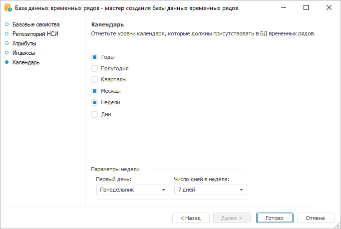

# Настройка календаря: База данных временных рядов

Настройка календаря: База данных временных рядов
-

# Настройка календаря

На странице «Календарь» настройте
 уровни календарной динамики:

Флажками отметьте все уровни календаря, которые должны присутствовать
 в базе данных временных рядов. Если отмечен уровень «Недели»,
 то доступны дополнительные параметры:

	- Первый день. Укажите
	 день, с которого начинается неделя;

	- Число дней в неделе.
	 Укажите количество дней в неделе.

Параметры недели влияют на расчёт вычисляемых рядов по недельной календарной
 динамике. Все вычисления выполняются с учетом заданных параметров. Например,
 если указано, что в неделе 7 дней и она начинается в понедельник, то расчёт
 будет выполняться по всем точкам ряда. Если в неделе 5 дней и она начинается
 в воскресение, то из расчёта будут исключены точки, попадающие на пятницу
 и субботу.

Для сохранения базы данных временных рядов и выхода из мастера нажмите
 кнопку «Готово».

См. также:

[База
 данных временных рядов](CreateTimeSeriesDatabase.htm)

		Справочная
		 система на версию 10.9
		 от 18/08/2025,
		 © ООО «ФОРСАЙТ»,
