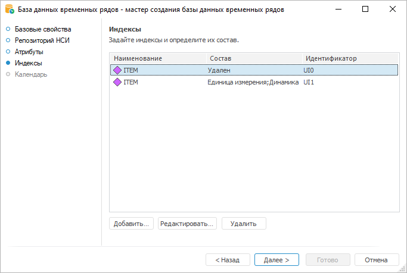
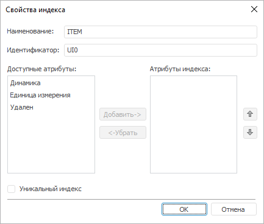

# Создание индексов: База данных временных рядов

Создание индексов: База данных временных рядов
-

# Создание индексов

Индексирование обеспечивает быстрый поиск и выборку значений по индексированным
 полям.

Для создания и редактирования индексов базы данных временных рядов используйте
 страницу «Индексы»:

Индекс формируется из значений одного или нескольких атрибутов временных
 рядов.

Основные операции с индексами:

[Создание индекса](javascript:TextPopup(this))

	Для создания индекса нажмите кнопку «Добавить».
	 Будет открыт диалог «[Свойства
	 индекса](#index)».

[Редактирование
 индекса](javascript:TextPopup(this))

	Для редактирования индекса:

		- нажмите кнопку «Редактировать»;

		- дважды щёлкните по индексу.

	Будет открыт диалог «[Свойства
	 индекса](#index)».

[Удаление индекса](javascript:TextPopup(this))

	Для удаления индекса выделите его и нажмите кнопку «Удалить».

	Будет запрошено подтверждение выполняемого действия.

## Свойства индекса

Для редактирования свойств индекса используйте диалог «Свойства
 индекса»:

Параметры индекса:

	- Наименование. Укажите
	 наименование индекса;

	- Идентификатор. Укажите
	 уникальный идентификатор индекса. Допускается использование только
	 латинских букв и цифр;

	- Доступные атрибуты.
	 Список атрибутов рядов, доступных для включения в индекс. В индекс
	 могут входить все атрибуты рядов, кроме атрибутов с [типом
	 данных](TS_Attributes.htm) «Длинный текст».
	 Настройка доступна только в настольном приложении;

	- Атрибуты индекса. Список
	 атрибутов, входящих в индекс. Если индекс состоит из нескольких атрибутов,
	 то поиск первоначально будет происходить по первому атрибуту в
	 списке, затем по второму и т.д. Настройте список атрибутов индекса:

		- для изменения положения атрибута в списке используйте кнопки
		  «Вверх» и  «Вниз»;

		- для перемещения атрибутов между списками «Доступные
		 атрибуты» и «Атрибуты
		 индекса»:

			- используйте кнопки «Добавить»
			 и «Убрать»;

			- перетащите атрибут из одного списка в другой;

			- дважды щёлкните по выбранному атрибуту;

	- Уникальный индекс.
	 Установка флажка делает индекс уникальным. Уникальный индекс однозначно
	 определяет каждый временной ряд и исключает возможность создания временного
	 ряда с идентичным набором значений атрибутов индекса.

См. также:

[База
 данных временных рядов](CreateTimeSeriesDatabase.htm)

		Справочная
		 система на версию 10.9
		 от 18/08/2025,
		 © ООО «ФОРСАЙТ»,
