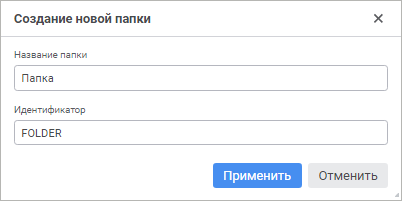
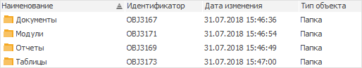

# Папка

Папка
-

# Папка

Папка предназначена для упорядочивания объектов репозитория.

Для создания папки:

	- в веб-приложении:

		- в [навигаторе
		 объектов](GetStarted.chm::/Interface/Interface_Navigator.htm) нажмите кнопку 
		 «Создать» в главном меню
		 и выберите тип объекта на боковой панели «[Новый объект](UiNav.chm::/02_Navigator/General_Principles_of_Work.htm#add_object)»;

		- в [среде
		 разработки](Developer.chm::/About_Developing/Start_the_Development_Environment.htm):

			- выполните команду «Файл
			 > Создать > Папка» в главном меню;

			- выполните команду «Создать
			 > Папка» в контекстном меню навигатора проекта;

			- выполните команду «Создать
			 > Папка» в контекстном меню сборки в навигаторе
			 проекта.

При создании папки в среде разработки откроется
 окно «Создание новой папки»:

Укажите наименование и уникальный идентификатор
 создаваемой папки в соответствующих полях.

	- в настольном приложении:

		- в навигаторе объектов:

			- нажмите кнопку  «Новая
			 папка» в группе «Создать»
			 на вкладке «Главная»
			 ленты инструментов;

			- выполните команду «Создать >
			 Папка» в контекстном
			 меню навигатора объектов;

		- в среде разработки:

			- выполните команду «Файл
			 > Создать > Папка» в главном меню;

			- выполните команду «Создать
			 > Папка» в контекстном меню навигатора проекта;

			- выполните команду «Создать
			 > Папка» в контекстном меню сборки в навигаторе
			 проекта.

Пример отображения папок в настольном приложении:

См. также:

[Создание
 прочих объектов](UiNavObj_Other_objects.htm)

		Справочная
		 система на версию 10.9
		 от 18/08/2025,
		 © ООО «ФОРСАЙТ»,
