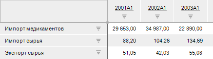
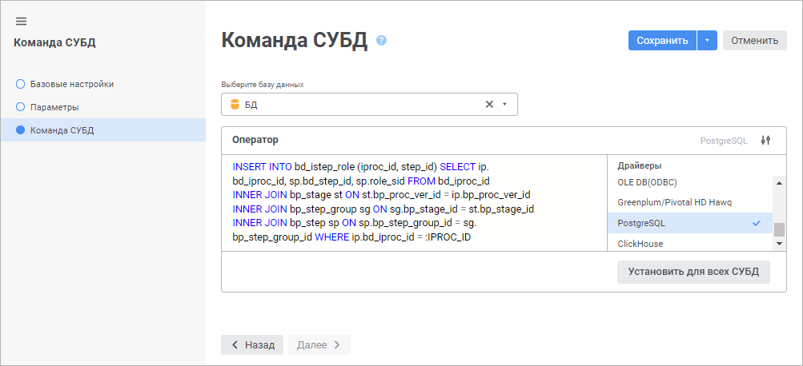
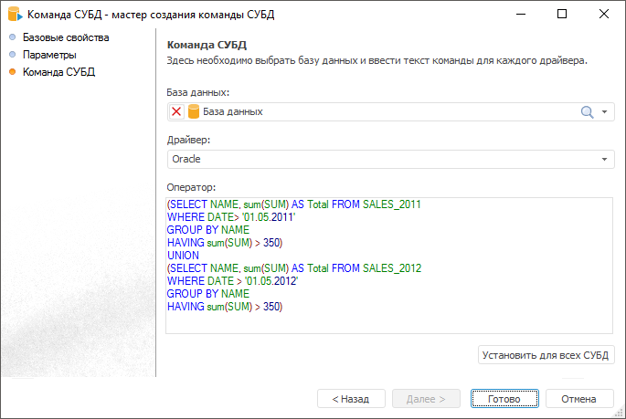
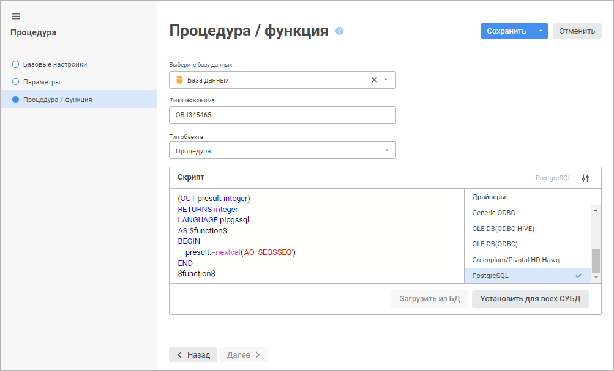
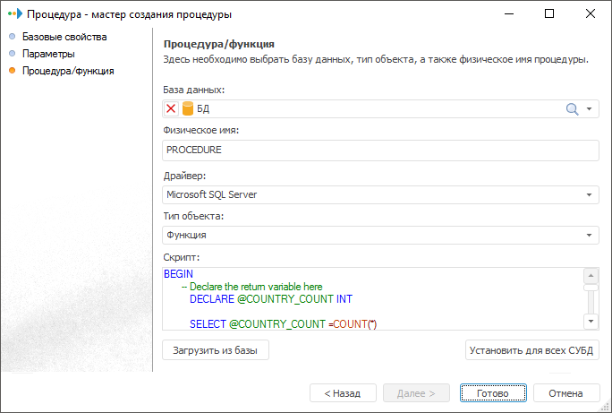
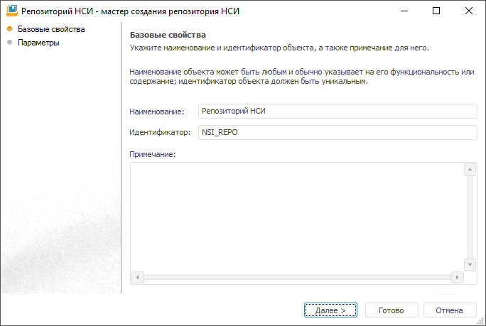
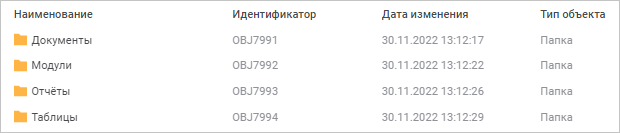
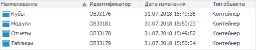

# Создание прочих объектов

Создание прочих объектов
-

# Создание прочих объектов

В репозитории также доступны такие объекты как:

	- [Единицы
	 измерения и меры](Units/Units.htm). Предназначен для автоматического пересчета единиц
	 измерения. Позволяет отображать в одинаковом масштабе данные, сохраненные
	 в разных масштабах:

	- [Команда
	 СУБД](CUBD/UiDb_relationa_CUBD_master_command.htm). Предназначен для извлечения данных, вставки, обновления
	 и удаления строк таблицы, создания, замены, изменения и удаления физических
	 объектов:

	 Веб-приложение Настольное приложение

		

		

	- [Процедура](procedure/UiDb_relationa_procedure.htm).
	 Позволяет создавать процедуры и функции для разных СУБД. В отличие
	 от [команды СУБД](CUBD/UiDb_relationa_CUBD.htm) при создании
	 в репозитории объекта «Процедура»
	 на сервере будет создана хранимая процедура/функция:

	 Веб-приложение Настольное приложение

		

		

	- [Репозиторий
	 НСИ](repository_RDS/RepositoryRDS.htm). Предназначен для создания объектов по схеме «сверху вниз»:

	- [Документ](UiNavObj_document.htm).
	 Предназначен для хранения и получения доступа к внешним файлам различных
	 расширений:

	 Веб-приложение Настольное приложение

		

		

	- [Папка](UiNavObj_Folder.htm).
	 Предназначена для упорядочивания объектов репозитория:

	 Веб-приложение Настольное приложение

		

		

	- [Контейнер](Container/Container.htm).
	 Предназначен для хранения объектов репозитория в собственном пространстве
	 идентификаторов:

См. также:

[Структурирование
 наборов данных](TimeSeriesDatabase/Structure_data_set.htm)

		Справочная
		 система на версию 10.9
		 от 18/08/2025,
		 © ООО «ФОРСАЙТ»,
