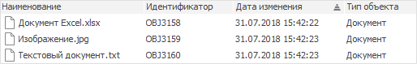

# Документ: Объект репозитория

Документ: Объект репозитория
-

# Документ

Документ предназначен для хранения и получения доступа к внешним файлам
 различных расширений.

Документами могут являться файлы различного формата:

	- изображения (*.bmp, *.jpg, *.png, *.tiff, *.gif);

	- видеоролики (*.asf, *.avi, *.mpg, *.wmv);

	- звукозаписи (*.mp3, *.wav, *.mid);

	- документы Microsoft Word (*.docx, *.doc, *.rtf);

	- документы Microsoft Excel (*.xlsx, *.xls);

	- документы Microsoft PowerPoint (*.pptx, *.ppt);

	- документы Adobe Acrobat (*.pdf);

	- текстовые документы (*.txt, *.xml);

	- гипертекстовые документы (*.htm, *.html);

	- архивы (*.rar, *.zip);

	- приложения (*.exe);

	- документы OpenOffice (*.odt, *.odg, *.odp, *.ods, *.odc, *.odi,
	 *.odf, *.odm) и др.

Примечание.
 По умолчанию в веб-приложении максимальный размер документа зависит от
 настроек веб-сервера. Для ограничения допустимого размера документа при
 загрузке в репозиторий задайте атрибут [maxRequestSize](Setup.chm::/UiWebSetup/03_Setup_Web/PP_config_Java.htm#metabase)
 в файле [PP.xml](Setup.chm::/UiWebSetup/03_setup_web/PP_config_Java.htm).

## Создание документа

Для создания документа в [навигаторе
 объектов](GetStarted.chm::/Interface/Interface_Navigator.htm):

	- в веб-приложении нажмите кнопку  «Создать» в главном меню и выберите
	 тип объекта на боковой панели «[Новый объект](UiNav.chm::/02_Navigator/General_Principles_of_Work.htm#add_object)»;

	- в настольном приложении:

		- выполните команду «Создать >
		 Другие > Папка» в контекстном меню;

		- выполните команду «Новый
		 объект > Другие > Документ», расположенную
		 в группе «Создать» на
		 вкладке «[Главная](GetStarted.chm::/Interface/Interface_Description.htm#customize_ribbon)»
		 ленты инструментов.

После выполнения действий будет открыт стандартный диалог для выбора
 файла. Выберите файл, который будет загружен в репозиторий в качестве
 документа.

## Открытие документа

Для открытия выбранного документа:

	- дважды щёлкните по документу;

	- выполните команду контекстного меню «Открыть»;

	- выполните команду «Просмотр»
	 в группе «Открыть» на вкладке
	 ленты «[Главная](GetStarted.chm::/Interface/Interface_Description.htm#customize_ribbon)».

Пример отображения документов:

Документ открывается в программе, соответствующей формату исходного
 файла, выбранной по умолчанию на компьютере.

Примечание.
 Открытие документа доступно только в настольном приложении. При открытии
 документа формируется [кеш](UiNav.chm::/02_Navigator/object_caching.htmUiNav/02_Navigator/object_caching.htm)
 для ускорения работы с внешними файлами.

## Изменение источника документа

Для изменения источника документа:

	- в веб-приложении выполните команду «Загрузить
	 в документ» в контекстном меню документа;

	- в настольном приложении выполните команду «Загрузить
	 из файла» в контекстном меню документа.

После выполнения действия будет открыт стандартный диалог для выбора
 файла.

## Сохранение документа в файл

Для сохранения документа во внешний файл:

	- в веб-приложении дважды щелкните по документу или выполните
	 команду «Сохранить в файл»
	 в контекстном меню документа. После чего начнётся автоматическая загрузка
	 файла;

	- в настольном приложении выполните команду «Сохранить
	 в файл» в контекстном меню документа. После чего будет открыт
	 стандартный диалог для сохранения файла на локальном диске. Выберите
	 расширение, в котором будет сохранён файл, и месторасположение.

## Ограничение допустимых форматов документов в репозитории

Для ограничения загрузки и открытия документов допустимого формата задайте
 разрешённые форматы в разделе «[Разрешённые
 форматы документов в репозитории](Admin.chm::/04_SecurityPolicy/Editor_of_Politicy/Security_EditorPoliticy_General.htm#limitation)» в [менеджере
 безопасности](Admin.chm::/01_RunSecManager/Admin_Organizational_Starting.htm).

Форматы задаются расширением файла, например: XML, XLS, PDF. Если заданы
 разрешённые форматы, то при попытке загрузки или открытия документа, который
 не соответствует заданным форматам, будет выдаваться сообщение о нарушении
 политики безопасности. По умолчанию доступна загрузка и открытие документов
 любого формата.

См. также:

[Создание
 прочих объектов](UiNavObj_Other_objects.htm)

		Справочная
		 система на версию 10.9
		 от 18/08/2025,
		 © ООО «ФОРСАЙТ»,
