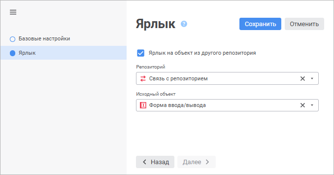

# Ярлык

Ярлык
-

# Ярлык

Ярлык - это объект репозитория,
 обладающий собственными метаданными, но данные для которого берутся из
 исходного объекта, доступного в данном репозитории или в репозитории,
 с которого установлена связь.

	 Веб-приложение
	  Настольное приложение

		Для создания ярлыка в веб-приложении выполните команду «Новый объект > Ярлык»
		 в группе «Создать» в главном
		 меню навигатора объектов. Будет открыт мастер ярлыка:

		

		Мастер содержит страницы «Базовые
		 свойства» и «Ярлык».

		На странице мастера «Базовые
		 свойства» задайте базовые свойства:

			- Наименование.
			 Введите наименование ярлыка;

			- Идентификатор.
			 Введите уникальный идентификатор ярлыка. Идентификатор может
			 состоять только из букв латинского алфавита, цифр и знака
			 «_» и не должен начинаться с цифр;

			- Примечание.
			 Необязательное для заполнения поле. Текстовое поле для ввода
			 примечания по ярлыку.

		На странице мастера «Ярлык»
		 определите объект, на который ссылается ярлык:

			- Ярлык на объект из
			 другого репозитория. После установки данного флажка
			 выберите объект типа «[Связь
			 с репозиторием](Link_with/UiDb_relational_LinkWith.htm)» в раскрывающемся списке «Репозиторий»,
			 который позволит получить доступ из текущего репозитория к
			 объекту другого репозитория. После выберите объект в поле
			 «Исходный объект»;

			- Исходный объект.
			 Выберите объект, на который будет ссылаться ярлык. В списке
			 отображаются все папки и объекты текущего репозитория. Если
			 объект, на который ссылается ярлык, находится в другом репозитории,
			 то в раскрывающемся меню «Исходный
			 объект» в качестве корневой папки указывается «[Связь с репозиторием](Link_with/UiDb_relational_LinkWith.htm)».

Для быстрого выбора объекта в поле для поиска введите его название/идентификатор/ключ,
 в зависимости от настроек отображения. Поиск будет выполняться автоматически
 по мере ввода текста. Список будет содержать объекты, наименования/идентификаторы/ключи
 которых содержат вводимый текст.

Для настройки отображения объектов репозитория в списке нажмите кнопку
  «Отображение
 объекта» и выберите в раскрывающемся меню вариант отображения:

	- Наименование. Объекты
	 отображаются под своими наименованиями. Вариант по умолчанию;

	- Идентификатор. Объекты
	 отображаются под своими идентификаторами;

	- Ключ. Объекты отображаются
	 под своими ключами.

Выбрать можно несколько вариантов. Идентификатор и ключ будут указаны
 в скобках.

Для сброса отметки выбранных объектов нажмите кнопку 
 «Очистить».

		Для редактирования выполните команду контекстного меню ярлыка
		 «Редактировать ярлык».

		Примечание.
		 При редактировании ярлыка в качестве исходного объекта доступны
		 объекты такого же типа, какой был выбран при создании ярлыка.

		Для создания ярлыка в настольном приложении:

			- выполните команду «Новый
			 объект > Ярлык» в группе «Создать»
			 на вкладке ленты «[Главная](GetStarted.chm::/Interface/Interface_Description.htm#customize_ribbon)»;

			- выполните команду контекстного меню «Создать >
			 Ярлык».

		Откроется окно создания ярлыка:

		

		Задайте параметры ярлыка:

			- Исходный объект.
			 Выберите объект, на который будет ссылаться ярлык. В списке
			 отображаются все папки и объекты текущего репозитория;

			- Наименование.
			 Введите наименование ярлыка;

			- Идентификатор.
			 Введите уникальный идентификатор ярлыка. Идентификатор может
			 состоять только из букв латинского алфавита, цифр и знака
			 «_» и не должен начинаться с цифр;

			- Ярлык на объект из
			 другого репозитория. После установки данного флажка
			 выберите объект «[Связь
			 с репозиторием](Link_with/UiDb_relational_LinkWith.htm)» в поле «Репозиторий»,
			 который позволит получить доступ из текущего репозитория к
			 объекту другого репозитория. После выберите объект в поле
			 «Исходный объект».

		Для редактирования ярлыка выполните команду контекстного меню
		 ярлыка «Редактировать ярлык».
		 Будет открыт мастер редактирования ярлыка:

		

		Мастер содержит страницы «Базовые
		 свойства» и «Ярлык».

		На странице мастера «Базовые
		 свойства» задаются базовые свойства:

			- Наименование.
			 Введите наименование ярлыка;

			- Идентификатор.
			 Введите уникальный идентификатор ярлыка. Идентификатор может
			 состоять только из букв латинского алфавита, цифр и знака
			 «_» и не должен начинаться с цифр;

			- Примечание.
			 Необязательное для заполнения поле. Текстовое поле для ввода
			 примечания по ярлыку.

		На странице мастера «Ярлык»
		 определите объект, на который ссылается ярлык.

		Примечание.
		 При редактировании ярлыка в качестве исходного объекта доступны
		 объекты такого же типа, какой был выбран при создании ярлыка.
		 Если объект, на который ссылается ярлык, находится в другом репозитории,
		 то в раскрывающемся списке «Исходный
		 объект» в качестве корневой папки указывается «[Связь с репозиторием](Link_with/UiDb_relational_LinkWith.htm)».

## Синхронизация с исходным объектом

При создании ярлыка сохраняются параметры, которые были заданы в исходном
 объекте. Набор параметров исходного объекта может быть изменен с момента
 создания ярлыка. Для того чтобы внести эти изменения в ярлык, выполните
 команду «Синхронизировать с исходным
 объектом» контекстного меню ярлыка. После синхронизации в ярлык
 будут добавлены актуальные параметры.

Примечание.
 Команда «Синхронизировать с исходным
 объектом» используется только для ярлыка, который находится в одном
 репозитории с исходным объектом.

## Переход к исходному объекту

Для перехода к объекту, на который ссылается ярлык, выполните команду
 «Перейти к исходному объекту»
 контекстного меню ярлыка.

Примечание.
 Команда «Перейти к исходному объекту»
 доступна только для ярлыка, который находится в одном репозитории с исходным
 объектом.

См. также:

[Создание
 прочих объектов](UiNavObj_Other_objects.htm) | [Подключение
 к другому репозиторию](Link_with/UiDb_relational_LinkWith.htm)

		Справочная
		 система на версию 10.9
		 от 18/08/2025,
		 © ООО «ФОРСАЙТ»,
