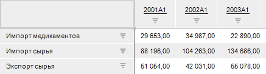

# Единицы измерения и меры

Единицы измерения и меры
-

# Единицы измерения и меры

Механизм автоматического пересчета единиц измерения позволяет отображать
 в одинаковом масштабе данные, сохраненные в разных масштабах. Например,
 показатели, сохраненные в десятках и тысячах, можно отобразить в миллионах
 единиц.

Пересчет единиц измерения доступен в инструментах: «Аналитические
 запросы (OLAP)», «Отчеты»,
 «Анализ временных рядов».

Существует два основных подхода к использованию единиц измерения:

	- [Единицы
	 измерения в кубах](Units_Cube.htm). Единицы измерения представлены в качестве отдельного
	 измерения;

	- [Единицы
	 измерения в базе данных временных рядов](Units_dbts.htm). Единицы измерения настраиваются
	 для отдельного ряда/листа/среза данных.

Примечание.
 Работа с единицами измерения и мерами доступна только в настольном приложении.

Для настройки единиц измерения:

	- в базе данных временных рядов используется [справочник
	 единиц измерения](Units_dbts.htm#units) и [справочник
	 мер](Units_dbts.htm#measures);

	- в кубах используется только [справочник
	 единиц измерения](Units_Cube.htm#units), но [справочник
	 показателей](Units_Cube.htm#indicators) куба должен иметь дополнительный атрибут.

Примечание.
 Пересчет единиц измерения недоступен при включенном [кешировании данных](UiNav.chm::/02_Navigator/UiNav_Cache.htm).

## Пример использования пересчета единиц измерения

В базе данных временных рядов данные сохранены в разных масштабах: в
 рублях и тысячах рублей. Различия в масштабах делают восприятие информации
 сложным, отображение по одной шкале визуализатора - неверным.

Для первой строки данные сохранены в единице измерения «Рубли» с масштабом
 1. Две других строки содержат данные сохраненные в единице измерения «Тысячи
 рублей» с масштабом 1000:

Выберем для текущего листа отчета единицу измерения «рубли», данные
 будут отображены в одной единице измерения:

См. также:

[Создание
 прочих объектов](../UiNavObj_Other_objects.htm) | [Организация
 хранилища данных](../DataWarehousing.htm)

		Справочная
		 система на версию 10.9
		 от 18/08/2025,
		 © ООО «ФОРСАЙТ»,
