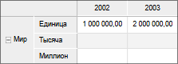
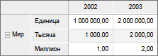
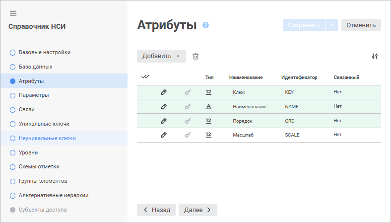
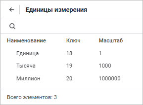
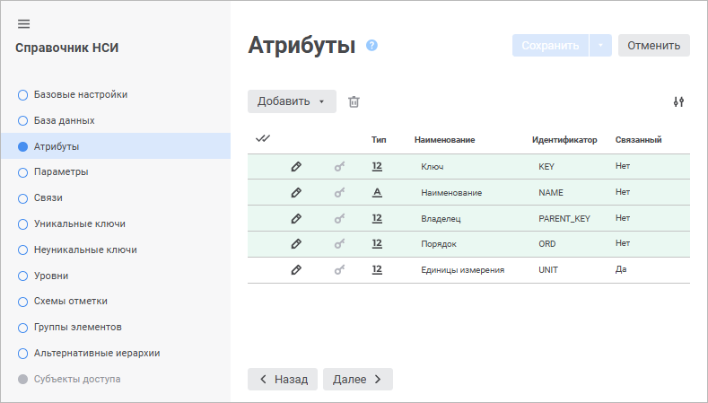
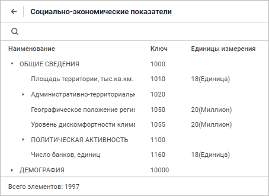
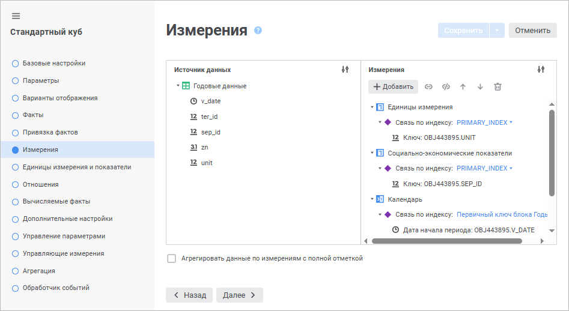
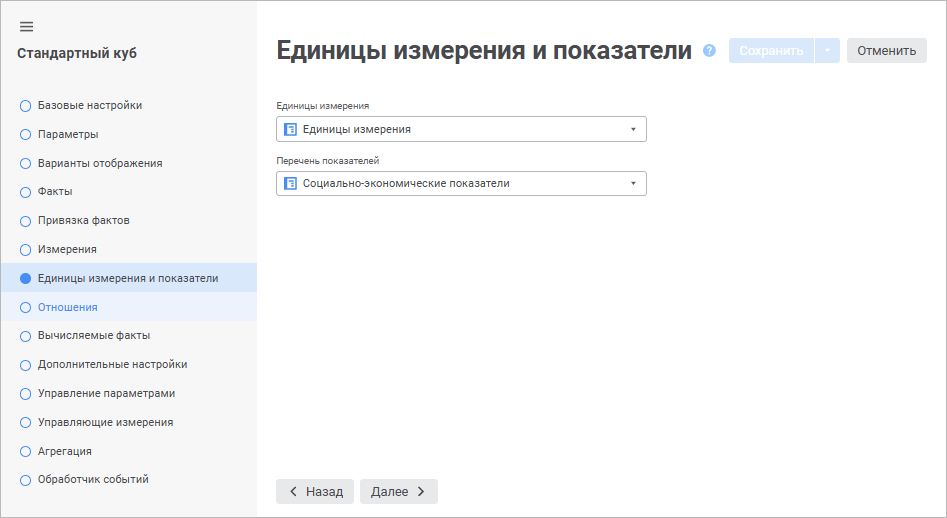

# Единицы измерения в кубах

Единицы измерения в кубах
-

# Единицы измерения в кубах

При работе с кубами все данные по показателям указываются в определенных
 единицах измерения, используемых пользователями. Если предполагается работа
 с показателями, представленными в различных единицах измерения, то можно
 настроить автоматический пересчет значений показателей.

## Принцип работы

Пересчет единиц измерения переводит значение, записанное в источнике
 в одной из единиц измерения, во все другие доступные единицы измерения.

Справочник единиц измерения добавляется как отдельное измерение.

Пример куба до включения пересчета единиц измерения, справочник единиц
 измерения выведен в строки:

Пример куба после включения пересчета единиц измерений:

Данные в источнике записаны только для базовой единицы измерения, но
 отображаться будут для каждой единицы измерения, соответственно масштабу
 данной единицы.

Нечисловые значения будут продублированы для каждого элемента справочника
 единиц измерения.

## Настройка единиц измерения и перечня показателей
 в кубе

Для правильного пересчета единиц измерения куб должен содержать справочники
 с определённой структурой:

	- [справочник единиц измерения](#units);

	- [справочник показателей](#indicators).

Созданные справочники должны быть добавлены в список [измерений
 куба](#cube) на страницу «Измерения»
 и выбраны на странице «Единицы измерения
 и показатели». Справочники могут быть как обычными, так и справочниками
 НСИ.

Используемый источник данных должен содержать поля для связи с данными
 справочниками.

Примечание.
 Для правильной работы механизма пересчета идентификаторы единиц измерения
 в справочнике показателей и в источнике данных должны совпадать.

[Справочник
 единиц измерения](javascript:TextPopup(this))

	Справочник единиц измерения содержит наименования и масштаб каждой
	 доступной единицы.

	Масштаб определяет кратность каждой единицы измерения.

	Структура справочника должна содержать дополнительный атрибут SCALE - масштаб единицы измерения.

	Пример настройки атрибутов справочника единиц измерения:

	

	Пример справочника единиц измерения:

	

[Справочник
 показателей](javascript:TextPopup(this))

	Справочник показателей содержит наименования показателей и дополнительный
	 атрибут, определяющий единицу измерения, в которой исчисляется показатель.

	Структура справочника должна содержать дополнительный атрибут UNIT - идентификатор единицы измерения.
	 Данный атрибут должен быть связан со справочником «Единицы
	 измерения».

	Пример настройки атрибутов справочника показателей:

	

	Пример справочника показателей:

	

[Настройка
 куба](javascript:TextPopup(this))

	На странице «Измерения»
	 созданные справочники должны быть добавлены в список измерений куба:

	

	На странице «Единицы измерения
	 и показатели» созданные справочники должны быть добавлены в
	 соответствующие поля:

	

См. также:

[Единицы измерения и меры](Units.htm)

		Справочная
		 система на версию 10.9
		 от 18/08/2025,
		 © ООО «ФОРСАЙТ»,
