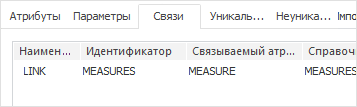
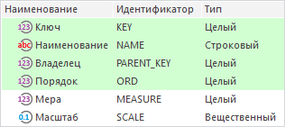
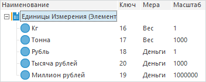
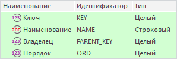
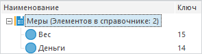
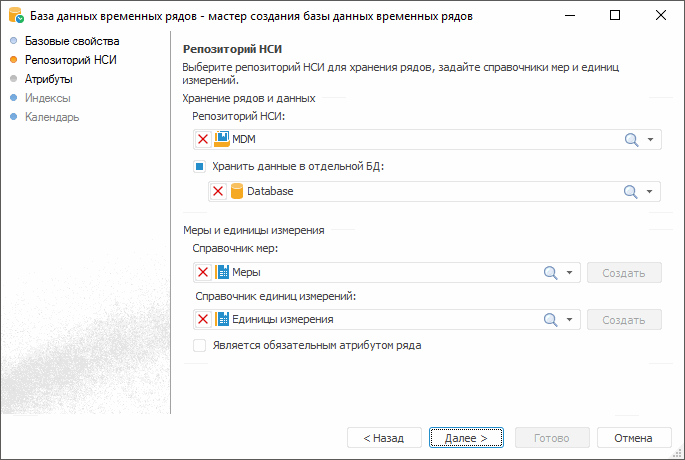
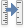
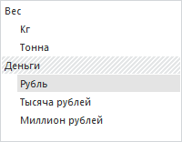

# Единицы измерения в базе данных временных рядов

Единицы измерения в базе данных временных рядов
-

# Единицы измерения в базе данных временных рядов

При работе с базой данных временных рядов все данные рядов указываются
 в определенных единицах измерения, используемых пользователями. Если предполагается
 работа с рядами, представленными в различных единицах измерения, то можно
 настроить автоматический пересчет значений рядов.

Единицы измерения, [настроенные](Units_dbts.htm#options)
 в базе данных временных рядов, имеют разное поведение при использовании
 в инструментах:

	- «[Анализ
	 временных рядов](Units_dbts.htm#dw)»;

	- «[Аналитические запросы (OLAP)](Units_dbts.htm#olap)»,
	 «[Отчёты](Units_dbts.htm#olap)».

Примечание.
 Пересчет единиц измерения недоступен при включенном [кешировании данных](UiNav.chm::/02_Navigator/UiNav_Cache.htm).

## Настройка единиц измерения в базе данных временных
 рядов

Для работы с единицами измерения необходимо создать два справочника
 НСИ: справочник мер и справочник единиц измерения. Справочники необходимой
 структуры можно создать на странице «[Репозиторий НСИ](../TimeSeriesDatabase/ChooseNSI.htm)»
 мастера базы данных временных рядов.

[Справочник
 единиц измерения](javascript:TextPopup(this))

	Справочник единиц измерения содержит наименования, масштаб и меру
	 каждой доступной единицы.

	Единица измерения отвечает за кратность значения - одну меру можно
	 отображать в десятках, сотнях и т.д.

	Структура справочника должна содержать следующие атрибуты:

		- KEY. Идентификатор
		 единицы измерения;

		- NAME. Наименование
		 единицы измерения;

		- SCALE. Масштаб единицы
		 измерения, определяет кратность каждой единицы измерения;

		- MEASURE. Мера единицы
		 измерения, определяет наименование меры измерения из связанного
		 [справочника мер](#measures).

	В справочнике должна быть настроена связь со справочником мер. Идентификатор
	 связи «MEASURES», связываемый
	 атрибут «MEASURE»:

	

	Пример структуры справочника единиц измерения:

	

	Пример справочника единиц измерения:

	

[Справочник
 мер](javascript:TextPopup(this))

	Справочник мер содержит наименования мер измерения для использования
	 в справочнике [единиц измерения](Units_dbts.htm#units).

	Мера отвечает за категории, в которые будут обобщены единицы измерения.

	Структура справочника должна содержать следующие атрибуты:

		- KEY. Идентификатор
		 меры;

		- NAME. Наименование
		 меры.

	Пример структуры справочника мер:

	

	Пример справочника мер:

	

[Настройка
 базы данных временных рядов](javascript:TextPopup(this))

	Справочники мер и единиц измерений задаются на странице «[Репозиторий НСИ](../TimeSeriesDatabase/ChooseNSI.htm)»:

	

## Анализ временных рядов

В инструменте «Анализ временных рядов»
 единицы измерения задаются для каждого ряда отдельно.
 После выбора единицы измерения, используемой для отображения данных, к
 данным ряда будет применен масштаб выбранной единицы измерения.

Примечание.
 Настройка единиц измерения недоступна для групп рядов, вычисляемых рядов
 и их дочерних рядов.

Для пересчета единиц измерения отдельного ряда:

	- выберите пункт «Единицы измерения»
	 в контекстном меню ряда и в раскрывающемся списке выберите единицу
	 измерения;

	- выберите ряд и установите флажок «Изменить
	 единицу измерения» на вкладке «Основные»,
	 расположенной в группе вкладок «Ряд»;

Примечание.
 Изменить отображаемую единицу измерения можно задав [атрибут ряда](UiDw.chm::/Workbook/TimeSeries_Attr_Edit.htm)
 «Единица измерения».

По умолчанию атрибут «Единица измерения»
 является скрытым. Для отображения данного атрибута:

	- установите флажок «Является
	 обязательным атрибутом ряда» на странице «[Репозиторий НСИ](../TimeSeriesDatabase/ChooseNSI.htm)» мастера базы
	 данных временных рядов;

Примечание.
 При установленном флажке «Является обязательным
 атрибутом ряда» пересчет единиц в инструментах «Аналитические
 запросы (OLAP)» и «Отчёты»
 будет недоступен.

	- снимите флажок «Скрытый атрибут»
	 для атрибута «Единицы измерения»
	 на странице «[Атрибуты](../TimeSeriesDatabase/TS_Attributes.htm)» мастера базы данных
	 временных рядов.

Совет. Если атрибут
 единиц измерения не является скрытым, то в заголовке ряда можно настроить
 отображение текущей единицы измерения. Для этого используйте вкладку «Вид», расположенную в группе вкладок
 «Данные» на боковой панели.

## Аналитические запросы (OLAP), Отчёты

В инструментах «Аналитические запросы
 (OLAP)», «Отчёты»
 единицы измерения задаются для всего листа в экспресс-отчете или среза
 в регламентном отчете. После выбора единицы измерения, используемой для
 отображения данных, ко всем данным листа/среза будет применен масштаб
 выбранной единицы измерения.

Для установки отображаемой единицы измерения нажмите кнопку  «Пересчитать единицы», которая расположена:

	- Аналитические
	 запросы (OLAP). На вкладке «Данные»
	 ленты инструментов;

	- Отчёты:

		- на вкладке «Срез»
		 ленты инструментов. Вкладка доступна при выделении в боковой панели
		 среза данных;

		- на панели «[Источники
		 и срезы](uireport.chm::/desktop/Source/UiReport_Source.htm)».

В раскрывшемся списке выберите необходимую единицу измерения.

Примечание.
 Пересчет единиц измерения будет недоступен, если в мастере базы данных
 временных рядов на странице «[Репозиторий НСИ](../TimeSeriesDatabase/ChooseNSI.htm)» установлен
 флажок «Является обязательным атрибутом
 ряда». Справочник единиц измерения будет представлен отдельным
 измерением, без автоматического пересчета данных во все единицы измерения.

См. также:

[Единицы измерения](Units.htm)

		Справочная
		 система на версию 10.9
		 от 18/08/2025,
		 © ООО «ФОРСАЙТ»,
