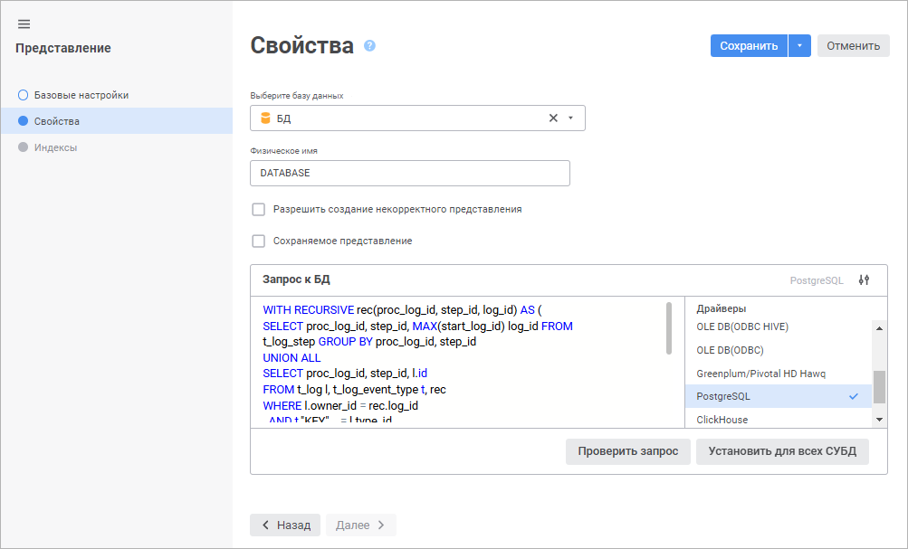

# Страница «Свойства»: Представление

Страница «Свойства»: Представление
-

# Свойства представления

На странице «Свойства» определяется
 база данных, в которую будет занесено представление, физическое имя представления
 и текст запроса представления.

	Веб-приложение Настольное приложение

		

		Определите параметры:

			- Выберите базу данных.
			 Выберите базу данных, в которую будет помещен запрос, в раскрывающемся
			 списке. При выборе базы данных СУБД ClickHouse и установленном
			 флажке «Сохраняемое представление»
			 создаётся таблица для хранения данных, полученных в результате
			 выполнения запроса, с помощью механизма [MergeTree](https://clickhouse.com/docs/ru/engines/table-engines/mergetree-family/mergetree).
			 Использование базы данных СУБД ClickHouse доступно только
			 в веб-приложении.

Для быстрого выбора объекта в поле для поиска введите его название/идентификатор/ключ,
 в зависимости от настроек отображения. Поиск будет выполняться автоматически
 по мере ввода текста. Список будет содержать объекты, наименования/идентификаторы/ключи
 которых содержат вводимый текст.

Для настройки отображения объектов репозитория в списке нажмите кнопку
  «Отображение
 объекта» и выберите в раскрывающемся меню вариант отображения:

	- Наименование. Объекты
	 отображаются под своими наименованиями. Вариант по умолчанию;

	- Идентификатор. Объекты
	 отображаются под своими идентификаторами;

	- Ключ. Объекты отображаются
	 под своими ключами.

Выбрать можно несколько вариантов. Идентификатор и ключ будут указаны
 в скобках.

Для сброса отметки выбранных объектов нажмите кнопку 
 «Очистить»;

			- Физическое имя.
			 В качестве физического имени таблицы по умолчанию используется
			 идентификатор таблицы;

			- Разрешить создание
			 некорректного представления. По умолчанию флажок снят.
			 Установите флажок для создания представления с некорректным
			 запросом;

			- Сохраняемое представление.
			 Установите флажок для работы как с данными представления,
			 так и с данными в [обычной
			 таблице](../../Table/Work/UiDb_relational_table_work.htm). При установке флажка изменение данных представления
			 не повлечет за собой изменение данных в базовых таблицах.
			 При изменении данных в базовых таблицах содержание представления
			 обновлено не будет. Для сохраняемого представления можно создать
			 [индексы](UiDb_relational_conception_master_index.htm);

		Примечание.
		 Создание некорректного сохраняемого представления невозможно.

	- Запрос к БД. Сформируйте
	 запрос к БД на языке SQL в соответствии с синтаксисом, который установлен
	 для выбранного драйвера СУБД.

Напротив поля «Запрос
 к БД» отображается выбранный драйвер СУБД и список драйверов. По
 умолчанию в списке драйверов выделен драйвер, используемый при [настройке
 подключения к репозиторию](setup.chm::/06_ak_client_config/uinav_repoconfig_repo1.htm). Если для одного или нескольких
 драйверов указан запрос, то в списке драйверов будет установлена отметка.

Для скрытия/отображения списка драйверов
 используйте кнопку  «Скрыть список драйверов»/«Отобразить список драйверов».

Для проверки корректности сформированного
 запроса нажмите кнопку «Проверить запрос».

Для установки указанного запроса к БД для
 всех СУБД нажмите кнопку «Установить
 для всех СУБД». После чего будет открыто окно подтверждения. Если
 хотя бы для одного драйвера, отличного от текущего, уже указан запрос,
 то при положительном ответе все существующие запросы будут замещены текущим.

		

		На данной странице определите параметры:

			- База данных.
			 В раскрывающемся списке выберите базу данных. При смене базы
			 данных автоматически выставляется драйвер, указанный в настройках
			 выбранной базы данных;

			- Физическое имя.
			 В качестве физического имени таблицы по умолчанию используется
			 идентификатор таблицы;

			- Разрешить создание
			 некорректного представления. По умолчанию флажок снят.
			 Установка данного флажка позволяет создавать представления
			 с некорректным запросом;

			- Сохраняемое представление.
			 Установка данного флажка позволяет работать как с данными
			 представления, так и с данными в [обычной
			 таблице](../../Table/Work/UiDb_relational_table_work.htm). При установке флажка изменение данных представления
			 не повлечет за собой изменение данных в базовых таблицах.
			 При изменении данных в базовых таблицах содержание представления
			 обновлено не будет. Для сохраняемого представления можно создать
			 [индексы](UiDb_relational_conception_master_index.htm);

		Примечание.
		 Создание некорректного сохраняемого представления невозможно.

			- Драйвер. В раскрывающемся
			 списке выберите тип драйвера. Более подробно о доступных драйверах
			 читайте в подразделе «[Поддерживаемые
			 СУБД](Setup.chm::/01_SysReq/database_Support.htm)». В списке «Драйвер»
			 по умолчанию отображается драйвер, который используется в
			 выбранной базе данных. При необходимости можно выбрать другой
			 драйвер и указать для него текст SQL-запроса. Параметр актуален,
			 если репозиторий будет использоваться на серверах с различными
			 СУБД и настройки базы данных в репозитории будут изменены;

			- Текст запроса.
			 В поле сформируйте запрос, написанный на языке SQL. На основе
			 данного запроса будет построено представление;

			- Установить для всех
			 СУБД. Кнопка позволяет установить текст запроса для
			 всех СУБД, то есть при смене драйвера текст запроса останется
			 тем же. При нажатии данной кнопки будет выдано подтверждение
			 на производимое действие. При положительном ответе текст запроса
			 будет указан для всех СУБД. Запрос на подтверждение действия
			 выдается только в том случае, если хотя бы для одного драйвера,
			 отличного от текущего, текст запроса непустой.

См. также:

[Представление](../UiDb_relational_conception.htm)

		Справочная
		 система на версию 10.9
		 от 18/08/2025,
		 © ООО «ФОРСАЙТ»,
