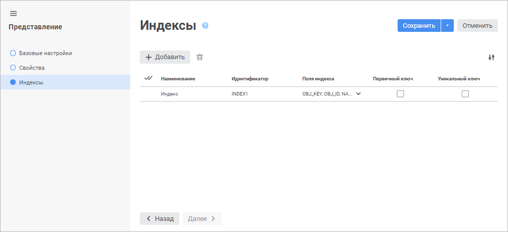
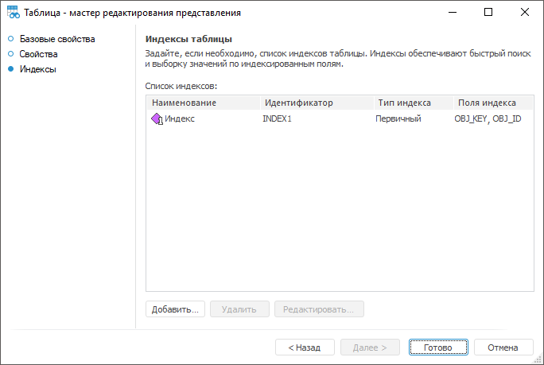

# Страница «Индексы»: Представление

Страница «Индексы»: Представление
-

# Индексы таблицы

На странице «Индексы» задается
 список индексов таблицы. Индексирование обеспечивает быстрый поиск и выборку
 значений по индексированным полям.

Примечание.
 Создание индексов возможно только для сохраняемого представления.

	Веб-приложение Настольное приложение

		

		Часто поиск осуществляется по различным полям или группам полей,
		 в таких случаях есть смысл создавать несколько индексов.

		Для создания индекса нажмите кнопку  «Добавить». В конец списка будет
		 добавлена строка, в которой определите следующие атрибуты:

			- Наименование.
			 Введите наименование индекса. По умолчанию наименование «Индекс»;

			- Идентификатор.
			 Введите уникальный идентификатор индекса в списке индексов
			 представления (допускается использование только латинских
			 букв, цифр и знаков «_», не допускается использование пробелов).
			 По умолчанию формируется как <Идентификатор
			 представления>_INDEX<Порядковый
			 номер индекса>;

			- Поля
			 индекса. Выберите из раскрывающегося списка поля. В
			 списке указаны все поля представления, добавление которых
			 возможно в поле индекса. Если индекс состоит из нескольких
			 полей, то поиск первоначально будет происходить по самому
			 первому отмеченному полю, потом по второму и т.д.;

			- Первичный
			 ключ. Установите флажок в том случае, если индекс первичный.
			 При установке автоматически устанавливается флажок «Уникальный ключ»;

			- Уникальный
			 ключ. Установите флажок, если индекс уникальный. Уникальный
			 индекс однозначно определяет каждую запись. При создании уникального
			 или первичного индекса необходимо помнить, что данные индексы
			 не могут быть построены на основе полей, которые могут содержать
			 пустые значения, поскольку в данном случае мы теряем однозначность.

		Примечание.
		 Если выбрана база данных СУБД ClickHouse на странице «[Свойства](UiDb_relational_conception_master_Property.htm)»,
		 то «Уникальный ключ» заменяется
		 на «Ключ сортировки».
		 Ключ сортировки определяет порядок хранения данных и не зависит
		 от флажка «Первичный ключ».
		 Если первичный ключ не задан, то ключ сортировки используется
		 в качестве первичного ключа.

		Для изменения количества отображаемых атрибутов нажмите кнопку
		  «Настройки»
		 и установите/снимите флажок напротив наименования атрибута.

		Редактирование уже созданных индексов осуществляется непосредственно
		 в списке индексов.

		Для удаления одного или нескольких индексов выделите их и нажмите
		 кнопку  «Удалить».
		 Будет запрошено подтверждение выполняемого действия.

		Для завершения работы мастера нажмите кнопку «Сохранить».

		

		Часто поиск осуществляется по различным полям или группам полей,
		 в таких случаях есть смысл создавать несколько индексов.

		Для создания индекса:

			- нажмите кнопку «Добавить»;

			- дважды щелкните в области списка индексов.

		Для редактирования выбранного индекса нажмите кнопку «Редактировать», в появившемся
		 окне «Свойства индекса»
		 внести требуемые изменения.

		Для удаления текущего индекса нажмите кнопку «Удалить».

## Свойства индекса

		Диалог «Свойства индекса»
		 будет открыт при создании и редактировании индекса:

		

		В появившемся окне определяются следующие атрибуты:

			- Наименование.
			 Наименование индекса;

			- Идентификатор.
			 Уникальный идентификатор индекса в списке индексов таблиц
			 (допускается использование только латинских букв, цифр и знаков
			 `_`, не допускается использование пробелов);

			- Поля
			 таблицы. Список всех полей таблицы, добавление которых
			 возможно в поле индекса;

			- Поля
			 индекса. Список полей, входящих в индекс. Если индекс
			 состоит из нескольких полей, то поиск первоначально будет
			 происходить по самому первому (верхнему в списке) полю, потом
			 по второму и т.д. Добавление полей из списка «Поля
			 таблицы» в список «Поля
			 индекса» осуществляется с помощью механизма перетаскивания
			 Drag&Drop;

			- Первичный
			 ключ. Флажок устанавливается в том случае, если индекс
			 первичный;

			- Уникальный.
			 Флажок устанавливается в том случае, если индекс уникальный.
			 Уникальный индекс однозначно определяет каждую запись. Первый
			 среди уникальных в списке индексов становится первичным индексом.
			 При создании уникального или первичного индекса необходимо
			 помнить, что данные индексы не могут быть построены на основе
			 полей, которые могут содержать пустые значения, поскольку
			 в данном случае теряется однозначность.

См. также:

[Представление](../UiDb_relational_conception.htm)

		Справочная
		 система на версию 10.9
		 от 18/08/2025,
		 © ООО «ФОРСАЙТ»,
