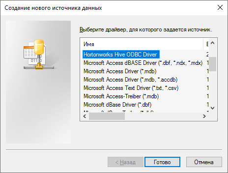
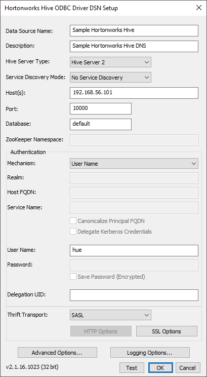
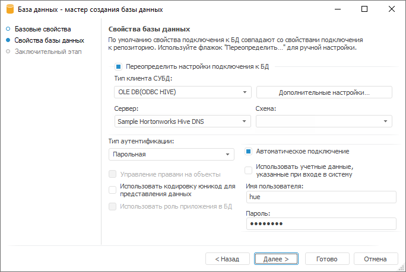

# Работа с источником данных Hive

Работа с источником данных Hive
-

# Работа с источником данных Hive

Продукт «Форсайт. Аналитическая платформа»
 позволяет пользователям в качестве источника данных использовать инфраструктуру
 [Hive](http://hive.apache.org/). Hive является
 системой манипулирования данными с использованием SQL-подобного языка
 запросов (HiveQL) и работает на базе распределенной системы хранения и
 обработки данных [Hadoop](http://hadoop.apache.org/).

Для начала работы с источником данных Hive выполните шаги, указанные
 ниже.

## Шаг 1. Установка приложения

Для создания подключения к источнику данных Hive необходимо использовать
 соответствующий ODBC-драйвер.

В качестве ODBC-драйвера рекомендуется использовать драйвер [Hortonworks Hive ODBC
 Driver](http://hortonworks.com/downloads/). Загрузите дистрибутив и установите драйвер, выполнив команду:

sudo dpkg -i ./clouderahiveodbc*.deb

Важно. Разрядность
 устанавливаемого приложения должна совпадать с разрядностью «Форсайт. Аналитическая платформа».

## Шаг 2. Настройка драйвера ODBC

Откройте на редактирование файл /opt/cloudera/hiveodbc/lib/64/cloudera.hiveodbc.ini
 и найдите параметры:

	- DriverManagerEncoding.
	 Замените значение параметра на UTF-16;

	- ODBCInstLib в категории
	 iODBC. Закомментируйте значение
	 параметра;

	- ODBCInstLib в категории
	 unixODBC. Раскомментируйте
	 значение параметра и установите значение libodbcinst.so.1.

Пример файла [cloudera.hiveodbc.ini](cloudera.hiveodbc.ini.zip).

## Шаг 3. Настройка подключения

Для получения подробной информации о настройке подключения обратитесь
 к [инструкции](Cloudera-ODBC-Driver-for-Apache-Hive-Install-Guide.zip).

При настройке подключения можно выделить два основных направления:

	- [настройка полнострочного подключения](#odbcinst);

	- [настройка подключения по DSN](#odbc).

### Настройка полнострочного подключения

	- Подготовьте файл /etc/odbcinst.ini. Пример содержимого файла:

[ODBC Drivers]

Cloudera ODBC Driver
 for Apache Hive 32-bit=Installed

Cloudera ODBC Driver
 for Apache Hive 64-bit=Installed

UsageCount=1

[Cloudera ODBC
 Driver for Apache Hive 32-bit]

Description=Cloudera
 ODBC Driver for Apache Hive (32-bit)

Driver=/opt/cloudera/hiveodbc/lib/32/libclouderahiveodbc32.so

UsageCount=1

[Cloudera ODBC
 Driver for Apache Hive 64-bit]

Description=Cloudera
 ODBC Driver for Apache Hive (64-bit)

Driver=/opt/cloudera/hiveodbc/lib/64/libclouderahiveodbc64.so

UsageCount=1

	- Выполните проверку подключения с помощью команды:

isql -v -k "Driver={Cloudera
 ODBC Driver for Apache Hive 64-bit};Host=10.0.2.118;Port=10000;AuthMech=3;UID=root;PWD=hadoop"

### Настройка подключения по DSN

	- Измените файл /etc/odbc.ini согласно [инструкции](Cloudera-ODBC-Driver-for-Apache-Hive-Install-Guide.zip).
	 Пример содержимого файла:

[ODBC Data Sources]

HiveDSN=Cloudera

[HiveDSN]

Driver=/opt/cloudera/hiveodbc/lib/64/libclouderahiveodbc64.so

HiveServerType=2

ServiceDiscoveryMode=0

Host=10.0.2.118

Port=10000

UID=root

PWD=root

	- Выполните проверку подключения с помощью команды:

isql -v "HiveDSN"

## Шаг 4. Настройка источника данных ODBC

Перед началом работы с Hive настройте источник данных:

	- На клиентском компьютере откройте
	 «Панель управления», затем
	 перейдите в раздел «Администрирование >
	 Источник данных ODBC».

	- В открывшемся окне «Администрирование
	 источников данных ODBC» перейдите на вкладку «Пользовательский
	 DNS». Выполните команду «Добавить».

	- В открывшемся окне «Создание
	 нового источника данных» выберите «Hortonworks
	 Hive ODBC Driver»:

	- Откроется окно «Hortonworks
	 Hive ODBC Driver DNS Setup»:

Задайте следующие настройки:

		- Data Source Name.
		 Укажите имя подключения;

		- Description. При
		 необходимости укажите описание подключения;

		- Host. Укажите IP-адрес
		 или имя сервера Hive;

		- Hive Server Type.
		 В качестве типа сервера выберите Hive Server 2;

		- Mechanism. В качестве
		 механизма аутентификации укажите User Name (укажите имя пользователя,
		 созданного в Вашей конфигурации Hadoop/Hive).

## Шаг 5. Настройка базы данных в «Форсайт. Аналитическая платформа»

Для настройки базы данных в «Форсайт. Аналитическая платформа»:

	- [Создайте базу данных в репозитории](UiDb_database.htm).

	- В свойствах базы данных укажите тип клиента СУБД «OLE DB(ODBC HIVE)».

	- В качестве названия сервера укажите имя созданного источника
	 данных «Data Source Name».

	- Выберите автоматическое подключение.

	- Заполните поля «Имя пользователя»/«Пароль»: укажите имя и пароль пользователя,
	 созданного в вашей конфигурации Hadoop/Hive.

Мастер базы данных после задания необходимых параметров имеет вид:

После выполнения указанных настроек созданное соединение можно использовать
 для подключения в репозиторий платформы таблиц Hive и создания запросов
 на языке HiveQL.

## Шаг 6. Настройка работы платформы с источником данных Hive через драйвер
 JDBC

Для корректного подключения к источнику данных Hive выполните настройку
 драйвера JDBC:

	- Убедитесь, что выполнена [настройка
	 BI-сервера](setup.chm::/UiWebSetup/03_Setup_Web/Debian/Install_BI_server_to_Debian.htm) и интеграция с языком программирования
	 [Python](UiNav.chm::/02_Navigator/CommonSettings/Integration.htm#MiniTOCBookMark2).

	- Установите pip3 с параметрами по умолчанию, выполнив команду:

sudo apt install python3-pip

	- Загрузите библиотеку jaydebeapi:

pip3 install jaydebeapi

	- Выполните интеграцию с языком программирования [Java](UiNav.chm::/02_Navigator/CommonSettings/Integration.htm#MiniTOCBookMark5).

	- Создайте каталог opt/jdbc:

sudo mkdir /opt/jdbc

	- Загрузите в папку /opt/jdbc файл с JDBC-драйвером [HiveJDBC.jar](https://www.cloudera.com/downloads/connectors/hive/jdbc/).

	- Сделайте пользователя www-data владельцем каталога opt/jdbc:

sudo chown -R www-data:www-data
 /opt/jdbc

	- Откройте [файл
	 обновления](UpdManager.chm::/Admin_UpMBObj_RunManager.htm)
	 в менеджере обновления.

	Пример файла обновления: [Update_pefx.zip](Update_pefx.zip).

В файл обновления входят объекты:

		- таблицы и справочники с данными;

		- куб, построенный на данных таблиц и справочников;

		- регламентный и экспресс-отчёты, построенные на данных куба;

		- модуль config.ini с идентификатором JDBC_HIVE_CONFIG.

		Пример модуля: [config.ini](config_ini.zip);

		- Python-модуль с идентификатором PYTHON_READ_DATA_JDBC_EXAMPLE

		Пример модуля: [python.py](python.zip);

		- модуль «Установка Callback для куба» с идентификатором MOD_SET_CUBE_CALLBACK_JDBC_EXAMPLE.

		Пример модуля: «[Установка
		 Callback для куба](Óñòàíîâêà%20callback%20äëÿ%20êóáà.zip)»;

		- модуль «Callback куба» с идентификатором «MOD_CUBE_FILLDATA_JDBC_EXAMPLE».

		Пример модуля: «[Callback куба](Ìîäóëü%20callback%20êóáà.zip)».

	- Запустите на выполнение модуль «Установка Callback для куба»,
	 входящий в файл обновления. В модуле задайте параметры:

		 Наименование
		 Описание константы

		 CUBE_ID
		 Идентификатор куба для заполнения данными.

		 MOD_ID
		 Идентификатор модуля, выполняемого при работе с кубом.

	- Задайте в модуле config.ini, входящего в файл обновления, параметры:

		 Наименование
		 Описание константы

		 TABLE_DATA_ID
		 Идентификатор таблицы, из которой необходимо получить данные.

		 PY_MOD_ID
		 Идентификатор модуля Python.

		 LINUX_PATH
		 Путь до JDBC-драйвера.

		 Параметры JDBC-соединения (Hive):

		 JDBC_CLASS
		 Класс драйвера.

		 JAR_NAME
		 Имя файла с JDBC-драйвером в ОС.

		 JDBC_URL
		 URL сервиса.

		 DB_USER
		 Имя пользователя.

		 DB_PSWD
		 Пароль пользователя.

В результате выполнения последовательности действий при каждом открытии
 данные будут подтягиваться в куб из источника данных Hive.

См. также:

[Подключение
 к реляционным базам данных](UiDb_database.htm)

		Справочная
		 система на версию 10.9
		 от 18/08/2025,
		 © ООО «ФОРСАЙТ»,
