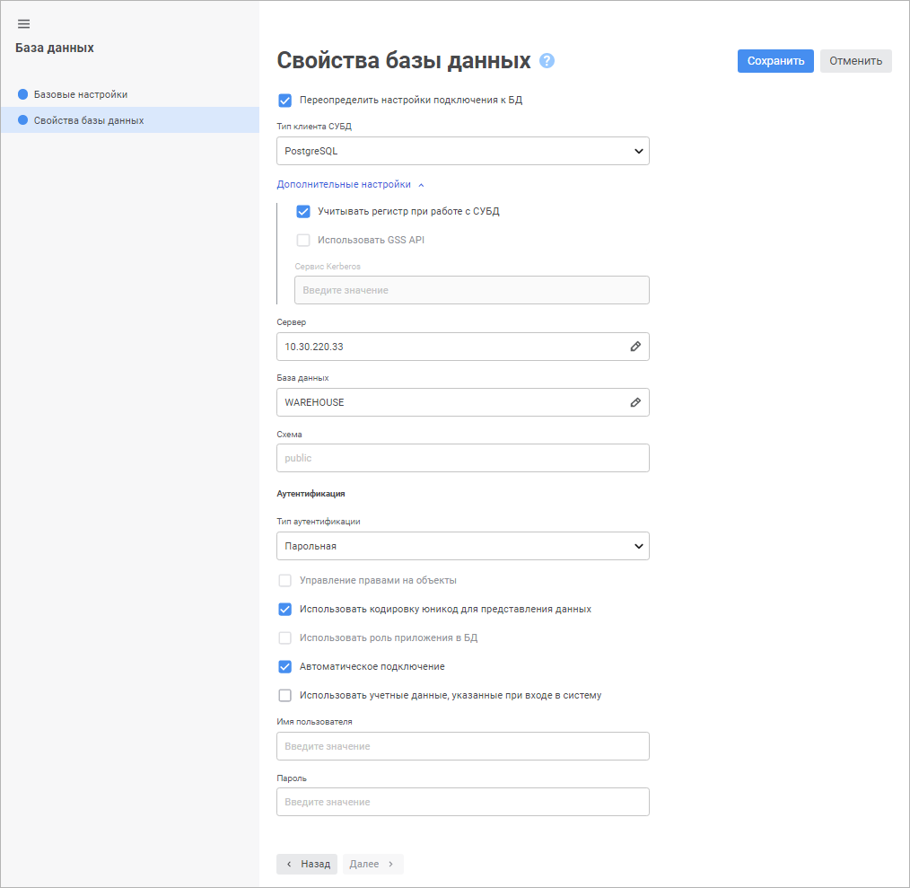
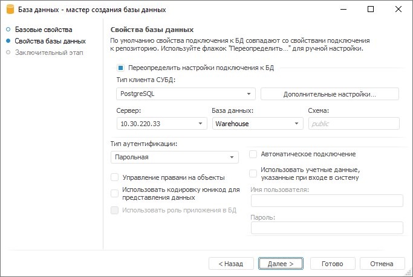

# Подключение к реляционным базам данных

Подключение к реляционным базам данных
-

# Подключение к реляционным базам
 данных

База данных - это объект
 репозитория, содержащий основные настройки для подключения к существующей
 базе данных, созданной на сервере СУБД. Подключение к базе данных используется
 различными объектами репозитория для получения доступа к объектам СУБД
 и информации, которую они хранят.

Для создания подключения к базе данных в навигаторе объектов:

	- в веб-приложении нажмите кнопку  «Создать» в главном меню и выберите
	 тип объекта на боковой панели «[Новый объект](UiNav.chm::/02_Navigator/General_Principles_of_Work.htm#add_object)»;

	- в настольном приложении:

		- выполните команду «Создать >
		 База данных» в контекстном
		 меню;

		- нажмите кнопку «Новый объект»,
		 расположенную в группе «Создать»
		 на вкладке «[Главная](GetStarted.chm::/Interface/Interface_Description.htm#customize_ribbon)»
		 ленты инструментов, и выберите пункт «База
		 данных».

После выполнения одного из действий будет открыт мастер базы данных.

	 Веб-приложение Настольное приложение

		

		

В мастере доступны следующие страницы:

	- [Базовые
	 настройки/Базовые свойства](base_settings.htm). Задаются наименование объекта, идентификатор
	 и примечание;

	- [Свойства
	 базы данных](UiDb_database_master_property.htm). Указывается тип системы управления базами данных
	 (СУБД), установленной на сервере, а также дополнительные параметры
	 подключения;

	- [Заключительный
	 этап](UiDb_database_master_property.htm#completion). Завершается работа мастера.

Примечание.
 Страница доступна только в настольном приложении.

После создания базы данных выполняется проверка базы данных [по умолчанию](UiNav.chm::/02_Navigator/Repo_Default.htm).
 Если база данных, используемая по умолчанию отсутствует, то будет предложено
 использовать созданную базу данных в качестве базы данных по умолчанию.

См. также:

[Подключение
 к внешним базам данных](../connect_to_database.htm) | [Авторизация в базе данных](UiDb_database_authorization.htm)

		Справочная
		 система на версию 10.9
		 от 18/08/2025,
		 © ООО «ФОРСАЙТ»,
