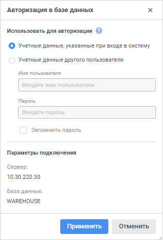
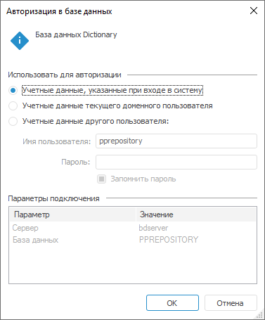

# Авторизация в базе данных

Авторизация в базе данных
-

# Авторизация в базе данных

Диалог «Авторизация в базе данных»
 появляется при подключении к базе данных:

	- при открытии объектов репозитория, если в [настройках
	 подключения](UiDb_database_master_property.htm) к базе данных не настроено [автоматическое
	 подключение](UiDb_database_master_property.htm#log_in_automatically);

	- в случае возникновения ошибок при подключении;

	- в случае отсутствия у текущего пользователя прав на запрошенную
	 операцию;

	- при создании новых реляционных объектов (таблиц, запросов и
	 других) или изменении прав доступа к существующим объектам под пользователем,
	 который не является владельцем схемы ADMIN.

Примечание.
 Диалог «Авторизация в базе данных»
 поддерживается в веб-приложении только при работе с [таблицей](../Table/UiDb_relational_table.htm),
 [присоединённой
 таблицей](../Attach_table/UiDb_relational_AttachTable.htm), [представлением](../conception/UiDb_relational_conception.htm).
 Для открытия остальных реляционных объектов в веб-приложении настройте
 [автоматическое
 подключение](UiDb_database_master_property.htm#log_in_automatically) к базе данных, в противном случае будет выведено сообщение
 об ошибке открытия базы данных.

Подключение к базе данных происходит при выполнении таких операций,
 как создание, удаление или редактирование структуры объектов, раздача
 прав доступа на объекты, создание и обновление пользователей и т.д. Для
 выполнения операции пользователь должен обладать соответствующими [привилегиями](admin.chm::/04_securitypolicy/admin_priv.htm),
 распределяемыми в [менеджере
 безопасности](admin.chm::/01_runsecmanager/admin_organizational_starting.htm), и правами доступа на уровне СУБД.

	Веб-приложение Настольное приложение

		

		

В настольном приложении вверху окна содержится сообщение, отображающее
 информацию о базе данных или пользователе, данные которого могут быть
 использованы при подключении к базе данных. Отображаемая информация зависит
 от того, откуда была вызвана авторизация.

Задайте параметры:

	- Учётные данные, указанные при
	 входе в систему. Установите переключатель для авторизации в
	 базе данных с использованием учётных данных, указанных в окне регистрации
	 при входе в систему;

	- Учётные данные текущего доменного
	 пользователя. Установите переключатель для авторизации в базе
	 данных с использованием учётных данных доменного пользователя;

Примечание.
 Если для схемы используется [доменная
 авторизация](setup.chm::/06_ak_client_config/uinav_repoconfig_repo1.htm#authentication), то данный переключатель будет отсутствовать.

	- Учётные данные другого пользователя.
	 Установите переключатель для авторизации в базе данных с использованием
	 заданных параметров:

		- Имя пользователя.
		 Введите имя пользователя, обладающего правами владельца схемы
		 ADMIN;

		- Пароль. Введите
		 пароль пользователя, обладающего правами владельца схемы ADMIN;

		- Запомнить пароль.
		 Установите флажок для сохранения пароля при необходимости. Сохранение
		 пароля позволяет избежать повторного открытия данного окна в текущем
		 подключении при повторной авторизации именно к этой базе данных.

При неверном вводе имени пользователя и/или
 пароля окно «Авторизация в базе данных»
 появится повторно.

В разделе «Параметры подключения»
 отображаются параметры схемы, которой принадлежит база данных (сервер,
 имя базы данных).

См. также:

[Подключение
 к реляционным базам данных](UiDb_database.htm)

		Справочная
		 система на версию 10.9
		 от 18/08/2025,
		 © ООО «ФОРСАЙТ»,
