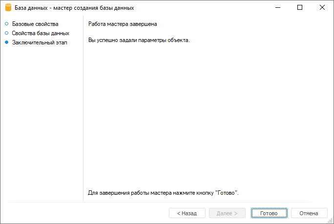

# Свойства базы данных

Свойства базы данных
-

# Свойства базы данных

На странице «Свойства базы данных»
 указывается тип системы управления базами данных (СУБД), установленной
 на сервере, а также дополнительные параметры подключения.

	 Веб-приложение Настольное приложение

		

		

Задайте параметры:

	- Переопределить настройки подключения
	 к БД. Снимите флажок для использования заданных [настроек
	 подключения к репозиторию](Setup.chm::/06_AK_Client_Config/UiNav_RepoConfig_repo1.htm), если они совпадают с
	 настройками подключения к базе данных. По умолчанию флажок установлен,
	 подключение к базе данных настраивается вручную:

		- Тип клиента СУБД.
		 Выберите в раскрывающемся списке [тип СУБД](Setup.chm::/01_SysReq/database_Support.htm).
		 В веб-приложении доступно подключение к базе данных СУБД ClickHouse
		 и создание следующих объектов, построенных на её основе: [таблица](../Table/Master/UiDb_relational_table_master_Property.htm),
		 [запрос](../Query/Master/UiDb_relational_query_master_Property.htm),
		 [присоединенная
		 таблица](../Attach_table/Master/UiDb_relational_AttachTable_master_database.htm), [представление](../conception/Master/UiDb_relational_conception_master_Property.htm),
		 [команда
		 СУБД](../CUBD/UiDb_relationa_CUBD_master_command.htm), [процедура](../procedure/UiDb_relational_procedure_master_procedure.htm).
		 Созданные таблицы могут использоваться в качестве [источников
		 данных](../reference_book/Master_Table_reference_book/DataSource.htm) только для [табличных
		 справочников](../reference_book/Master_Table_reference_book/Master_Table.htm);

		- Сервер. Введите
		 IP-адрес или DNS-имя, под которым зарегистрирован сервер с подключаемой
		 базой данных, или выберите [глобальную
		 переменную репозитория](UiDb_database_master_property1.htm). Поле отображается, если выбран тип
		 СУБД: Oracle, Microsoft SQL Server, Microsoft SQL Server (ODBC),
		 OLE DB (ODBC HIVE), OLE DB (ODBC), Greenplum/Pivotal HD Hawq,
		 PostgreSQL, ClickHouse.

Если порт сервера СУБД отличается от [порта
 по умолчанию](Setup.chm::/01_SysReq/EnviromentRequirements.htm#ports_and_protocols), то значение параметра задаётся в формате:

			- для PostgreSQL: <IP-адрес
			 или DNS-имя сервера>:<номер
			 порта>;

			- для Microsoft SQL Server: <IP-адрес
			 или DNS-имя сервера>,<номер
			 порта>;

			- для Oracle: <IP-адрес
			 или DNS-имя сервера>:<номер
			 порта>/<имя
			 сервиса базы данных>. Порт сервера и имя сервиса
			 базы данных определяется в файле tnsnames.ora.

		- Схема/База
		 данных. Введите идентификатор базы данных или выберите
		 [глобальную переменную
		 репозитория](UiDb_database_master_property1.htm). Идентификатор базы данных совпадает с идентификатором
		 репозитория. Поле «Схема»
		 отображается, если выбран тип СУБД: Oracle, OLE DB (ODBC HIVE),
		 OLE DB (ODBC). Поле «База данных» отображается,
		 если выбран тип СУБД: Microsoft SQL Server, Microsoft SQL Server
		 (ODBC), Greenplum/Pivotal HD Hawq, PostgreSQL, ClickHouse;

		- Схема.
		 Введите идентификатор пользовательской схемы, если она была создана
		 при [подготовке
		 серверной части СУБД](Setup.chm::/03_DB_Server_Config/Setup_DB_Server_Config.htm). Поле отображается, если
		 выбран тип СУБД: Microsoft SQL Server, Microsoft SQL Server (ODBC),
		 Greenplum/Pivotal HD Hawq, PostgreSQL. По умолчанию для Microsoft
		 SQL Server, Microsoft SQL Server (ODBC) используется схема «dbo»,
		 а для Greenplum/Pivotal HD Hawq, PostgreSQL - «public»;

		- Имя
		 файла. Выберите файл с настройками подключения к базе данных,
		 если выбран тип СУБД SQLite, с помощью кнопки 
		 «Выбрать файл». После
		 чего будет открыт стандартный диалог выбора файла;

Примечание.
 Параметр доступен только в настольном приложении.

		- DSN или строка подключения.
		 Введите имя источника данных или параметры подключения к базе
		 данных в виде строки. Поле отображается, если выбран тип СУБД:
		 ClickHouse (ODBC), Generic ODBC. Для работы должен быть установлен
		 и настроен соответствующий драйвер ODBC. Если на сервере СУБД
		 используются пользовательские схемы, то добавьте в строку подключения
		 ключевое слово Schema, а в качестве значения - наименование нужной
		 схемы. При подключении к ClickHouse в строке подключения рекомендуется
		 указывать параметр STRINGMAXLENGTH, который ограничивает максимальный
		 размер строковых значений, например STRINGMAXLENGTH=8000. Для
		 аутентификации в базе данных учётные данные пользователя могут
		 передаваться в открытом или закрытом виде:

			- если учётные данные предполагается передавать в открытом
			 виде, то укажите имя пользователя и пароль в строке подключения;

			- если учётные данные предполагается передавать в закрытом
			 виде, то выполните следующие действия:

				- Укажите маску %USR% и %PWD% в качестве значений
				 имени пользователя и пароля в строке подключения.

				- Установите флажок «Использовать
				 подстановку учётных данных по маске» в веб-приложении.
				 Если настройка подключения к базе данных выполняется в
				 настольном приложении, то пропустите шаг.

				- Заполните поля «Имя
				 пользователя» и «Пароль».

Для настройки [дополнительных
 параметров подключения](database_additional_adjustment.htm) к базе данных:

		- в настольном приложении нажмите кнопку «Дополнительные
		 настройки». После чего будет открыто окно «Дополнительные
		 настройки»;

		- в веб-приложении используйте раскрывающийся набор параметров
		 «Дополнительные настройки».

	- Тип аутентификации.
	 Выберите в раскрывающемся списке один из способов [аутентификации
	 пользователя](Setup.chm::/UiWebSetup/Authentication/Authentication.htm) на сервере базы данных. Параметр доступен
	 для всех типов СУБД, кроме ClickHouse (ODBC), Generic ODBC:

		- Парольная. Аутентификация
		 пользователя производится при указании имени пользователя и пароля
		 в явном виде. В ОС Linux тип аутентификации доступен, если выбран
		 тип СУБД: Oracle, Microsoft SQL Server (ODBC), PostgreSQL;

		- Интегрированная доменная.
		 Аутентификация пользователя производится с использованием доменного
		 имени пользователя и пароля (текущей учётной записи ОС). В ОС
		 Linux тип аутентификации доступен, если выбран тип СУБД PostgreSQL;

		- Доменная. Аутентификация
		 пользователя производится при указании домена, имени пользователя
		 и пароля в явном виде. В ОС Linux тип аутентификации доступен,
		 если выбран тип СУБД: Oracle, PostgreSQL. В ОС Windows тип аутентификации
		 доступен, если выбран тип СУБД: Oracle, Microsoft SQL Server,
		 Microsoft SQL Server (ODBC), Greenplum/Pivotal HD Hawq, PostgreSQL.

	- Управление
	 правами на объекты. Установите флажок для раздачи прав на объекты
	 базы данных на уровне репозитория и СУБД. По умолчанию флажок снят,
	 изменение прав происходит только на уровне репозитория. Флажок автоматически
	 устанавливается при установке флажка «Использовать
	 учётные данные, указанные при входе в систему». Параметр доступен
	 для всех типов СУБД, кроме ClickHouse (ODBC), Generic ODBC;

	- Использовать кодировку юникод
	 для представления данных. Установите флажок для создания в
	 таблицах текстовых полей с типом NVARCHAR. Данный тип позволяет работать
	 с символами кодировки юникод. По умолчанию флажок снят, используется
	 тип VARCHAR;

	- Использовать роль приложения
	 в БД. Установите флажок для получения доступа к созданию таблиц
	 на уровне СУБД только из «Форсайт. Аналитическая платформа».
	 Под ролью приложения понимается роль на уровне СУБД Microsoft SQL
	 Server, у которой есть права на создание таблиц в заданной схеме и
	 раздачу привилегий на эти таблицы. Например, если пользователь создает
	 новые таблицы, но прав на создание таблиц в выбранной базе данных
	 и прав на раздачу грантов на эти таблицы не имеет, то по умолчанию
	 будет открыто окно «[Авторизация
	 в базе данных](UiDb_database_authorization.htm)». Использование роли приложения в этом случае
	 позволяет осуществить подключение к базе данных под учётными данными
	 роли без появления диалога авторизации. Далее под установленным соединением
	 происходят операции с таблицами. По умолчанию флажок снят. Параметр
	 доступен, если выбран тип СУБД Microsoft SQL Server. Флажки «Автоматическое подключение» и «Использовать учётные данные, указанные
	 при входе в систему» на использование роли приложения не влияют;

	- Автоматическое
	 подключение. Установите флажок для автоматического подключения
	 к базе данных и определите один из вариантов подключения:

		- Использовать учётные данные,
		 указанные при входе в систему. Установите флажок для подключения
		 к серверу СУБД с таким же именем пользователя и паролем, какие
		 были указаны при подключении к репозиторию. При этом пользователю
		 будут установлены необходимые права на все доступные ему таблицы,
		 зарегистрированные в схеме метаданных, на сервере СУБД. По умолчанию
		 флажок снят. Также вместе с данным флажком автоматически устанавливается
		 флажок «Управление правами на
		 объекты». Это позволит автоматически раздавать права на
		 реляционные объекты репозитория (таблицы, запросы и прочие) на
		 уровне СУБД;

Примечание.
 Если у объекта базы данных установлен флажок «Использовать
 учётные данные, указанные при входе в систему», то при создании
 объектов СУБД учитывайте длину названия схемы базы данных, так как использование
 у объектов СУБД в качестве префикса имени базы приводит к превышению ограничения
 в 30 символов на имя.

		- Имя пользователя.
		 Введите имя пользователя для соединения с сервером базы данных.
		 Если выбран тип аутентификации «Доменная»,
		 то введите домен и имя пользователя в формате <Домен\Имя
		 пользователя>;

		- Пароль. Введите
		 пароль пользователя.

Примечание.
 Поля «Имя пользователя» и «Пароль» доступны, если снят флажок
 «Использовать учётные данные, указанные
 при входе в систему».

Параметр доступен для всех типов СУБД, кроме
 ClickHouse (ODBC), Generic ODBC.

При настройке подключения к СУБД ClickHouse
 (ODBC), Generic ODBC доступны только поля «Имя
 пользователя» и «Пароль»
 для использования маски %USR% и %PWD% в строке подключения. В веб-приложении
 доступность полей зависит от состояния флажка «Использовать
 подстановку учётных данных по маске».

При подключении к базе данных будет выдаваться
 окно «[Авторизация
 в базе данных](UiDb_database_authorization.htm)»:

		- если снят флажок «Автоматическое
		 подключение»;

		- в случае возникновения ошибок при подключении;

		- при создании, удалении или изменении структуры объектов,
		 если для подключения используются учётные
		 данные, указанные при входе в систему, и вход в систему
		 был осуществлен не под владельцем схемы;

		- если для подключения используются учётные
		 данные не владельца схемы.

Если установлен флажок «Автоматическое
 подключение», то подключение осуществляется автоматически при открытии
 объектов. Если используется автоматическое подключение и установлен флажок
 «Использовать учётные данные, указанные
 при входе в систему», то для создания реляционных объектов пользователю
 требуется привилегия «[Право
 чтения и открытия всех объектов](Admin.chm::/04_SecurityPolicy/Admin_Priv.htm#objects)», в противном
 случае при попытке создать таблицу произойдёт ошибка доступа. Если флажок
 «Использовать учётные данные, указанные
 при входе в систему» снят, то в поля «Имя
 пользователя» и «Пароль»
 необходимо указать данные владельца схемы ADMIN, в противном случае при
 попытке создать таблицу будет выведен [диалог
 авторизации](UiDb_database_authorization.htm).

Ошибки подключения возникают, если:

		- неправильно указаны пользователь и/или пароль;

		- у пользователя недостаточно прав для подключения к базе
		 данных;

		- неправильно указаны схема и/или сервер.

## Завершение
 работы мастера

Для завершения работы мастера:

	- в веб-приложении нажмите кнопку «Сохранить»;

	- в настольном приложении:

		- нажмите кнопку «Готово»;

		- нажмите кнопку «Готово»
		 на странице «Заключительный этап»:

См. также:

[Подключение
 к реляционным базам данных](UiDb_database.htm)

		Справочная
		 система на версию 10.9
		 от 18/08/2025,
		 © ООО «ФОРСАЙТ»,
