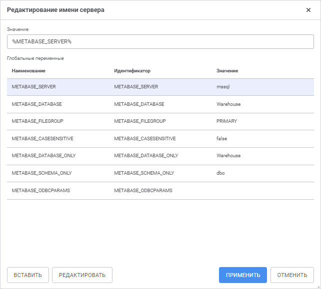
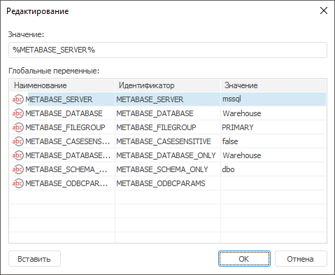

# Использование глобальных переменных

Использование глобальных переменных
-

# Использование глобальных переменных

Для использования [глобальных
 переменных](UiNav.chm::/02_Navigator/UiNav_GlobalVariables.htm) в полях «Сервер»,
 «Схема/База данных» на странице
 «[Свойства
 базы данных](UiDb_database_master_property.htm)»:

	- в веб-приложении нажмите кнопку  «Редактировать» в необходимом поле;

	- в настольном приложении выполните команду «Редактировать»
	 в раскрывающемся списке необходимого поля. По умолчанию в раскрывающемся
	 списке «Сервер» содержится
	 переменная %METABASE_SERVER%, а в списке «Схема/База
	 данных» - %METABASE_DATABASE%;

После выполнения одного из действий будет открыто окно «Редактирование
 <имени
 сервера/названия схемы/идентификатора базы данных>»
 в веб-приложении или окно «Редактирование»
 в настольном приложении.

	Веб-приложение Настольное приложение

		

		

Для указания выражения, в соответствии с которым будет формироваться
 имя сервера/название схемы/идентификатор базы данных, вставьте глобальную
 переменную из списка «Глобальные переменные»
 в поле «Значение». Для этого:

	- Выделите глобальную переменную в списке «Глобальные
	 переменные».

	- Выполните одно из действий:

		- нажмите кнопку «Вставить»;

		- дважды щёлкните по глобальной переменной;

		- выполните команду «Вставить»
		 в контекстном меню глобальной переменной. Доступно только в настольном
		 приложении.

После выполнения действий в поле «Значение»
 будет вставлено выражение глобальной переменной, значение которой будет
 использоваться в качестве имени сервера/названия схемы/идентификатора
 базы данных.

Для управления глобальными переменными нажмите кнопку «Редактировать».
 После чего будет открыто окно «Редактирование
 глобальных переменных», аналогичное странице «[Глобальные
 переменные](UiNav.chm::/02_Navigator/UiNav_GlobalVariables.htm)».

Примечание.
 Управление глобальными переменными в окне «Редактирование
 глобальных переменных» доступно только в веб-приложении. Для управления
 глобальными переменными в настольном приложении используйте вкладку «[Глобальные
 переменные](UiNav.chm::/02_Navigator/UiNav_GlobalVariables.htm)» в окне «Параметры».

См. также:

[Свойства
 базы данных](UiDb_database_master_property.htm)

		Справочная
		 система на версию 10.9
		 от 18/08/2025,
		 © ООО «ФОРСАЙТ»,
