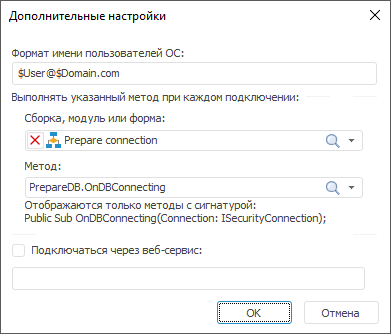
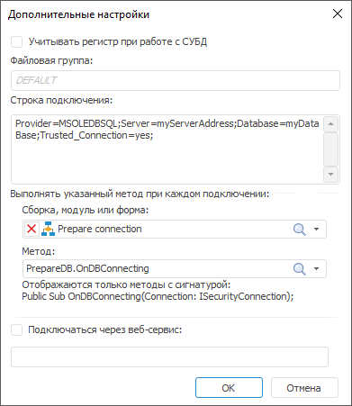
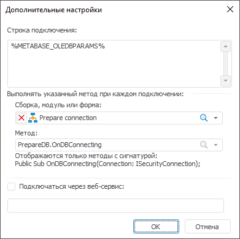
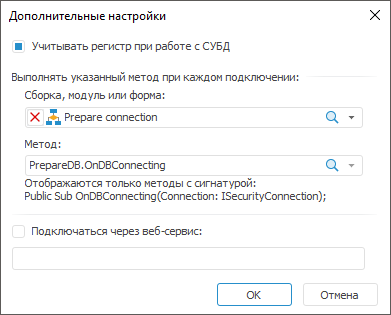
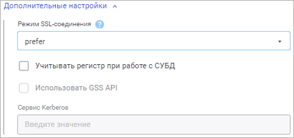
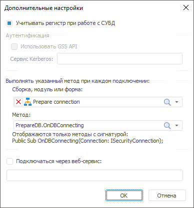
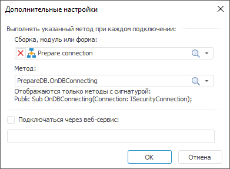

# Дополнительные настройки: База данных

Дополнительные настройки: База данных
-

# Дополнительные настройки

Для настройки дополнительных параметров подключения к базе данных на
 странице «[Свойства
 базы данных](UiDb_database_master_property.htm)»:

	- в веб-приложении используйте раскрывающийся набор параметров
	 «Дополнительные настройки»;

	- в настольном приложении нажмите кнопку «Дополнительные
	 настройки».

После выполнения одного из действий раскрыт набор параметров «Дополнительные настройки» в веб-приложении
 или будет открыто окно «Дополнительные
 настройки» в настольном приложении. Набор параметров зависит от
 выбранного [типа
 клиента СУБД](Setup.chm::/01_SysReq/database_Support.htm),
 который используется для подключения к базе данных:

[Oracle](javascript:TextPopup(this))

	Примечание.
	 Доступно только в настольном приложении.

	

	Задайте параметры:

		- Формат
		 имени пользователя ОС. При доменной аутентификации может
		 понадобиться задание формата имен пользователей, так как по умолчанию
		 используется следующий формат: «ДОМЕН\ИМЯ_ПОЛЬЗОВАТЕЛЯ». Если
		 на сервере задан префикс перед именами пользователей (параметр
		 [OS_AUTHENT_PREFIX](setup.chm::/03_db_server_config/setup_db_server_config_oracle_tuning.htm)),
		 то его также необходимо указать в данном поле. Для формирования
		 формата можно использовать статичный текст и следующие теги:

			- $User. Имя пользователя;

			- $Domain. Наименование
			 домена;

			- $FullDomain.
			 Полное наименование домена;

			- $FullDomainUser.
			 Полное доменное имя пользователя (включает имя пользователя
			 и полное имя домена, разделённые символом «@»).

	Примечание.
	 При использовании тегов необходимо соблюдать указанный регистр символов.

	Примеры форматов:

	$User@$Domain.COM

	При данном формате имя пользователя будет
	 выглядеть: «IVANOV@EXAMPLE.COM».

	$Domain@$User

	При данном формате имя пользователя будет
	 выглядеть: «EXAMPLE@IVANOV».

	$User@$FullDomain

	При данном формате имя пользователя будет
	 выглядеть: «IVANOV@EXAMPLE.WORLD.COM».

	$FullDomainUser

	При данном формате имя пользователя будет
	 выглядеть: «IVANOV@EXAMPLE.WORLD.COM».

	- Сборка, модуль или форма.
	 Вне зависимости от типа используемой СУБД можно определить макрос,
	 который будет выполняться при каждом подключении. Для этого из раскрывающегося
	 списка выберите модуль/форму/сборку, где имеется реализация макроса.
	 При этом в раскрывающемся списке «Метод»
	 будет сформирован список доступных для использования методов. Доступными
	 для использования являются статические процедуры, имеющие только один
	 параметр с типом [ISecurityConnection](KeSom.chm::/Interface/ISecurityConnection/ISecurityConnection.htm):

Class PrepareDB: Object

    Public Shared Sub OnDBConnecting(Connection: ISecurityConnection);

    Begin

        //Подготовка подключения

    End Sub OnDBConnecting;

End Class PrepareDB;

Процедура будет выполняться непосредственно
 после самого подключения и перед выполнением каких-либо других запросов.
 Созданное подключение будет доступно во входном параметре процедуры. В
 данной процедуре можно произвести какие-либо дополнительные настройки
 подключения;

Примечание.
 Настройка доступна только в настольном приложении.

	- Подключаться через веб-сервис.
	 При установке флажка подключение к базе данных и работа с объектами
	 СУБД будет выполняться через [веб-сервис](PPSOMService.chm::/Intro/PP7Service_Using.htm).
	 Укажите в поле адрес [BI-сервера](Setup.chm::/UiWebSetup/UiWebSetup_TitlePage.htm),
	 через который будут передаваться запросы к СУБД.

Примечание.
 Настройка доступна только в настольном приложении.

[Microsoft SQL
 Server](javascript:TextPopup(this))

		Веб-приложение
		 Настольное приложение

			

			

	Примечание.
	 В веб-приложении доступен только один параметр - «Учитывать
	 регистр при работе с СУБД».

	Задайте параметры:

	- Учитывать регистр при работе
	 с СУБД. Установите флажок для работы с объектами и их полями
	 в СУБД с различным регистром символов в их физическом имени. После
	 установки флажка объекты базы данных будут доступны только при указании
	 их точного физического имени. Если флажок снят, то физические имена
	 объектов и их полей в СУБД преобразуются к нижнему регистру в момент
	 обращения платформы к серверу. Параметр используется при раздаче прав
	 на уровне СУБД и учитывается при соединении с базой данных и выполнении
	 операций над ней;

Важно.
 Параметр задаётся один раз при первичной настройке подключения к базе
 данных. Повторное изменение параметра может привести к потере данных.

		- Файловая группа.
		 При подключении к СУБД используется файловая группа по умолчанию
		 и в поле отображается «DEFAULT». Для изменения файловой группы
		 введите наименование новой файловой группы;

		- Строка подключения.
		 По умолчанию в строке подключения содержится [системная
		 глобальная переменная](UiNav.chm::/02_Navigator/UiNav_GlobalVariables.htm) %METABASE_ODBCPARAMS%.
		 Переменная предназначена для хранения дополнительных параметров
		 подключения с использованием драйвера ODBC, заданных в строке
		 подключения при [настройке
		 репозитория](Setup.chm::/06_AK_Client_Config/UiNav_RepoConfig_repo1.htm). При необходимости задайте дополнительные
		 параметры подключения вручную.

	Для использования драйвера OLE DB в строке
	 подключения укажите глобальную переменную %METABASE_OLEDBPARAMS%.
	 Переменная предназначена для хранения дополнительных параметров подключения,
	 заданных вручную. Поддерживаемые параметры в разных версиях драйвера
	 OLE DB могут отличаться. Для получения подробной информации обратитесь
	 к документации [Microsoft](https://docs.microsoft.com/ru-ru/sql/connect/oledb/applications/using-connection-string-keywords-with-oledb-driver-for-sql-server?view=sql-server-ver15).

	Пример строки подключения для Microsoft
	 SQL Server (ODBC):

	Provider=SQLNCLI10.1;
	 Integrated Security=""; Persist Security Info=False; User
	 ID=sa; Initial Catalog=BudgetDatabase; Data Source=MsServer; Initial
	 File Name=""; Server SPN=""

	- Сборка, модуль или форма.
	 Вне зависимости от типа используемой СУБД можно определить макрос,
	 который будет выполняться при каждом подключении. Для этого из раскрывающегося
	 списка выберите модуль/форму/сборку, где имеется реализация макроса.
	 При этом в раскрывающемся списке «Метод»
	 будет сформирован список доступных для использования методов. Доступными
	 для использования являются статические процедуры, имеющие только один
	 параметр с типом [ISecurityConnection](KeSom.chm::/Interface/ISecurityConnection/ISecurityConnection.htm):

Class PrepareDB: Object

    Public Shared Sub OnDBConnecting(Connection: ISecurityConnection);

    Begin

        //Подготовка подключения

    End Sub OnDBConnecting;

End Class PrepareDB;

Процедура будет выполняться непосредственно
 после самого подключения и перед выполнением каких-либо других запросов.
 Созданное подключение будет доступно во входном параметре процедуры. В
 данной процедуре можно произвести какие-либо дополнительные настройки
 подключения;

Примечание.
 Настройка доступна только в настольном приложении.

	- Подключаться через веб-сервис.
	 При установке флажка подключение к базе данных и работа с объектами
	 СУБД будет выполняться через [веб-сервис](PPSOMService.chm::/Intro/PP7Service_Using.htm).
	 Укажите в поле адрес [BI-сервера](Setup.chm::/UiWebSetup/UiWebSetup_TitlePage.htm),
	 через который будут передаваться запросы к СУБД.

Примечание.
 Настройка доступна только в настольном приложении.

[OLEDB(ODBC)](javascript:TextPopup(this))

	Примечание.
	 Доступно только в настольном приложении.

	

	Задайте параметры:

		- Строка подключения.
		 По умолчанию в строке подключения содержится [системная
		 глобальная переменная](UiNav.chm::/02_Navigator/UiNav_GlobalVariables.htm) %METABASE_ODBCPARAMS%.
		 Переменная предназначена для хранения дополнительных параметров
		 подключения с использованием драйвера ODBC, заданных в строке
		 подключения при [настройке
		 репозитория](Setup.chm::/06_AK_Client_Config/UiNav_RepoConfig_repo1.htm). При необходимости задайте дополнительные
		 параметры подключения вручную.

	Для использования драйвера OLE DB в строке
	 подключения укажите глобальную переменную %METABASE_OLEDBPARAMS%.
	 Переменная предназначена для хранения дополнительных параметров подключения,
	 заданных вручную. Поддерживаемые параметры в разных версиях драйвера
	 OLE DB могут отличаться. Для получения подробной информации обратитесь
	 к документации [Microsoft](https://docs.microsoft.com/ru-ru/sql/connect/oledb/applications/using-connection-string-keywords-with-oledb-driver-for-sql-server?view=sql-server-ver15);

	- Сборка, модуль или форма.
	 Вне зависимости от типа используемой СУБД можно определить макрос,
	 который будет выполняться при каждом подключении. Для этого из раскрывающегося
	 списка выберите модуль/форму/сборку, где имеется реализация макроса.
	 При этом в раскрывающемся списке «Метод»
	 будет сформирован список доступных для использования методов. Доступными
	 для использования являются статические процедуры, имеющие только один
	 параметр с типом [ISecurityConnection](KeSom.chm::/Interface/ISecurityConnection/ISecurityConnection.htm):

Class PrepareDB: Object

    Public Shared Sub OnDBConnecting(Connection: ISecurityConnection);

    Begin

        //Подготовка подключения

    End Sub OnDBConnecting;

End Class PrepareDB;

Процедура будет выполняться непосредственно
 после самого подключения и перед выполнением каких-либо других запросов.
 Созданное подключение будет доступно во входном параметре процедуры. В
 данной процедуре можно произвести какие-либо дополнительные настройки
 подключения;

Примечание.
 Настройка доступна только в настольном приложении.

	- Подключаться через веб-сервис.
	 При установке флажка подключение к базе данных и работа с объектами
	 СУБД будет выполняться через [веб-сервис](PPSOMService.chm::/Intro/PP7Service_Using.htm).
	 Укажите в поле адрес [BI-сервера](Setup.chm::/UiWebSetup/UiWebSetup_TitlePage.htm),
	 через который будут передаваться запросы к СУБД.

Примечание.
 Настройка доступна только в настольном приложении.

[Greenplum/Pivotal
 HD Hawq](javascript:TextPopup(this))

		Веб-приложение
		 Настольное приложение

			

			

	Примечание.
	 В веб-приложении доступен только один параметр - «Учитывать
	 регистр при работе с СУБД».

	Задайте параметры:

	- Учитывать регистр при работе
	 с СУБД. Установите флажок для работы с объектами и их полями
	 в СУБД с различным регистром символов в их физическом имени. После
	 установки флажка объекты базы данных будут доступны только при указании
	 их точного физического имени. Если флажок снят, то физические имена
	 объектов и их полей в СУБД преобразуются к нижнему регистру в момент
	 обращения платформы к серверу. Параметр используется при раздаче прав
	 на уровне СУБД и учитывается при соединении с базой данных и выполнении
	 операций над ней;

Важно.
 Параметр задаётся один раз при первичной настройке подключения к базе
 данных. Повторное изменение параметра может привести к потере данных.

	- Сборка, модуль или форма.
	 Вне зависимости от типа используемой СУБД можно определить макрос,
	 который будет выполняться при каждом подключении. Для этого из раскрывающегося
	 списка выберите модуль/форму/сборку, где имеется реализация макроса.
	 При этом в раскрывающемся списке «Метод»
	 будет сформирован список доступных для использования методов. Доступными
	 для использования являются статические процедуры, имеющие только один
	 параметр с типом [ISecurityConnection](KeSom.chm::/Interface/ISecurityConnection/ISecurityConnection.htm):

Class PrepareDB: Object

    Public Shared Sub OnDBConnecting(Connection: ISecurityConnection);

    Begin

        //Подготовка подключения

    End Sub OnDBConnecting;

End Class PrepareDB;

Процедура будет выполняться непосредственно
 после самого подключения и перед выполнением каких-либо других запросов.
 Созданное подключение будет доступно во входном параметре процедуры. В
 данной процедуре можно произвести какие-либо дополнительные настройки
 подключения;

Примечание.
 Настройка доступна только в настольном приложении.

	- Подключаться через веб-сервис.
	 При установке флажка подключение к базе данных и работа с объектами
	 СУБД будет выполняться через [веб-сервис](PPSOMService.chm::/Intro/PP7Service_Using.htm).
	 Укажите в поле адрес [BI-сервера](Setup.chm::/UiWebSetup/UiWebSetup_TitlePage.htm),
	 через который будут передаваться запросы к СУБД.

Примечание.
 Настройка доступна только в настольном приложении.

[PostgreSQL](javascript:TextPopup(this))

		Веб-приложение
		 Настольное приложение

			

			

	Задайте параметры:

		- Режим SSL-соединения.
		 Из раскрывающегося списка выберите режим создания защищённого
		 соединения при подключении к СУБД:

			- Disable.
			 Соединение без использования SSL;

			- Allow. Сначала
			 пытаться установить соединение без использования SSL. Если
			 соединение неудачное, то пытаться установить SSL-соединение;

			- Prefer.
			 Сначала пытаться установить SSL-соединение. Если соединение
			 неудачное, то пытаться установить соединение без использования
			 SSL;

			- Require.
			 Пытаться установить только SSL-соединение. Если присутствует
			 корневой сертификат, то верифицировать его таким же образом,
			 который используется при режиме VerifyCA;

			- VerifyCA. Пытаться
			 установить только SSL-соединение. Проверять, чтобы сертификат
			 сервера СУБД был выпущен доверенным центром сертификации;

			- VerifyFull.
			 Пытаться установить только SSL-соединение. Проверять, чтобы
			 сертификат сервера СУБД был выпущен доверенным центром сертификации
			 и имя сервера соответствовало имени в сертификате.

	Примечание.
	 Настройка доступна только в веб-приложении.

	- Учитывать регистр при работе
	 с СУБД. Установите флажок для работы с объектами и их полями
	 в СУБД с различным регистром символов в их физическом имени. После
	 установки флажка объекты базы данных будут доступны только при указании
	 их точного физического имени. Если флажок снят, то физические имена
	 объектов и их полей в СУБД преобразуются к нижнему регистру в момент
	 обращения платформы к серверу. Параметр используется при раздаче прав
	 на уровне СУБД и учитывается при соединении с базой данных и выполнении
	 операций над ней;

Важно.
 Параметр задаётся один раз при первичной настройке подключения к базе
 данных. Повторное изменение параметра может привести к потере данных.

		- Использовать GSS API.
		 При установке флажка будет возможность использовать аутентификацию
		 к серверу PostgreSQL по механизму [GSS
		 API](https://www.postgresql.org/docs/9.4/static/auth-methods.html). Установка флажка доступна только в том случае, если на
		 странице «[Свойства базы данных](../Link_with/UiDb_relational_LinkWith_master_property.htm)»
		 выбран тип аутентификации «Интегрированная
		 доменная»:

			- Сервис Kerberos.
			 Вместе с GSS API используется сервис [Kerberos](https://www.postgresql.org/docs/9.1/static/auth-methods.html#KERBEROS-AUTH).
			 GSS API позволяет использовать разные реализации Kerberos
			 без изменения кода приложения. В строке необходимо указать
			 наименование сервера Kerberos, которое задано в настройках
			 сервера PostgreSQL. Более подробно о API Kerberos можно ознакомиться
			 на [официальном
			 сайте](https://www.postgresql.org/docs/9.1/static/auth-methods.html#KERBEROS-AUTH);

	- Сборка, модуль или форма.
	 Вне зависимости от типа используемой СУБД можно определить макрос,
	 который будет выполняться при каждом подключении. Для этого из раскрывающегося
	 списка выберите модуль/форму/сборку, где имеется реализация макроса.
	 При этом в раскрывающемся списке «Метод»
	 будет сформирован список доступных для использования методов. Доступными
	 для использования являются статические процедуры, имеющие только один
	 параметр с типом [ISecurityConnection](KeSom.chm::/Interface/ISecurityConnection/ISecurityConnection.htm):

Class PrepareDB: Object

    Public Shared Sub OnDBConnecting(Connection: ISecurityConnection);

    Begin

        //Подготовка подключения

    End Sub OnDBConnecting;

End Class PrepareDB;

Процедура будет выполняться непосредственно
 после самого подключения и перед выполнением каких-либо других запросов.
 Созданное подключение будет доступно во входном параметре процедуры. В
 данной процедуре можно произвести какие-либо дополнительные настройки
 подключения;

Примечание.
 Настройка доступна только в настольном приложении.

	- Подключаться через веб-сервис.
	 При установке флажка подключение к базе данных и работа с объектами
	 СУБД будет выполняться через [веб-сервис](PPSOMService.chm::/Intro/PP7Service_Using.htm).
	 Укажите в поле адрес [BI-сервера](Setup.chm::/UiWebSetup/UiWebSetup_TitlePage.htm),
	 через который будут передаваться запросы к СУБД.

Примечание.
 Настройка доступна только в настольном приложении.

[ClickHouse (ODBC),
 Generic ODBC, OLE DB(ODBC HIVE), SQLite](javascript:TextPopup(this))

	Примечание.
	 Доступно только в настольном приложении.

	

	Задайте параметры:

	- Сборка, модуль или форма.
	 Вне зависимости от типа используемой СУБД можно определить макрос,
	 который будет выполняться при каждом подключении. Для этого из раскрывающегося
	 списка выберите модуль/форму/сборку, где имеется реализация макроса.
	 При этом в раскрывающемся списке «Метод»
	 будет сформирован список доступных для использования методов. Доступными
	 для использования являются статические процедуры, имеющие только один
	 параметр с типом [ISecurityConnection](KeSom.chm::/Interface/ISecurityConnection/ISecurityConnection.htm):

Class PrepareDB: Object

    Public Shared Sub OnDBConnecting(Connection: ISecurityConnection);

    Begin

        //Подготовка подключения

    End Sub OnDBConnecting;

End Class PrepareDB;

Процедура будет выполняться непосредственно
 после самого подключения и перед выполнением каких-либо других запросов.
 Созданное подключение будет доступно во входном параметре процедуры. В
 данной процедуре можно произвести какие-либо дополнительные настройки
 подключения;

Примечание.
 Настройка доступна только в настольном приложении.

	- Подключаться через веб-сервис.
	 При установке флажка подключение к базе данных и работа с объектами
	 СУБД будет выполняться через [веб-сервис](PPSOMService.chm::/Intro/PP7Service_Using.htm).
	 Укажите в поле адрес [BI-сервера](Setup.chm::/UiWebSetup/UiWebSetup_TitlePage.htm),
	 через который будут передаваться запросы к СУБД.

Примечание.
 Настройка доступна только в настольном приложении.

См. также:

[Свойства
 базы данных](UiDb_database_master_property.htm)

		Справочная
		 система на версию 10.9
		 от 18/08/2025,
		 © ООО «ФОРСАЙТ»,
