# Примеры: Редактор формул

Примеры: Редактор формул
-

# Примеры

[Использование
 глобальных переменных](javascript:TextPopup(this))

	Для использования [глобальной
	 переменной](UiNav.chm::/02_Navigator/UiNav_GlobalVariables.htm) укажите идентификатор глобальной переменной
	 в области «Формулы», например:

	

[Использование
 прикладных функций](javascript:TextPopup(this))

	Для использования прикладных функций из модуля укажите полный путь
	 к функции в формате: <идентификатор
	 модуля>.<имя функции>.[(<значения параметров>)]. Например:

	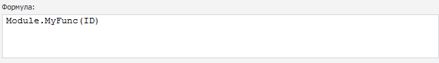

[Использование
 статических методов прикладных и системных классов](javascript:TextPopup(this))

	Для использования методов укажите полный путь к методу в формате:
	 <имя модуля>.<имя класса>.<имя
	 метода>. Например:

	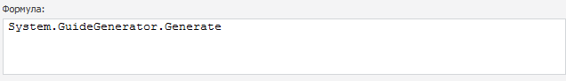

	См. также: [Классы](fore.chm::/02_generalinfo/fore_classesandobjects.htm),
	 [Классы
	 сборки System](foresys.chm::/class/system_classes.htm),
	 [IStatistics](statlib.chm::/interface/istatistics/istatistics.htm)
	 и [MathFin](mathlib.chm::/interface/interfaces.htm).

	Пример использования прикладных методов:

	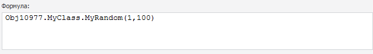

[Использование
 условного оператора](javascript:TextPopup(this))

	Для использования условного оператора введите строку следующей структуры:
	 <условие> ? <значение, если условие выполняется>
	 : <значение, если условие не
	 выполняется>.

	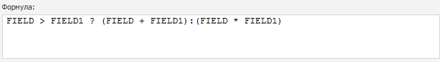

	Указанное выражение, заданное через условный оператор IIF:

	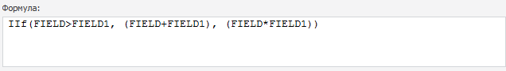

[Использование
 операций +, -, *, /](javascript:TextPopup(this))

	Для использования операций сложения, вычитания, умножения и деления
	 нажмите кнопки «+», «-», «-» и «/» соответственно. Например:

	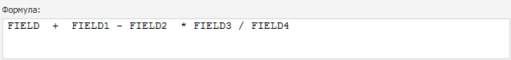

[Использование
 знаков =, <>, <, >, <=,>= и ()](javascript:TextPopup(this))

	Для использования знаков «равно», «не равно», «меньше», «больше»,
	 «меньше или равно», «больше или равно» и скобок нажмите кнопки «=»,
	 «<>», «<», «>», «<=», «>=», «()» соответственно.
	 Например:

	

[Использование
 операций DIV и MOD](javascript:TextPopup(this))

	Для получения частного двух значений нажмите кнопку «DIV»; для получения
	 остатка от деления - кнопку «MOD». Например:

	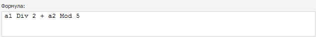,

	где a1 и а2 - координаты в кубе источнике.

[Использование
 союзов AND и OR](javascript:TextPopup(this))

	Для использования союзов «и» и «или» нажмите кнопку «AND» или «OR»
	 соответственно. Например:

	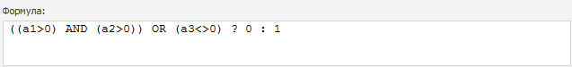,

	где a1, а2 и a3 - координаты в кубе источнике.

[Использование
 союза NOT](javascript:TextPopup(this))

	Для использования союза «отрицание» нажмите кнопку «NOT». Например:

	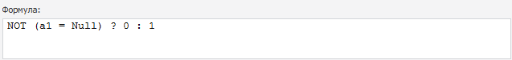,

	где a1 - координата в кубе источнике.

[Использование
 функции LAGVAL](javascript:TextPopup(this))

	Для использования функции, возвращающей значение со смещением по
	 календарному измерению, нажмите кнопку «LAGVAL». В вставленном выражении
	 рядом с символом «@» укажите элемент измерения, по которому будет
	 браться значение со смещением. Во втором параметре указывается смещение
	 относительно текущей точки расчёта - лаг. Если значение лага положительное,
	 то смещение осуществляется назад по календарному измерению. При отрицательном
	 значении лага смещение осуществляется вперёд по календарному измерению.
	 Смещение осуществляется по тому уровню календаря, на котором расположена
	 текущая точка расчёта. По умолчанию лаг равен «1». Пример:

	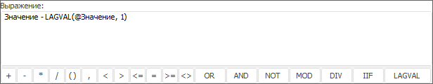

	где «Значение» - элемент измерения фактов в кубе-источнике.
	 Результат расчёта значений элемента «Изменение» по данной формуле:

	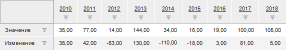

См. также:

[Редактор
 формул вычисляемого куба](UiMd_Equation_editor_CalculationCube.htm)

		Справочная
		 система на версию 10.9
		 от 18/08/2025,
		 © ООО «ФОРСАЙТ»,
