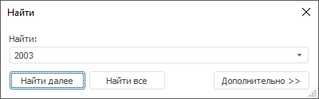
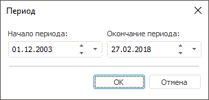

# Редактор формул вычисляемого куба

Редактор формул вычисляемого куба
-

# Редактор формул для вычисляемого
	 куба

	Для задания формул расчёта вычисляемого куба используется редактор
	 формул. Для открытия редактора формул:

		- в веб-приложении перейдите на страницу «Редактор
		 формул» мастера вычисляемого куба;

		- в настольном приложении в навигаторе объектов выполните
		 команду «Редактировать формулы»
		 в контекстном меню вычисляемого куба.

		 Веб-приложение Настольное приложение

			

			

	В редакторе формул доступны области:

		- Области измерений:

			- Измерения-назначения.
			 В области отображаются незафиксированные измерения куба-назначения;

			- Измерения-источники.
			 В области отображаются незафиксированные измерения куба, выбранного
			 в поле «Куб-источник».

	[Особенности
	 работы с областями измерений](javascript:TextPopup(this))

		Одно из измерений кубов в областях
		 измерений является активным. Под названием активного измерения
		 находится область дерева самого измерения. Остальные измерения
		 отображаются под областью дерева активного измерения. Для каждого
		 предусмотрен раскрывающийся список элементов с кнопкой  «Раскрыть»
		 в веб-приложении или кнопкой  «Раскрыть» в настольном приложении,
		 при нажатии на которую измерение становится активным.

		В областях измерений доступны команды
		 контекстного меню:

				- Наименование
				 в измерении. При выборе данного пункта появляется
				 всплывающее меню, вид которого зависит от набора атрибутов
				 справочника. В меню необходимо выбрать один из предлагаемых
				 атрибутов, который будет использоваться для формирования
				 наименований элементов справочника;

				- Наименование
				 для формул. При выборе данного пункта появляется
				 всплывающее меню, вид которого зависит от набора атрибутов
				 справочника. В меню необходимо выбрать один из предлагаемых
				 атрибутов, который будет использоваться в качестве наименования
				 элемента в формуле. Так же всплывающее меню будет обязательно
				 содержать пункт:

					- Отобразить/Скрыть
					 в формулах. В формулах будут отображены / скрыты
					 элементы. При скрытии всех координат куба в формуле
					 будет отражен текст «<Скрытый элемент>»;

				- Развернуть
				 все. Разворачивает иерархию измерения;

				- Свернуть
				 все. Сворачивает иерархию измерения.

		- Период. Область
		 содержит список всех периодов действия формул для выбранной координаты
		 куба-назначения. Список доступен, если для вычисляемого куба задано
		 [управление
		 формулами](../Cube/CreateCube/Master_Calculation/UiMd_Cube_CreateCube_Master_Calculation_3.htm);

		- Выражение. Область
		 предназначена для формирования выражение, по которому будет рассчитано
		 значение в выбранной координате куба-назначения.

	[Особенности
	 задания выражения](javascript:TextPopup(this))

		В настольном приложении при формировании
		 наименования элемента формулы по отметке в кубе можно задать вид
		 его отображения с помощью команд контекстного меню:

				- Не отображать источники
				 данных. Источники данных элемента формулы не отображаются;

				- Отображать наименования
				 источников данных. Будут отображены только наименования
				 источников, принадлежащих данному элементу в формуле;

				- Отображать идентификаторы
				 источников данных.
				 Будут отображены только идентификаторы источников, принадлежащих
				 данному элементу в формуле;

				- Отображать наименования
				 и идентификаторы источников
				 данных. Будут отображены наименования и идентификаторы
				 источников, принадлежащих данному элементу в формуле.

## Поиск элемента измерения

	Поиск элемента измерения доступен только в настольном приложении.

	Для поиска элементов измерения:

		- выполните команду контекстного меню «Найти»;

		- нажмите сочетание клавиш CTRL+F.

	После выполнения одного из действий будет открыто стандартное окно
	 поиска:

	

	Для поэтапного получения результатов поиска следует нажимать
	 кнопку «Найти далее»,
	 фокус будет последовательно перемещаться к найденному элементу. Кнопка
	 «Закрыть» закрывает
	 данный диалог.

## Настройка периодов действия формул

	Список «Период» содержит
	 все периоды действия формул для выбранной координаты куба-назначения.
	 Для каждого периода задается своя формула расчёта значения.

	Для добавления периода нажмите кнопку  «Добавить» в веб-приложении или выполните
	 команду контекстного меню «Добавить»
	 в настольном приложении. Будет открыто окно для создания периода:

		 Веб-приложение Настольное приложение

			

			

	Укажите в окне даты начала и окончания периода.

	Примечание.
	 В случае если создаваемый период пересекается с уже существующими
	 периодами, будет выдано соответствующее сообщение. При положительном
	 ответе период будет добавлен или отредактирован, все полностью входящие
	 в него периоды будут удалены, частично входящие - откорректированы.

	Для редактирования выбранного периода дважды щёлкните по периоду
	 в веб-приложении или выполните команду контекстного меню «Редактировать»
	 в настольном приложении. Будет открыто окно как при создании периода.

	Для удаления выбранного периода:

		- в веб-приложении нажмите кнопку  «Удалить»;

		- в настольном приложении выполните команду контекстного меню
		 «Удалить». Будет выдан
		 диалог подтверждения выполняемого действия.

## Создание формулы

	Формула задается для координаты куба-назначения. Для формирования
	 координаты следует произвести отметку во всех измерениях куба. В формируемых
	 выражениях используются координаты кубов-источников.

	Для добавления координаты куба-источника в выражение для координаты
	 куба-назначения:

		- в веб-приложении выделите элемент измерения-источника и
		 нажмите кнопку  «Вставить
		 в формулу»;

		- в настольном приложении выполните команду «Добавить
		 в формулу» контекстного меню элемента измерения-источника.

	В результате в текущей позиции в поле «Выражение»
	 появится элемент выражения, соответствующий координате куба-источника.

	Если в вычисляемом кубе используется период действия формул и для
	 выбранной координаты куба-назначения ни один период не был создан,
	 то при выполнении одного из действий будет открыто окно создания периода.

	При формировании выражения можно использовать различные математические
	 функции и операции:

			 Функция/Операция
			 Описание

			 +
			 Операция сложения.

			 -
			 Операция вычитания.

			 *
			 Операция умножения.

			 /
			 Операция деления.

			 =
			 Знак «равно».

			 <>
			 Знак «не равно».

			 <
			 Знак «меньше».

			 >
			 Знак «больше».

			 <=
			 Знак «меньше или равно».

			 >=
			 Знак «больше или равно».

			 ()
			 Скобки.

			 AND
			 Союз «и».

			 DIV
			 Операция целочисленного деления. Возвращает целое от деления.

			 IIF
			 Условный оператор: IIF(<условие>,<выражение,
			 если условие верно>,<выражение,
			 если условие неверно>).

			 LAGVAL
			 Получение значения со смещением по календарному измерению
			 с заданным лагом: LAGVAL(@<элемент>, <лаг, на
			 который осуществляется сдвиг>).

Если значение лага положительное, то смещение
			 осуществляется назад по календарному измерению. При отрицательном
			 значении лага смещение осуществляется вперёд по календарному
			 измерению. Смещение осуществляется по тому уровню календаря,
			 на котором расположена текущая точка расчёта. Для корректной
			 работы функции может потребоваться задание [лагов
			 для измерений](../Cube/CreateCube/Master_Calculation/UiMd_Cube_CreateCube_Master_Calculation_2.htm#lag).
			Примечание.
			 Если в кубе несколько календарных измерений, то используется
			 первое по порядку календарное измерение.

			 MOD
			 Операция целочисленного деления. Возвращает остаток от
			 деления.

			 NOT
			 Союз «отрицание».

			 OR
			 Союз «или».

	Совет.
	 Для получения примеров составления выражений обратитесь к разделу
	 «[Примеры](EE_samples.htm)».

	При закрытии редактора формул автоматически сохраняются выбранный
	 куб-источник, порядок расположения измерений кубов-источников и куба-назначения,
	 отмеченные элементы измерений, вид отображения наименований в измерениях
	 и в формулах, а также параметры, с которыми были построены измерения.
	 При последующем открытии редактора формул вычисляемого куба он будет
	 открыт с сохраненными ранее настройками.

	Для сохранения формулы:

		- в веб-приложении нажмите кнопку «Сохранить»;

		- в настольном приложении выполните команду «Куб >
		 Сохранить» главного меню.

### Использование прикладных функций

	Для расчёта формулы может использоваться прикладная функция. Функция
	 может содержать любое количество параметров (обязательных и необязательных)
	 и должна возвращать значение, имеющее простой тип данных. В функцию
	 могут быть переданы координаты куба, для этого в сигнатуре функции
	 должны быть объявлены параметры с типом [ICalculatedCubeInstanceCoord](KeCubes.chm::/Interface/ICalculatedCubeInstanceCoord/ICalculatedCubeInstanceCoord.htm).
	 Если в выражении указывается координата, то при расчёте в функцию
	 будет передано фактическое значение по этой координате. Пример: Calc_Functions.Sample1(Россия|2000).
	 Для передачи в функцию самой координаты, описываемой интерфейсом [ICalculatedCubeInstanceCoord](KeCubes.chm::/Interface/ICalculatedCubeInstanceCoord/ICalculatedCubeInstanceCoord.htm),
	 укажите в выражении перед координатой символ «@». Пример: Calc_Functions.Sample2(@Россия|2000).

## Изменение значения параметра

	В настольном приложении при наличии у куба-назначения параметров,
	 его можно переоткрыть с новыми значениями этих параметров. Для этого
	 выполните команду «Куб >
	 Изменить значения параметров» главного меню.

	Будет открыто окно «[Установка значений параметров](uinav.chm::/02_Navigator/General_Principles_of_Work.htm#open_param_object)»,
	 в котором следует определить значения.

	Если у куба-назначения нет параметров, то куб будет просто переоткрыт.

## Закрытие редактора формул

	Для закрытия редактора формул:

		- в веб-приложении нажмите кнопку «Отменить».
		 Мастер вычисляемого куба будет закрыт;

		- в настольном приложении выполните одно из действий:

			- выполните команду главного меню «Куб >
			 Закрыть»;

			- нажмите сочетание клавиш ALT+F4.

	Если до закрытия не были сохранены созданные
	 или изменённые формулы, то при сохранении будет выдано предложение
	 на их сохранение. При положительном ответе формулы будут сохранены,
	 в противном случае - нет.

См. также:

[Вычисляемый
 куб](../Cube/CreateCube/Master_Calculation/UiMd_Cube_CreateCube_Master_Calculation.htm)

		Справочная
		 система на версию 10.9
		 от 18/08/2025,
		 © ООО «ФОРСАЙТ»,
