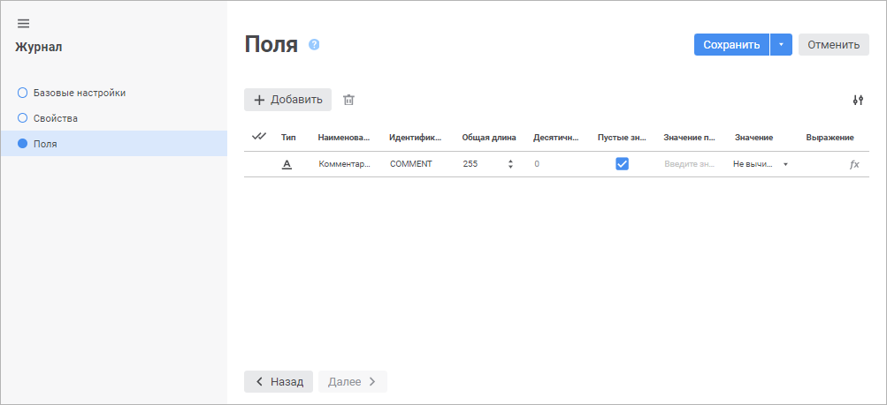
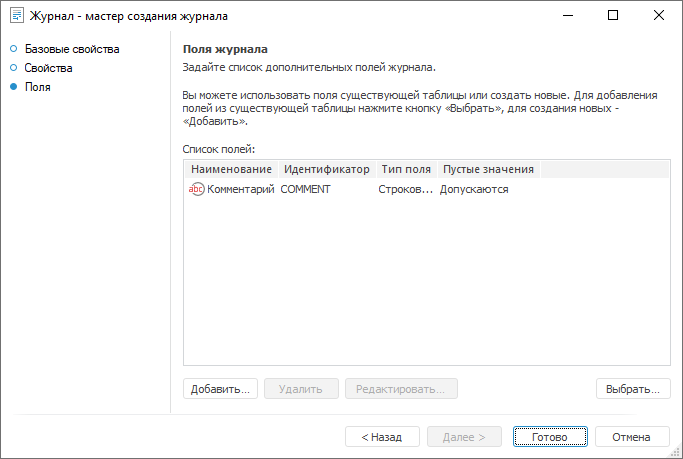

# Страница «Поля»: Журнал

Страница «Поля»: Журнал
-

# Поля журнала

На странице «Поля» создаётся
 список дополнительных полей журнала.

	Веб-приложение Настольное приложение

		

		

[Добавление поля](javascript:TextPopup(this))

	Для добавления новых полей выполните одно из действий:

		- в веб-приложении нажмите кнопку  «Добавить». В список полей добавится
		 новая строка;

		- в настольном приложении:

			- нажмите кнопку «Добавить»;

			- дважды щелкните в области списка полей.

	Откроется окно «Свойства
	 поля таблицы»:

	

	Определите атрибуты поля:

		- Наименование. Введите
		 название поля, характеризующее его назначение;

		- Идентификатор. Введите
		 уникальное имя поля таблицы. Идентификатор представляет собой
		 непрерывную последовательность латинских букв, цифр и подчёркиваний
		 и используется для SQL-запросов, определения связей между таблицами;

		- Тип/Тип данных.
		 Выберите из раскрывающегося списка тип данных, которые будут храниться
		 в таблице: строка, число, вещественный, дата, пользовательский;

		- Общая длина. Укажите
		 максимально возможную длину поля таблицы: для символьного -
		 количество символов, для числового - количество цифр;

		- Десятичных знаков.
		 Укажите количество десятичных знаков после запятой для числовых
		 полей;

		- Пустые значения.
		 Определите возможность хранения в поле пустых значений. В настольном
		 приложении параметр принимает одно из значений «Допускаются»
		 и «Не допускаются»;

		- Значение по умолчанию.
		 Определите значение, которое будет присвоено полю при его создании,
		 при необходимости. Можно ввести, например, наиболее часто встречающееся
		 значение;

		- Значение/Вычисляемое поле.
		 Определите признак вычисляемости поля. В веб-приложении параметр
		 принимает одно из значений «Вычисляемое»
		 и «Не вычисляемое». При
		 установке вычисляемого поля задайте в поле «Выражение»
		 выражение, по которому будет вычисляться значение поля. Для задания
		 выражения используется «[Редактор
		 выражения](UiNav.chm::/GUI/ExpressionEditor.htm)», вызов которого происходит
		 при нажатии кнопки  «Задать
		 выражение» в веб-приложении или  «Задать выражение» в настольном
		 приложении;

	В настольном приложении также существует возможность добавления
	 полей в список полей журнала из существующих таблиц. Для этого воспользуйтесь
	 кнопкой «Выбрать», при нажатии
	 которой откроется окно «Выбор таблицы».
	 В данном окне выберите таблицу, все поля которой будут занесены в
	 список полей журнала.

	Для изменения отображаемых свойств в веб-приложении установите или
	 снимите отметку около требуемых свойств в раскрывающемся меню кнопки
	  «Настройки».

[Редактирование
 поля](javascript:TextPopup(this))

	Для редактирования выбранного поля журнала:

		- в веб-приложении задайте или измените требуемые настройки
		 поля в соответствующих столбцах;

		- в настольном приложении нажмите кнопку «Редактировать»
		 или дважды щёлкните по параметру в списке. Будет открыто окно
		 «Свойства поля таблицы».

[Удаление поля](javascript:TextPopup(this))

	Для удаления выбранного поля:

		- в веб-приложении нажмите кнопку  «Удалить»;

		- в настольном приложении нажмите кнопку «Удалить»
		 или нажмите сочетание клавиш CTRL+DELETE.

	Будет отображено окно подтверждения удаления.

При нажатии кнопки «Сохранить»
 в веб-приложении или кнопки «Готово»
 в настольном приложении в репозитории будет создан журнал, а в базе репозитория -
 таблица с сформированной структурой.

См. также:

[Журнал](../UiDb_relational_journal.htm)

		Справочная
		 система на версию 10.9
		 от 18/08/2025,
		 © ООО «ФОРСАЙТ»,
