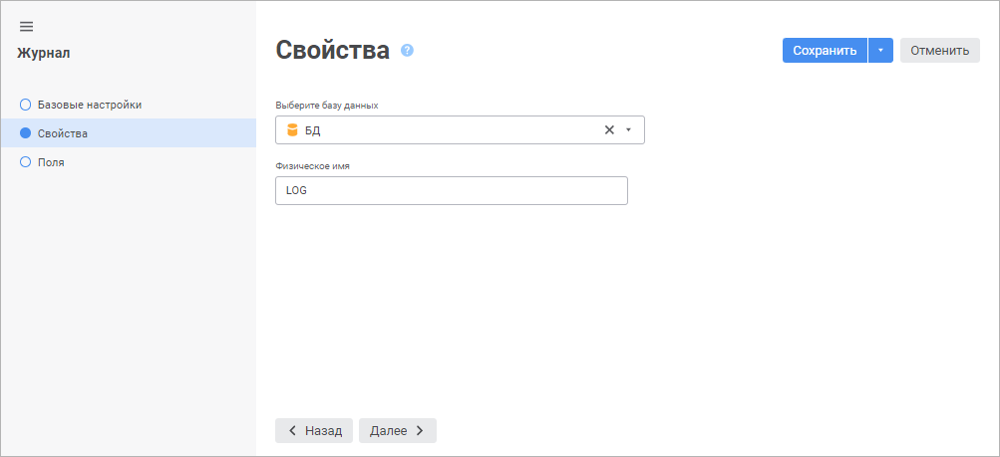
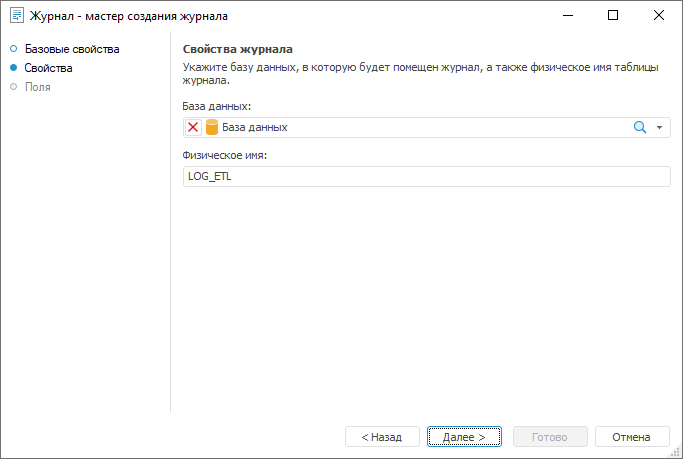

# Страница «Свойства»: Журнал

Страница «Свойства»: Журнал
-

# Свойства журнала

На странице «Свойства» определяется
 база данных, в которую будет помещен журнал, а также физическое имя таблицы.

	 Веб-приложение Настольное приложение

		

		

Определите параметры:

	- Выберите базу данных/База данных.
	 Выберите базу данных, в которую будет помещен запрос, в раскрывающемся
	 списке.

Для быстрого выбора объекта в поле для поиска введите его название/идентификатор/ключ,
 в зависимости от настроек отображения. Поиск будет выполняться автоматически
 по мере ввода текста. Список будет содержать объекты, наименования/идентификаторы/ключи
 которых содержат вводимый текст.

Для настройки отображения объектов репозитория в списке нажмите кнопку
  «Отображение
 объекта» и выберите в раскрывающемся меню вариант отображения:

	- Наименование. Объекты
	 отображаются под своими наименованиями. Вариант по умолчанию;

	- Идентификатор. Объекты
	 отображаются под своими идентификаторами;

	- Ключ. Объекты отображаются
	 под своими ключами.

Выбрать можно несколько вариантов. Идентификатор и ключ будут указаны
 в скобках.

Для сброса отметки выбранных объектов нажмите кнопку 
 «Очистить»;

	- Физическое имя. В качестве
	 физического имени журнала по умолчанию используется идентификатор
	 журнала.

Для перехода на следующую страницу мастера нажмите кнопку «Далее».

См. также:

[Журнал](../UiDb_relational_journal.htm)

		Справочная
		 система на версию 10.9
		 от 18/08/2025,
		 © ООО «ФОРСАЙТ»,
