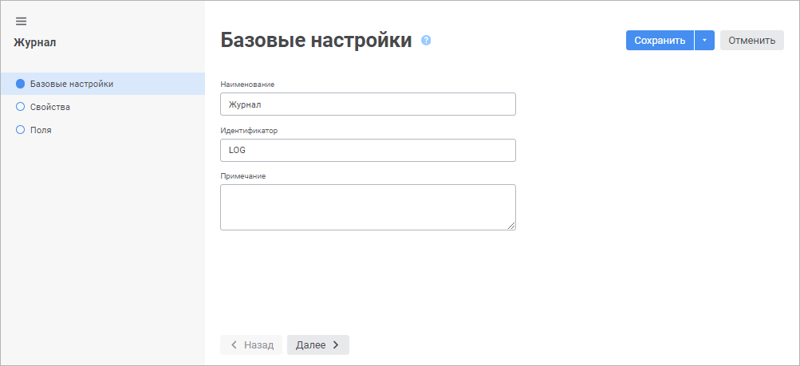
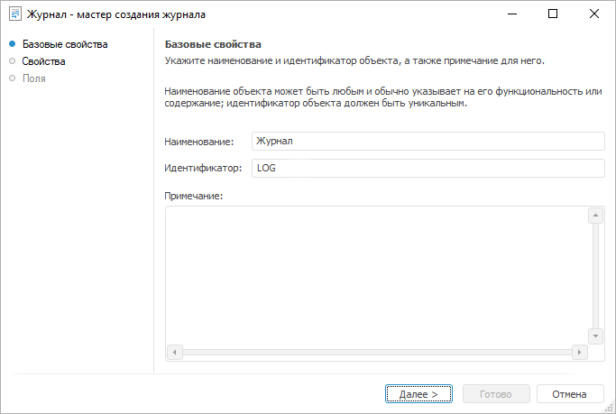

# Назначение и основные возможности: Журнал

Назначение и основные возможности: Журнал
-

# Журнал

Журнал предназначен для хранения информации о выполнении задач ETL.
 Фактически журнал представляет собой таблицу с заданным списком полей.
 Журнал имеет фиксированное число полей, но при этом существует возможность
 добавления новых.

В журнале фиксируются записи о следующих операциях:

	- запись о начале выполнения задачи ETL;

	- ошибка выполнения задачи ETL;

	- пропуск записей;

	- добавление записей;

	- запись об окончании выполнения задачи ETL.

Для создания журнала:

	- в [навигаторе
	 объектов](GetStarted.chm::/Interface/Interface_Navigator.htm):

		- в веб-приложении нажмите кнопку  «Создать» главного меню и выберите
		 тип объекта на боковой панели «[Новый объект](UiNav.chm::/02_Navigator/General_Principles_of_Work.htm#add_object)»;

		- в настольном приложении:

			- выполните команду «Создать >
			 Другие > Журнал» контекстного меню;

			- выполните команду «Новый
			 объект > Другие > Журнал» в группе
			 «Создать» на вкладке
			 «[Главная](GetStarted.chm::/Interface/Interface_Description.htm#customize_ribbon)»
			 ленты инструментов;

	- в открытой задаче ETL в настольном приложении:

		- Выполните команду «Задача >
		 Свойства» главного меню.

		- В открывшемся мастере перейдите на страницу «[Параметры задачи](UiETL.chm::/Desktop/04_Work/04_Jurnal/UiEtl_Jurnal.htm)».

		- Нажмите кнопку «Создать».

После выполнения действий откроется мастер журнала.

	 Веб-приложение Настольное приложение

		

		

Задайте настройки на страницах:

	- [Базовые
	 настройки/Базовые свойства](Master/base_settings.htm). Задаются наименование
	 объекта, идентификатор и примечание;

	- [Свойства](Master/UiDb_relational_journal_master_Property.htm).
	 Указывается база данных, в которой будет создан журнал, а также физическое
	 имя таблицы, которая будет соответствовать журналу репозитория;

	- [Поля](Master/UiDb_relational_journal_master_Field.htm).
	 Формируется список дополнительных полей журнала.

Созданная таблица журнала включает в себя поля:

	- Дата (STAMP). Дата и
	 время выполнения определенной операции;

	- Пользователь (USER_ID).
	 Имя пользователя;

	- Операция (OP). Наименования
	 выполняемых операций;

	- Успешно (OP_SUCC). Результат
	 выполнения операции (содержит 0, если операция завершена неудачно,
	 и 1 если операция завершена успешно);

	- Идентификатор объекта (OBJ_ID).
	 Идентификатор объекта задачи ETL;

	- Наименование объекта (OBJ_NAME).
	 Наименование объекта задачи ETL;

	- Описание (DESCR). Описание
	 произведенной операции;

	- Все пользовательские поля, созданные на странице мастера «[Поля](Master/UiDb_relational_journal_master_Field.htm)».

Для сохранения настроек в мастере журнала:

	- в веб-приложении:

		- нажмите кнопку «Сохранить»;

		- выполните команду «Сохранить
		 и закрыть» в раскрывающемся меню кнопки «Сохранить».
		 После этого будут сохранены заданные настройки, закрыт мастер
		 и выполнен переход в [режим
		 редактирования](../Table/Work/UiDb_relational_table_work_edit_data.htm) данных;

Примечание.
 Команда «Сохранить и закрыть» доступна
 только при [редактировании настроек](UiDb_relational_journal.htm#edit).

	- в настольном приложении нажмите кнопку «Готово».

## Работа с журналом

[Редактирование
 настроек](javascript:TextPopup(this))

	Для редактирования выбранного в навигаторе объектов журнала:

		- в веб-приложении:

			- выполните команду «Редактировать»
			 в контекстном меню объекта;

			- выполните команду «Редактировать
			 в новой вкладке» в контекстном меню объекта;

			- выполните команду «Редактировать в новом окне»
			 в контекстном меню объекта;

			- нажмите клавишу F4.

	Затем нажмите кнопку  «Настройки»;

		- в настольном приложении:

			- нажмите кнопку 
			 «Редактировать» на
			 вкладке «Главная»
			 ленты инструментов;

			- выполните команду «Редактировать»
			 в контекстном меню объекта;

			- нажмите клавишу F4.

	После чего будет открыт мастер журнала. Измените настройки на соответствующих
	 страницах мастера.

[Просмотр данных](javascript:TextPopup(this))

Для просмотра данных выделите соответствующий объект в [навигаторе
 объектов](GetStarted.chm::/Interface/Interface_Navigator.htm) и выполните одно из действий:

	- в веб-приложении:

		- выполните команду «Открыть»
		 в контекстном меню объекта;

		- выполните команду «Открыть
		 в новой вкладке» в контекстном меню объекта;

		- выполните команду «Открыть
		 в новом окне» в контекстном меню объекта;

		- дважды щёлкните по объекту;

		- нажмите клавишу ENTER;

	- в настольном приложении:

		- нажмите кнопку  «Открыть»
		 на вкладке «Главная»
		 ленты инструментов;

		- нажмите кнопку  «Открыть
		 > В инструменте по умолчанию» на вкладке «Главная» ленты инструментов;

		- выполните команду «Открыть»
		 в контекстном меню объекта.

		- дважды щёлкните по объекту.

После выполнения одного из действий будет открыт соответствующий объект
 с данными. Для получения подробной информации о принципах работы с набором
 данных обратитесь к разделу «[Работа
 с набором данных](../Table/Work/UiDb_relational_table_work.htm)».

Для просмотра данных в отчете в настольном приложении:

	- нажмите кнопку «Открыть
	 > Конструктор регламентных отчётов» на вкладке «Главная» ленты инструментов;

	- выполните команду «Открыть
	 с помощью > Конструктор регламентных отчётов» в контекстном
	 меню объекта.

Для [импорта данных](../Data_import_wizard/Data_import_wizard.htm)
 в настольном приложении:

	- нажмите кнопку «Открыть >
	 Мастер импорта данных» на вкладке «Главная»
	 ленты инструментов;

	- выполните команду «Открыть
	 с помощью > Мастер импорта данных» в контекстном меню объекта.

## Привязка журнала к задаче ETL

Для привязки журнала к задаче ETL необходимо выполнить следующие действия:

	- Создать журнал.

	- Открыть объект задачи ETL, к которому будет осуществляться привязка
	 журнала.

	- Выбрать пункт главного меню «Задача >
	 Свойства» объекта задачи ETL, при этом появится мастер задачи
	 ETL.

	- На странице мастера «[Параметры задачи](UiETL.chm::/desktop/04_Work/04_Jurnal/UiEtl_Jurnal.htm)»
	 выбрать созданный журнал.

См. также:

[Создание
 табличных наборов данных](../Table/Master/object_type_page.htm)

		Справочная
		 система на версию 10.9
		 от 18/08/2025,
		 © ООО «ФОРСАЙТ»,
