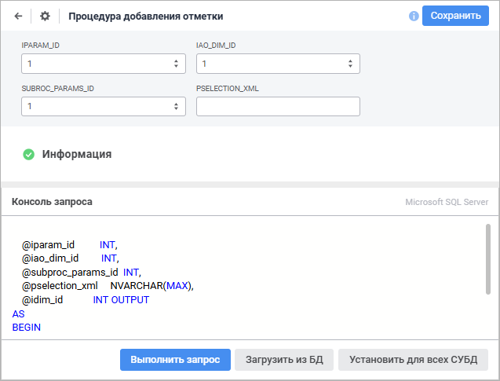

# Назначение и основные возможности: Процедура

Назначение и основные возможности: Процедура
-

# Процедура

Объект «Процедура» позволяет
 создавать процедуры и функции для разных СУБД.

В отличие от [команды СУБД](../CUBD/UiDb_relationa_CUBD.htm)
 при создании в репозитории объекта «Процедура»
 на сервере будет создана хранимая процедура/функция. Несколько процедур
 репозитория могут ссылаться на одну и ту же хранимую процедуру на сервере
 базы данных. Изменение текста хранимой процедуры отразится на всех объектах,
 ссылающихся на нее. Результатом работы процедуры может являться количество
 обработанных записей либо конкретное значение, если создана не процедура,
 а функция.

Примечание.
 Создание процедур/функций недоступно в СУБД SQLite из-за отсутствия данного
 типа объектов в указанной СУБД.

Для создания объекта «Процедура»
 в [навигаторе
 объектов](GetStarted.chm::/Interface/Interface_Navigator.htm):

	- в веб-приложении нажмите кнопку  «Создать» в главном меню и выберите
	 тип объекта на боковой панели «[Новый объект](UiNav.chm::/02_Navigator/General_Principles_of_Work.htm#add_object)»;

	- в настольном приложении:

		- выполните команду «Создать >
		 Другие > Процедура»
		 в контекстном меню;

		- выполните команду «Новый
		 объект > Другие > Процедура», расположенную
		 в группе «Создать» на
		 вкладке «[Главная](GetStarted.chm::/Interface/Interface_Description.htm#customize_ribbon)»
		 ленты инструментов.

После выполнения одного из действий будет открыт мастер процедуры, содержащий
 страницы:

	- [Базовые
	 настройки/Базовые свойства](base_settings.htm). Задаются наименование объекта,
	 идентификатор и примечание;

	- [Параметры](parameters.htm).
	 Задаётся список параметров, которые будут использоваться в коде процедуры.
	 Для каждого параметра определяется его роль в коде процедуры;

	- [Процедура/Функция](UiDb_relational_procedure_master_procedure.htm).
	 Осуществляется настройка процедуры, указывается её тип и определяется
	 выполняемый скрипт.

Для сохранения настроек в мастере процедуры:

	- в веб-приложении:

		- нажмите кнопку «Сохранить»;

		- выполните команду «Сохранить
		 и закрыть» в раскрывающемся меню кнопки «Сохранить».
		 После этого будут сохранены заданные настройки, закрыт мастер
		 и выполнен переход в [режим
		 редактирования](UiDb_relationa_procedure.htm#edit) данных;

Примечание.
 Команда «Сохранить и закрыть»
 доступна только при [редактировании
 настроек](UiDb_relationa_procedure.htm#edit_settings).

	- в настольном приложении нажмите кнопку «Готово».

## Работа с процедурой

[Запуск процедуры](javascript:TextPopup(this))

	Для запуска выбранной процедуры выполните одно из действий:

		- в веб-приложении:

			- выполните команду «Открыть» в контекстном меню
			 объекта.

			- выполните команду «Открыть в новой вкладке»
			 в контекстном меню объекта;

			- выполните команду «Открыть в новом окне» в
			 контекстном меню объекта;

			- дважды щёлкните по объекту;

		- в настольном приложении:

			- нажмите кнопку 
			 «Открыть» в группе
			 «Открыть» на вкладке
			 «Главная» ленты инструментов;

			- нажмите кнопку 
			 «Открыть > В инструменте
			 по умолчанию» в группе «Открыть»
			 на вкладке «Главная»
			 ленты инструментов;

			- выполните команду «Открыть»
			 в контекстном меню объекта;

			- дважды щелкните по объекту.

[Редактирование
 настроек](javascript:TextPopup(this))

	Для редактирования настроек процедуры выделите соответствующий объект
	 в [навигаторе
	 объектов](GetStarted.chm::/Interface/Interface_Navigator.htm) и выполните одно из действий:

		- в веб-приложении:

			- Откройте процедуру на [редактирование](UiDb_relationa_procedure.htm#edit).

			- Нажмите кнопку  «Настройки»;

		- в настольном приложении:

			- нажмите кнопку 
			 «Редактировать» на вкладке
			 «Главная» ленты инструментов;

			- выполните команду «Редактировать»
			 в контекстном меню команды;

			- нажмите клавишу F4.

	После выполнения одного из действий будет открыт мастер процедуры.
	 Измените настройки на соответствующих страницах мастера.

[Управление версиями](javascript:TextPopup(this))

	Если репозиторий [подключён
	 к системе управления версиями](uidevenv.chm::/04_NavigatorSetting/VCS/Add_In_VCS.htm), то процедура может
	 быть добавлена в систему для контроля изменений её версии. Для этого
	 в навигаторе объектов в контекстном меню для процедуры выполните команду
	 «Добавить в VCS». После отправки
	 объекта на сервер VCS будет возможность отслеживать его изменение.
	 В системе управления версиями сохраняются текст процедуры и настройки
	 параметров. Более подробно о работе с объектами, добавленными в систему
	 управления версиями, читайте в подразделе «[Разработка
	 приложений в команде](UiDevEnv.chm::/01_Development_Environment/06_Version_Control_System/VSC_Introduction.htm)».

## Редактирование процедуры в веб-приложении

Для открытия процедуры на редактирование выделите соответствующий объект
 в [навигаторе
 объектов](GetStarted.chm::/Interface/Interface_Navigator.htm) и выполните одно из действий:

	- выполните команду «Редактировать»
	 в контекстном меню процедуры;

	- выполните команду «Редактировать
	 в новой вкладке» в контекстном меню процедуры;

	- выполните команду «Редактировать
	 в новом окне» в контекстном меню процедуры;

	- нажмите клавишу F4.

Откроется окно редактирования процедуры:

Доступные операции:

[Изменение
 текста процедуры/функции](javascript:TextPopup(this))

	Для изменения текста процедуры/функции используйте панель «Консоль запроса».

	На панели отображается используемый драйвер СУБД и содержится текст
	 процедуры/функции, заданный при её [создании](UiDb_relational_procedure_master_procedure.htm).
	 Сформируйте новый текст на языке SQL в соответствии с синтаксисом,
	 который установлен для драйвера СУБД.

	Примечание.
	 Если выбран драйвер PostgreSQL, первая строка скрипта должна содержать
	 список параметров и этот список должен быть в одну строку.

	Для установки указанного текста процедуры/функции для всех СУБД
	 нажмите кнопку «Установить для всех
	 СУБД». После чего будет открыто окно для подтверждения производимого
	 действия. Запрос на подтверждение действия выдается только в том случае,
	 если хотя бы для одного драйвера, отличного от текущего, текст процедуры/функции
	 непустой.

	Для обновления текста процедуры/функции из базы данных нажмите кнопку
	 «Загрузить из БД». При нажатии
	 на данную кнопку будет выдано подтверждение на производимое действие.
	 При выборе положительного ответа текст процедуры/функции будет обновлен
	 из базы.

	Для выполнения текста процедуры нажмите кнопку «Выполнить
	 запрос».

[Переименование
 процедуры](javascript:TextPopup(this))

	Для переименования процедуры:

		- Щёлкните по наименованию процедуры в области «Базовые
		 настройки». Наименование будет переведено в режим редактирования.

		- Внесите требуемые изменения.

		- Щёлкните за пределами наименования процедуры.

[Сохранение
 процедуры](javascript:TextPopup(this))

	Для сохранения процедуры:

		- нажмите кнопку «Сохранить»;

		- подтвердите производимое действие в информационном окне
		 при переходе в [навигатор
		 объектов](getstarted.chm::/Interface/Interface_Navigator.htm)/[мастер
		 процедуры](../CUBD/base_settings.htm).

См. также:

[Пример создания процедуры](UiDb_relationa_procedure_Example.htm) |
 [Обработчики данных в СУБД](../database/data_handler.htm) |
 [IProcedure](kedb.chm::/interface/iprocedure/iprocedure.htm)

		Справочная
		 система на версию 10.9
		 от 18/08/2025,
		 © ООО «ФОРСАЙТ»,
