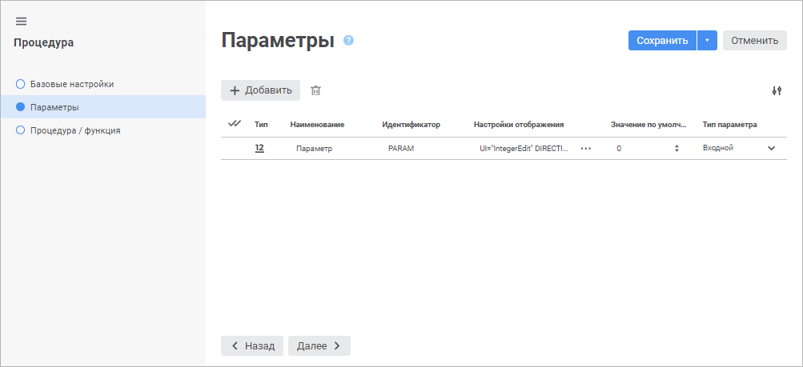

# Страница «Параметры»: Процедура

Страница «Параметры»: Процедура
-

# Параметры

На странице «Параметры» задаётся
 список параметров объекта. Параметры позволяют формировать содержимое
 объекта динамически.

	Веб-приложение Настольное приложение

		

		

[Создание
 параметра](javascript:TextPopup(this))

	Для создания нового параметра:

		- в веб-приложении нажмите кнопку  «Добавить». В список параметров
		 будет добавлена новая строка;

		- в настольном приложении:

			- нажмите кнопку «Добавить»;

			- дважды щёлкните по свободному пространству списка параметров.

	Будет открыт диалог «Свойства
	 параметра объекта»:

	

	Все поля заполнены значениями по умолчанию.

	Задайте атрибуты параметра:

		- Наименование. Введите
		 наименование параметра;

		- Идентификатор. Введите
		 последовательность букв латинского алфавита, цифр и знаков подчёркивания,
		 начинающуюся с буквы. Идентификатор должен быть уникальным в рамках
		 объекта;

		- Тип/Тип данных.
		 выберите один из доступных типов данных из раскрывающегося списка;

		- Значение по умолчанию.
		 Задайте значение параметра по умолчанию при необходимости. Особенности
		 значения по умолчанию для типов данных:

			- Строковый. Может
			 содержать до 2 Гб данных. Текст строки указывается без
			 кавычек;

			- Целый. Допускается
			 целое число в диапазоне [-2147483648; 2147483647];

			- Десятичный.
			 Допускается десятичное число, содержащее не более 28 разрядов
			 после запятой в диапазоне [-179228162514264337593543950335; 179228162514264337593543950335];

			- Вещественный.
			 Допускается вещественное число в диапазоне [-5.0 x 10-324; 1.7 x 10308];

			- Дата. Минимальная
			 дата - 1 января 100 года (н.э.) 00:00:00, максимальная
			 дата - 31 декабря 9999 года (н.э.) 23:59:59;

			- Пользовательский.
			 Допускается набор неструктурированных данных, представляющий
			 массив двоичных или символьных данных. Передача значений параметров,
			 имеющих пользовательский тип данных, доступна только при работе
			 с объектом в прикладном коде;

		- Настройки отображения/Параметры
		 отображения. Задайте внешний вид и поведение редактора
		 значений параметра. Параметры отображения задаются в виде специально
		 сформированной строки, в которой указывается вид редактора, значение
		 по умолчанию и т.д. Строка может быть отредактирована как непосредственно
		 в поле ввода, так и при помощи специального диалога «[Параметры
		 редактора значений](uinav.chm::/GUI/valueeditorparameters.htm)». Для открытия диалога нажмите
		 кнопку  «Обзор»
		 в веб-приложении или  «Обзор»
		 в настольном приложении. По умолчанию параметр отображения устанавливается
		 в соответствии с выбранным типом параметра;

		- Тип параметра. Установите
		 тип параметра с помощью раскрывающегося списка в веб-приложении
		 или соответствующих флажков в настольном приложении:

			- Входной. По
			 умолчанию;

			- Выходной;

			- Входной/Выходной.
			 Доступен только в веб-приложении. Для установки входного/выходного
			 типа параметра в настольном приложении установите флажки «Входной» и «Выходной»;

			- Результат функции. Необходим,
			 если тип создаваемого объекта - «Функция».
			 В настольном приложении при установке данного флажка будут
			 автоматически сняты флажки «Входной»
			 и «Выходной», если
			 ранее они были установлены.

	Примечание.
	 Среди параметров функции должен быть только один параметр с назначением
	 «Результат функции».

	Количество входных и выходных параметров
	 должно соответствовать количеству переменных, указанных в поле «[Скрипт](UiDb_relational_procedure_master_procedure.htm#script)»
	 в заголовке скрипта.

	Для изменения отображаемых свойств в веб-приложении установите или
	 снимите отметку около требуемых свойств в раскрывающемся меню кнопки
	  «Настройки».

[Редактирование
 параметра](javascript:TextPopup(this))

	Для редактирования выбранного параметра:

		- в веб-приложении задайте или измените требуемые настройки
		 параметра в соответствующих столбцах;

		- в настольном приложении нажмите кнопку «Редактировать»
		 или дважды щёлкните по параметру в списке. Будет открыт диалог
		 «Свойства параметра объекта».

[Удаление
 параметра](javascript:TextPopup(this))

	Для удаления выбранного параметра:

		- в веб-приложении нажмите кнопку  «Удалить»;

		- в настольном приложении нажмите кнопку «Удалить»
		 или нажмите сочетание клавиш CTRL+DELETE.

	Будет отображено окно подтверждения удаления.

Для перехода на следующую страницу мастера нажмите кнопку «Далее».

См. также:

[Процедура](UiDb_relationa_procedure.htm)

		Справочная
		 система на версию 10.9
		 от 18/08/2025,
		 © ООО «ФОРСАЙТ»,
