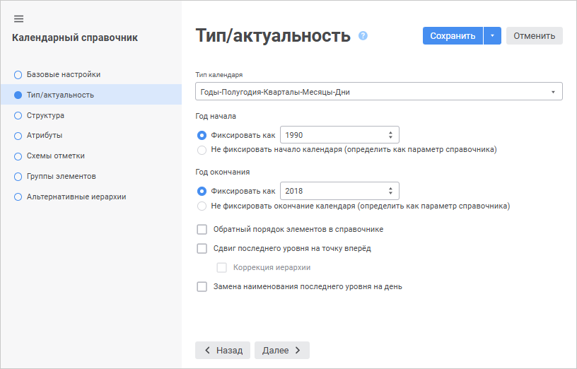
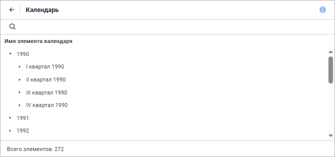

# Календарный справочник «Календарь»

Календарный справочник «Календарь»
-

# Календарный справочник «Календарь»

Для создания справочника в навигаторе объектов выполните пункт контекстного
 меню «Создать > Справочник».
 Будет открыт [мастер справочника](Create.htm).

	- На странице «Базовые свойства»
	 задайте стандартные параметры справочника:

		- Наименование: Календарь;

		- Идентификатор: CALENDAR.

	- На странице «Параметры»
	 задаётся список параметров объекта. В данном примере не требуется
	 добавлять параметры справочника.

	- На странице «Тип справочника»
	 установите переключатель напротив пункта «Календарный
	 справочник».

	- Перейдите на страницу «Тип
	 и период актуальности календаря»:

Установите на ней следующие параметры:

		- Тип календаря - Годы-Полугодия-Кварталы-Месяцы-Дни;

		- Год начала - 1990;

		- Год окончания - 2018.

	- На странице «Структура календаря»
	 установите флажки:

		- Годы;

		- Кварталы;

		- Месяцы.

	- На странице «Атрибуты»
	 содержится набор характеристик, которые будет иметь каждый элемент
	 справочника. В данном примере не требуется добавлять атрибуты элементов
	 справочника.

Для завершения процесса создания справочника нажмите на кнопку «Готово».

Для просмотра созданного справочника щелкните по нему дважды мышью.

См. также:

[Примеры создания справочников](UiMd_reference_book_Examples.htm)

		Справочная
		 система на версию 10.9
		 от 18/08/2025,
		 © ООО «ФОРСАЙТ»,
