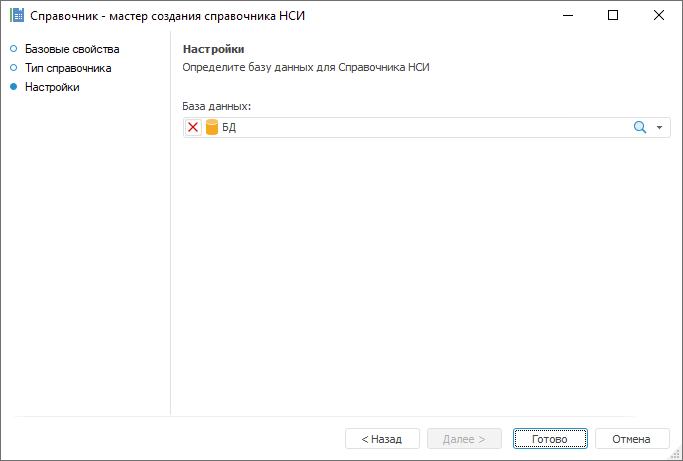

# Создание справочников

Создание справочников
-

# Создание справочников

Справочник предоставляет линейный
 или иерархический перечень элементов, содержащий краткие и точные сведения,
 объединенные единой тематикой. Обычно сведения в справочнике расположены
 в определённом порядке (алфавитном, систематическом, хронологическом и
 т.д.), удобном для их быстрого поиска.

В многомерной модели данных элементы справочника играют роль индексов,
 которые используются для составления координатного вектора показателей,
 находящихся в ячейках куба. Элементы справочника обладают набором атрибутов,
 таких как имя элемента, его уникальный код, порядок следования в иерархии.
 При объединении элементов в справочнике появляется наиболее важное свойство
 справочника - иерархия. Как правило, иерархия может быть представлена
 в виде дерева, в вершинах которого находятся элементы справочника, связанные
 между собой атрибутами отношения владения.

Для создания справочника в [навигаторе
 объектов](GetStarted.chm::/Interface/Interface_Navigator.htm):

	- в веб-приложении нажмите кнопку  «Создать» в главном меню и выберите
	 тип объекта на боковой панели «[Новый объект](UiNav.chm::/02_Navigator/General_Principles_of_Work.htm#add_object)»;

	- в настольном приложении выполните одно из действий:

		- нажмите кнопку «Новый объект
		 > Справочник» в группе «Создать»
		 на вкладке «Главная» ленты
		 инструментов;

		- выполните команду «Создать
		 > Справочник» в контекстном меню навигатора объектов.

Выберите тип создаваемого справочника на
 странице «Тип справочника» в мастере
 справочника.

Страницы мастера справочника зависят от его типа. После создания справочника
 можно перейти к [работе с ним](Work/Work_Dictionary.htm).

Типы справочников:

	- [Табличный
	 справочник](Master_Table_reference_book/Master_Table.htm). Справочник предназначен для структурированного
	 представления элементов без возможности их добавления и изменения.
	 Для создания справочника требуется [табличный
	 набор данных](../Table/Master/object_type_page.htm), [справочник
	 НСИ](Master_RDS_reference_book/Master_RDS.htm) или [составной
	 справочник НСИ](Master_Composite_Table_reference_book/Master_CompositeTable.htm). Каждая запись источника данных представляет собой
	 элемент справочника и должна содержать определение всех атрибутов
	 справочника. Для ограничения количества данных, попадающих в справочник,
	 пользователь может использовать различные фильтры. Табличный справочник
	 поддерживает управление содержимым при помощи параметров, то есть
	 является динамическим. Может быть создан в любом месте репозитория:

		 Веб-приложение Настольное приложение

			

			

	- [Календарный
	 справочник](Master_Calendar_reference_book/Master_Calendar.htm). Содержит иерархическое представление временной
	 шкалы с заданной детализацией.

Календарный справочник поддерживает детализацию
 по следующим уровням: годы, 9 месяцев, полугодия, кварталы, месяцы, недели
 и дни. Его содержимое генерируется автоматически в зависимости от указанных
 параметров.

Календарный справочник поддерживает динамическое
 определение начала и окончания временной шкалы, то есть является динамическим.

Для построения данного справочника не нужно
 создавать таблицы и устанавливать взаимосвязь между элементами таблиц.
 Необходимо лишь выбрать уровни календаря, а их соподчиненность, элементы
 и взаимосвязь между ними генерируются системой:

		 Веб-приложение Настольное приложение

			

			

Примечание.
 Календарный справочник не поддерживает детализацию по уровню «время»,
 учитывается только дата.

	- [Вычисляемый
	 справочник](Master_Calculation_reference_book/Master_Calculation.htm). Структура справочника задается по аналогии
	 с табличным справочником. Наполнение справочника элементами осуществляется
	 на основе алгоритма пользователя. Алгоритм задается в виде модуля
	 на внутреннем языке программирования Fore. Модуль должен
	 содержать процедуру, имеющую следующую сигнатуру:

Sub <Name>(UserDim: IUserDimension; Builder: IDimBuilder; Params: IMetabaseObjectParamValues);

Begin

    //Код для построения дерева элементов вычисляемого справочника

End Sub <Name>;

Наименование процедуры и параметров может
 быть любым, удовлетворяющим спецификации языка Fore.

Модуль выполняется всякий раз, когда справочник
 используется. Однако при помощи механизма кеширования объектов платформы
 эта операция автоматически выполняется только в случае, когда он еще отсутствует
 в кеше либо при выполнении операции «Обновить».
 В общем случае для вычисляемого справочника не обязательно наличие таблицы
 для хранения его элементов. В определении модуля могут использоваться
 любые объекты репозитория, в том числе и таблицы с данными.

Вычисляемый справочник поддерживает динамическое
 изменение при помощи параметров, то есть является динамическим:

	 Веб-приложение Настольное приложение

		

		

	- [Справочник
	 НСИ](Master_RDS_reference_book/Master_RDS.htm). Справочник предназначен для структурированного представления
	 элементов с возможностью их преобразования. Для создания справочника
	 не требуется источник данных. Данные в справочник могут быть внесены
	 вручную или загружены из источника данных с помощью встроенных инструментов
	 ETL. Элементы справочника могут изменяться во времени, то есть иметь
	 несколько версий. Справочник НСИ может быть создан в любом месте репозитория.
	 Справочник НСИ использует для хранения информации отдельную таблицу.
	 Она создается автоматически при создании справочника и является его
	 дочерним объектом. Поля таблицы соответствуют атрибутам справочника:

		 Веб-приложение Настольное
		 приложение

			

			

	- [Составной
	 справочник НСИ](Master_Composite_Table_reference_book/Master_CompositeTable.htm). Справочник НСИ, который включает в себя
	 как свои собственные элементы, так и элементы из других справочников
	 НСИ:

	 Веб-приложение

	 Настольное
	 приложение

		

		

В зависимости от структуры справочники можно разделить на следующие
 виды:

	- Рекурсивный справочник.
	 Справочник, число уровней которого не может быть зафиксировано при
	 создании, так как оно зависит от данных, на основе которых он построен;

	- Нерекурсивный справочник.
	 Справочник, число уровней которого фиксируется при создании и не зависит
	 от данных, на основе которых он построен.

Справочник может быть:

	- иерархическим. Элементы
	 расположены на различных уровнях [иерархии](UiMd_reference_book_Hierarchy.htm)
	 и связаны между собой отношениями «родитель - потомок»;

	- неиерархическим. Элементы
	 справочника расположены на одном уровне [иерархии](UiMd_reference_book_Hierarchy.htm)
	 и не связаны между собой отношениями «родитель - потомок».

См. также:

[Структурирование
 наборов данных](../TimeSeriesDatabase/Structure_data_set.htm) | [Работа со
 справочником](Work/Work_Dictionary.htm)

		Справочная
		 система на версию 10.9
		 от 18/08/2025,
		 © ООО «ФОРСАЙТ»,
