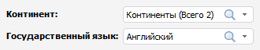
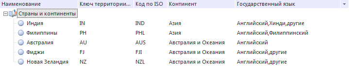

# Как управлять параметрами справочника?

Как управлять параметрами справочника?
-

# Как управлять параметрами справочника?

Параметры справочника позволяют:

	- не удалять данные справочников, чтобы не нарушать целостность
	 данных;

	- динамически изменять содержимое справочника;

	- исключать данные, используя параметр в качестве фильтра данных.

Справочник НСИ с заданными параметрами называется параметрическим.

## Настройка параметров справочника НСИ

Настройку параметров рассмотрим на примере справочника НСИ, содержащего
 наименования стран, коды территорий и прочую информацию.

	- На вкладке/странице мастера «[Атрибуты](../Master_RDS_reference_book/Attributes.htm)»
	 добавьте атрибут со следующими [свойствами](../Master_RDS_reference_book/Attributes/Attribute.htm):

		- в поле «Наименование»
		 введите «Континенты»;

		- установите флажок «Может
		 иметь множественные значения».

Значения добавленного атрибута будут использоваться
 в качестве параметра.

	- На вкладке/странице мастера «[Связи](../Master_RDS_reference_book/Link.htm)» настройте
	 связь по атрибутам со следующими свойствами:

		- в качестве связываемого атрибута укажите ранее созданный
		 атрибут «Континенты»;

		- в раскрывающемся списке «Справочник»
		 выберите справочник, содержащий наименования континентов.

	- Перейдите на вкладку/страницу мастера «[Элементы справочника](../Work/Work_Dictionary.htm)»
	 и установите соответствие между наименованиями стран и континентов,
	 на которых они располагаются, используя [карточку
	 элемента](../Master_RDS_reference_book/Element_Card.htm).

	- На вкладке/странице мастера «[Параметры](../Master_RDS_reference_book/Parameters.htm)»
	 добавьте параметр со следующими свойствами:

		- в поле «Наименование»
		 введите «Континент»;

		- в качестве атрибута выберите ранее созданный атрибут «Континенты».

Параметр будет добавлен на [вкладке
 с элементами справочника](../Work/Work_Dictionary.htm#rds).

Аналогичным образом добавьте в справочник атрибут и параметр «Государственный язык».

## Работа с параметрами справочника НСИ

Настроим справочник таким образом, чтобы в дереве элементов отображались
 страны, удовлетворяющие условиям:

	- страна должна располагаться на одном из континентов: «Азия»,
	 «Австралия и Океания»;

	- государственный язык - английский.

Для этого на [вкладке с элементами
 справочника](../Work/Work_Dictionary.htm#rds) в раскрывающемся списке «Континент»
 выберите элементы «Азия» и «Австралия и Океания», в раскрывающемся
 списке «Государственный язык»
 выберите элемент «Английский»:

Если требуется, [обновите](../Work/Operations_Elements.htm#refresh)
 дерево элементов.

Примечание.
 При работе со справочником НСИ в веб-приложении для применения параметров
 к элементам справочника нажмите кнопку «Применить»
 на [панели параметров](../Work/Work_Dictionary.htm#rds).

В справочнике будут отображены элементы, удовлетворяющие заданным условиям:

## Операции над параметрами

При работе с параметрами, которые являются раскрывающимися списками,
 доступны операции:

[Поиск элемента
 в списке параметров](javascript:TextPopup(this))

	Для поиска значения параметра:

		- нажмите кнопку  «Найти»
		 в строке ввода параметра и начните вводить искомый текст. Элементы,
		 в которых встречается заданная подстрока, будут выведены в дереве
		 элементов. Для очистки строки поиска нажмите кнопку  «Очистить»;

		- выполните команду «Строка
		 поиска» в контекстном меню раскрытого списка элементов
		 параметров. Затем введите искомый текст в строке поиска. Для последовательного
		 перехода по найденным элементам нажмите кнопку  «Найти» или клавишу ENTER.

[Управление отметкой](javascript:TextPopup(this))

	Для отметки всех элементов выполните команду «Отметить
	 все» в контекстном меню раскрытого списка элементов параметров.
	 Для снятия отметки со всех элементов выполните команду «Снять
	 отметку со всех» в контекстном меню раскрытого списка элементов
	 параметров.

	Для отметки элементов выбранного уровня выполните команду «Отметить уровень» в контекстном
	 меню уровня в раскрытом списке элементов параметров. Для снятия отметки
	 с элементов выбранного уровня выполните команду «Снять
	 отметку с уровня» в контекстном меню уровня в раскрытом списке
	 элементов параметров.

	Для отметки всех подчиненных элементов по выбранному уровню выполните
	 команду «Отметить подчиненные по
	 уровню» в контекстном меню уровня в раскрытом списке элементов
	 параметров. Для снятия отметки со всех подчиненных элементов выполните
	 команду «Снять отметку с подчиненных»
	 в контекстном меню уровня в раскрытом списке элементов параметров.

[Настройка списка
 элементов](javascript:TextPopup(this))

	Для разворачивания иерархии списка элементов выполните команду «Развернуть все» в контекстном меню
	 уровня в раскрытом списке элементов параметров.

	Для сворачивания иерархии списка элементов выполните команду «Свернуть все» в контекстном меню
	 уровня в раскрытом списке элементов параметров.

См. также:

[Вопросы
 и ответы](../../../FAQ/FAQ.htm)

		Справочная
		 система на версию 10.9
		 от 18/08/2025,
		 © ООО «ФОРСАЙТ»,
